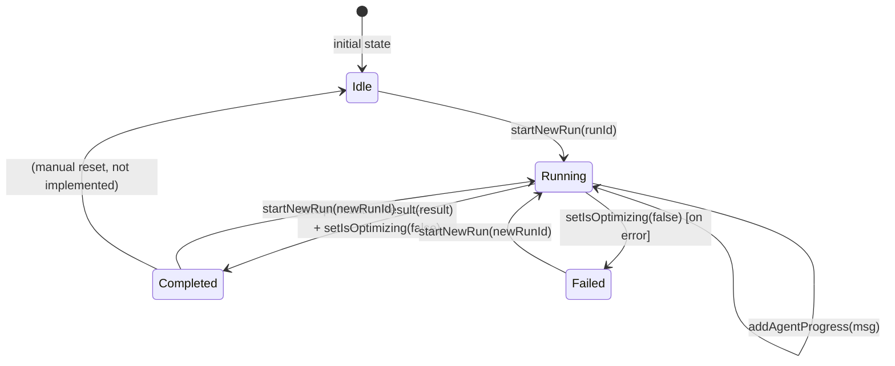

# State Management

The frontend uses [Zustand](https://github.com/pmndrs/zustand) for global client-side state. A single store — `useUIStore` — manages the active optimization run lifecycle: tracking the current run ID, accumulating agent progress events, storing the final result, and controlling the active comparison tab.

Server state (run history, run details, asset search) is managed separately by TanStack Query in the custom hooks. See [Hooks](hooks.md) for details.

## Store Location

**File:** `src/store/uiStore.ts`

## State Shape

```typescript
interface UIState {
  currentRunId: string | null;
  optimizationResult: OptimizationRunDetail | null;
  isOptimizing: boolean;
  agentProgress: AgentProgressMessage[];
  activeTab: ComparisonTab;
}
```

| Field | Type | Initial Value | Description |
|-------|------|---------------|-------------|
| `currentRunId` | `string \| null` | `null` | The run ID currently being tracked. `null` when idle. |
| `optimizationResult` | `OptimizationRunDetail \| null` | `null` | The completed optimization result. `null` until a run finishes. |
| `isOptimizing` | `boolean` | `false` | `true` while an optimization run is in progress. |
| `agentProgress` | `AgentProgressMessage[]` | `[]` | Ordered list of agent progress events received via WebSocket. |
| `activeTab` | `ComparisonTab` | `"classical"` | Which comparison tab is selected in the dashboard. |

### `ComparisonTab` Type

```typescript
export type ComparisonTab = "classical" | "qaoa" | "vqe";
```

---

## Actions

```typescript
interface UIActions {
  setCurrentRunId: (runId: string | null) => void;
  setOptimizationResult: (result: OptimizationRunDetail | null) => void;
  setIsOptimizing: (value: boolean) => void;
  addAgentProgress: (message: AgentProgressMessage) => void;
  resetProgress: () => void;
  setActiveTab: (tab: ComparisonTab) => void;
  startNewRun: (runId: string) => void;
}
```

### `setCurrentRunId(runId)`

Sets the active run ID. Called immediately after submitting an optimization request.

```typescript
setCurrentRunId: (runId) => set({ currentRunId: runId }),
```

### `setOptimizationResult(result)`

Stores the completed optimization result. Called by `useWebSocket` when a `"result"` message arrives.

```typescript
setOptimizationResult: (result) => set({ optimizationResult: result }),
```

### `setIsOptimizing(value)`

Toggles the in-progress flag. Set to `true` by `startNewRun`, set to `false` by `useWebSocket` when a `"result"` or `"error"` message arrives.

```typescript
setIsOptimizing: (value) => set({ isOptimizing: value }),
```

### `addAgentProgress(message)`

Appends a single agent progress event to the ordered list. Includes **deduplication logic** to prevent duplicate events from being displayed.

```typescript
addAgentProgress: (message) =>
  set((state) => {
    // Deduplicate: skip if an identical node+status event already exists
    const isDuplicate = state.agentProgress.some(
      (p) => p.node === message.node && p.status === message.status,
    );
    if (isDuplicate) return state;
    return { agentProgress: [...state.agentProgress, message] };
  }),
```

**Deduplication key:** `(node, status)` pair. If the same node emits the same status twice (e.g., due to WebSocket reconnection replaying messages), only the first event is stored.

### `resetProgress()`

Clears all progress events. Called at the start of a new run.

```typescript
resetProgress: () => set({ agentProgress: [] }),
```

### `setActiveTab(tab)`

Switches the active comparison tab in the `ComparisonDashboard`.

```typescript
setActiveTab: (tab) => set({ activeTab: tab }),
```

### `startNewRun(runId)` — Convenience Action

Atomically resets all run-related state and starts tracking a new run. This is the primary action called by `useOptimize` after a successful submission.

```typescript
startNewRun: (runId) =>
  set({
    currentRunId: runId,
    isOptimizing: true,
    optimizationResult: null,
    agentProgress: [],
    activeTab: "classical",
  }),
```

Equivalent to calling these actions in sequence:
1. `resetProgress()`
2. `setCurrentRunId(runId)`
3. `setIsOptimizing(true)`
4. `setOptimizationResult(null)`
5. `setActiveTab("classical")`

The atomic update prevents intermediate renders with inconsistent state.

---

## Store Creation

```typescript
export type UIStore = UIState & UIActions;

export const useUIStore = create<UIStore>((set) => ({
  // Initial state
  currentRunId: null,
  optimizationResult: null,
  isOptimizing: false,
  agentProgress: [],
  activeTab: "classical",

  // Actions
  setCurrentRunId: (runId) => set({ currentRunId: runId }),
  setOptimizationResult: (result) => set({ optimizationResult: result }),
  setIsOptimizing: (value) => set({ isOptimizing: value }),
  addAgentProgress: (message) => set((state) => { /* dedup logic */ }),
  resetProgress: () => set({ agentProgress: [] }),
  setActiveTab: (tab) => set({ activeTab: tab }),
  startNewRun: (runId) => set({ /* atomic reset */ }),
}));
```

---

## Selector Helpers

Pre-defined selector functions provide stable references and prevent unnecessary re-renders when only a subset of state is needed:

```typescript
export const selectCurrentRunId       = (s: UIStore) => s.currentRunId;
export const selectOptimizationResult = (s: UIStore) => s.optimizationResult;
export const selectIsOptimizing       = (s: UIStore) => s.isOptimizing;
export const selectAgentProgress      = (s: UIStore) => s.agentProgress;
export const selectActiveTab          = (s: UIStore) => s.activeTab;
```

### Usage with Selectors

```typescript
// Inline selector (most common)
const currentRunId = useUIStore((s) => s.currentRunId);

// Named selector (avoids re-creating the function on each render)
import { selectAgentProgress } from "@/store/uiStore";
const agentProgress = useUIStore(selectAgentProgress);
```

Zustand uses shallow equality by default — a component only re-renders when the selected value changes. Using named selectors avoids creating a new function reference on every render, which would cause unnecessary re-renders.

---

## Run Lifecycle State Machine



### State Descriptions

| State | `isOptimizing` | `currentRunId` | `optimizationResult` |
|-------|---------------|----------------|---------------------|
| Idle | `false` | `null` | `null` |
| Running | `true` | `"abc123"` | `null` |
| Completed | `false` | `"abc123"` | `OptimizationRunDetail` |
| Failed | `false` | `"abc123"` | `null` |

---

## Usage Patterns

### Reading State in Components

```typescript
// DashboardPage — reads multiple fields
const currentRunId       = useUIStore((s) => s.currentRunId);
const isOptimizing       = useUIStore((s) => s.isOptimizing);
const agentProgress      = useUIStore((s) => s.agentProgress);
const optimizationResult = useUIStore((s) => s.optimizationResult);
```

### Dispatching Actions from Hooks

```typescript
// useOptimize — calls startNewRun after successful submission
const startNewRun = useUIStore((s) => s.startNewRun);
startNewRun(run_id);

// useWebSocket — dispatches progress and result messages
const addAgentProgress      = useUIStore((s) => s.addAgentProgress);
const setOptimizationResult = useUIStore((s) => s.setOptimizationResult);
const setIsOptimizing       = useUIStore((s) => s.setIsOptimizing);
```

### Subscribing to a Single Field

```typescript
// Only re-renders when isOptimizing changes
const isOptimizing = useUIStore((s) => s.isOptimizing);
```

---

## Why Zustand?

The project uses Zustand for global UI state because:

1. **Minimal boilerplate** — no reducers, action creators, or provider nesting required
2. **Selective subscriptions** — components only re-render when their selected slice changes
3. **Outside React** — actions can be called from non-component code (hooks, utilities)
4. **TypeScript-first** — full type inference without extra configuration

TanStack Query handles server state (caching, refetching, pagination) while Zustand handles ephemeral UI state (current run, progress events, active tab).

---

## Related Pages

- [Hooks](hooks.md) — `useOptimize` and `useWebSocket` that update this store
- [Type Definitions](type-definitions.md) — `AgentProgressMessage` and `OptimizationRunDetail` types
- [Components](components.md) — components that read from this store
