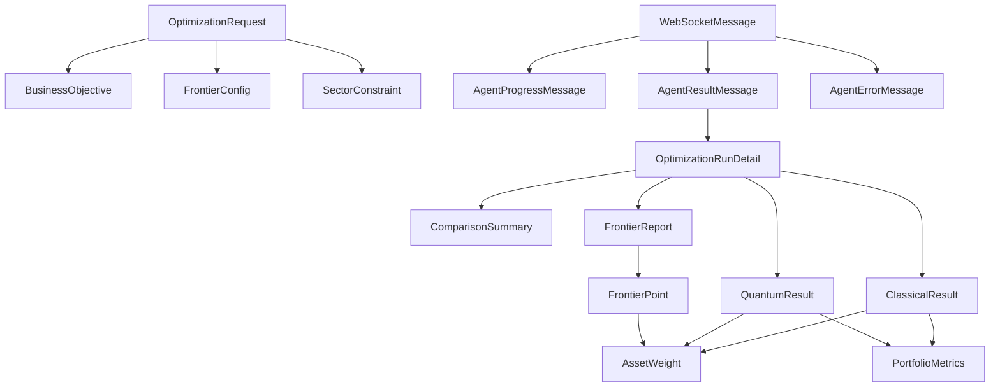

# Type Definitions

All TypeScript interfaces for the frontend are defined in `src/types/api.ts`. These types mirror the Pydantic schemas in the backend (`backend/app/schemas/`) and must be kept in sync when the API changes.

> **Sync requirement:** When backend Pydantic models change, the corresponding TypeScript interfaces in `src/types/api.ts` must be updated to match. The frontend has no runtime schema validation — type mismatches will cause silent failures.

## File Location

**File:** `src/types/api.ts`

---

## Enumerations

### `OptimizationStatus`

```typescript
export type OptimizationStatus =
  | "pending"
  | "running"
  | "completed"
  | "failed";
```

Lifecycle states for an optimization run:

| Value | Description |
|-------|-------------|
| `"pending"` | Run is queued, not yet started |
| `"running"` | Agent pipeline is executing |
| `"completed"` | All nodes finished successfully |
| `"failed"` | One or more nodes encountered an error |

### `AgentNodeName`

```typescript
export type AgentNodeName =
  | "data_fetch"
  | "constraint_validation"
  | "classical_optimization"
  | "quantum_dispatch"
  | "comparison"
  | "frontier_computation"
  | "llm_explanation";
```

The seven nodes in the LangGraph agent pipeline. Used in `AgentProgressMessage` to identify which node emitted a progress event.

### `ObjectiveName`

```typescript
export type ObjectiveName =
  | "return"
  | "volatility"
  | "sharpe"
  | "diversification_hhi"
  | "sector_concentration"
  | "max_drawdown"
  | "esg_score";
```

All measure names accepted in the `objectives` matrix. The first five are valid frontier axes; `max_drawdown` and `esg_score` are informational only.

### `FrontierMeasureName`

```typescript
export type FrontierMeasureName =
  | "return"
  | "volatility"
  | "sharpe"
  | "diversification_hhi"
  | "sector_concentration";
```

Subset of `ObjectiveName` — only the convex measures that can be used as efficient frontier axes.

### `ObjectiveDirection`

```typescript
export type ObjectiveDirection = "maximize" | "minimize";
```

Whether a business objective should be maximized or minimized in the scalarized CVXPY objective.

---

## Request Types

### `SectorConstraint`

```typescript
export interface SectorConstraint {
  sector: string;
  max_weight: number;
}
```

| Field | Type | Description |
|-------|------|-------------|
| `sector` | `string` | Sector name (e.g. `"Technology"`, `"Healthcare"`) |
| `max_weight` | `number` | Maximum allocation fraction for this sector (0.0–1.0) |

### `BusinessObjective`

```typescript
export interface BusinessObjective {
  name: ObjectiveName;
  direction: ObjectiveDirection;
  weight: number;
  enabled: boolean;
  threshold?: number | null;
  label?: string | null;
}
```

A single row in the multi-objective optimization matrix.

| Field | Type | Description |
|-------|------|-------------|
| `name` | `ObjectiveName` | Which measure this objective targets |
| `direction` | `ObjectiveDirection` | Whether to maximize or minimize |
| `weight` | `number` | Relative weight in the scalarized objective (0.0–1.0; rows are renormalized at solve time) |
| `enabled` | `boolean` | Whether this row participates in the solve |
| `threshold` | `number \| null` | Optional hard constraint: `≥ threshold` for maximize, `≤ threshold` for minimize |
| `label` | `string \| null` | Free-form label for UI display and LLM commentary |

### `FrontierConfig`

```typescript
export interface FrontierConfig {
  enabled: boolean;
  x_measure: FrontierMeasureName;
  y_measure: FrontierMeasureName;
  num_points: number;
}
```

Configuration for the efficient-frontier sweep.

| Field | Type | Description |
|-------|------|-------------|
| `enabled` | `boolean` | Whether to compute and return an efficient frontier |
| `x_measure` | `FrontierMeasureName` | Measure plotted on the X-axis (default: `"volatility"`) |
| `y_measure` | `FrontierMeasureName` | Measure plotted on the Y-axis (default: `"return"`) |
| `num_points` | `number` | Number of parametric solves to trace the frontier (5–100) |

### `OptimizationRequest`

```typescript
export interface OptimizationRequest {
  tickers: string[];
  budget: number;
  objectives?: BusinessObjective[];
  frontier?: FrontierConfig;
  min_return?: number;
  max_volatility?: number;
  max_weight_per_asset?: number;
  min_weight_per_asset?: number;
  sector_constraints?: SectorConstraint[];
  num_assets_to_select?: number;
  lookback_days?: number;
  run_quantum?: boolean;
}
```

The full optimization request payload sent to `POST /api/v1/optimize`.

| Field | Type | Required | Description |
|-------|------|----------|-------------|
| `tickers` | `string[]` | ✓ | List of ticker symbols (e.g. `["AAPL", "MSFT"]`) |
| `budget` | `number` | ✓ | Total investment budget in USD |
| `objectives` | `BusinessObjective[]` | — | Multi-objective matrix (preferred over legacy fields) |
| `frontier` | `FrontierConfig` | — | Efficient-frontier sweep configuration |
| `min_return` | `number` | — | **Deprecated** — use `objectives` with a `return` threshold |
| `max_volatility` | `number` | — | **Deprecated** — use `objectives` with a `volatility` threshold |
| `max_weight_per_asset` | `number` | — | Maximum weight for any single asset (0.0–1.0) |
| `min_weight_per_asset` | `number` | — | Minimum weight for any included asset (0.0–1.0) |
| `sector_constraints` | `SectorConstraint[]` | — | Per-sector allocation limits |
| `num_assets_to_select` | `number` | — | Number of assets for the quantum QUBO formulation |
| `lookback_days` | `number` | — | Historical data lookback period in days |
| `run_quantum` | `boolean` | — | Whether to run QAOA + VQE (default: `false`) |

---

## Portfolio Result Types

### `AssetWeight`

```typescript
export interface AssetWeight {
  ticker: string;
  weight: number;
  allocation: number;
  sector?: string;
}
```

| Field | Type | Description |
|-------|------|-------------|
| `ticker` | `string` | Asset ticker symbol |
| `weight` | `number` | Portfolio weight fraction (0.0–1.0) |
| `allocation` | `number` | Dollar amount allocated |
| `sector` | `string` | Optional sector classification |

### `PortfolioMetrics`

```typescript
export interface PortfolioMetrics {
  expected_return: number;
  volatility: number;
  sharpe_ratio: number;
  max_drawdown?: number;
  num_assets: number;
}
```

| Field | Type | Description |
|-------|------|-------------|
| `expected_return` | `number` | Annualized expected return (decimal, e.g. `0.12` = 12%) |
| `volatility` | `number` | Annualized volatility / standard deviation |
| `sharpe_ratio` | `number` | Risk-adjusted return (return / volatility) |
| `max_drawdown` | `number` | Maximum peak-to-trough decline (optional) |
| `num_assets` | `number` | Number of assets with non-zero weight |

### `ClassicalResult`

```typescript
export interface ClassicalResult {
  weights: AssetWeight[];
  metrics: PortfolioMetrics;
  solver_status: string;
  solve_time_ms: number;
}
```

| Field | Type | Description |
|-------|------|-------------|
| `weights` | `AssetWeight[]` | Per-asset allocation |
| `metrics` | `PortfolioMetrics` | Portfolio performance metrics |
| `solver_status` | `string` | CVXPY solver status (e.g. `"optimal"`) |
| `solve_time_ms` | `number` | Wall-clock solve time in milliseconds |

### `QuantumResult`

```typescript
export interface QuantumResult {
  qaoa?: {
    selected_assets: string[];
    weights: AssetWeight[];
    metrics: PortfolioMetrics;
    circuit_depth: number;
    num_qubits: number;
    solve_time_ms: number;
  };
  vqe?: {
    selected_assets: string[];
    weights: AssetWeight[];
    metrics: PortfolioMetrics;
    num_qubits: number;
    solve_time_ms: number;
  };
}
```

Both `qaoa` and `vqe` are optional — they are only present when `run_quantum: true` was set in the request and the respective solver succeeded.

| Field | Type | Description |
|-------|------|-------------|
| `qaoa.selected_assets` | `string[]` | Assets selected by the QUBO formulation |
| `qaoa.circuit_depth` | `number` | Depth of the QAOA quantum circuit |
| `qaoa.num_qubits` | `number` | Number of qubits used |
| `vqe.selected_assets` | `string[]` | Assets selected by VQE |
| `vqe.num_qubits` | `number` | Number of qubits used |

### `ComparisonSummary`

```typescript
export interface ComparisonSummary {
  sharpe_improvement_qaoa?: number;
  sharpe_improvement_vqe?: number;
  return_diff_qaoa?: number;
  return_diff_vqe?: number;
  volatility_diff_qaoa?: number;
  volatility_diff_vqe?: number;
  recommendation: string;
}
```

Comparison deltas between quantum and classical results. All numeric fields are differences (quantum − classical).

| Field | Type | Description |
|-------|------|-------------|
| `sharpe_improvement_qaoa` | `number` | QAOA Sharpe − Classical Sharpe |
| `sharpe_improvement_vqe` | `number` | VQE Sharpe − Classical Sharpe |
| `return_diff_qaoa` | `number` | QAOA return − Classical return |
| `return_diff_vqe` | `number` | VQE return − Classical return |
| `volatility_diff_qaoa` | `number` | QAOA volatility − Classical volatility |
| `volatility_diff_vqe` | `number` | VQE volatility − Classical volatility |
| `recommendation` | `string` | LLM-generated recommendation text |

---

## Efficient Frontier Types

### `FrontierPoint`

```typescript
export interface FrontierPoint {
  x: number;
  y: number;
  sharpe: number;
  weights: AssetWeight[];
  is_dominant: boolean;
  is_knee: boolean;
  solver_status: string;
}
```

A single sample on the efficient frontier.

| Field | Type | Description |
|-------|------|-------------|
| `x` | `number` | X-axis measure value |
| `y` | `number` | Y-axis measure value |
| `sharpe` | `number` | Sharpe ratio of this portfolio |
| `weights` | `AssetWeight[]` | Full asset allocation for this frontier portfolio |
| `is_dominant` | `boolean` | True when the point is Pareto-efficient |
| `is_knee` | `boolean` | True for the algorithmically chosen knee point |
| `solver_status` | `string` | CVXPY solver status for this point |

### `FrontierReport`

```typescript
export interface FrontierReport {
  x_measure: FrontierMeasureName;
  y_measure: FrontierMeasureName;
  x_direction: ObjectiveDirection;
  y_direction: ObjectiveDirection;
  points: FrontierPoint[];
  knee_point_index?: number | null;
  max_sharpe_index?: number | null;
  min_risk_index?: number | null;
  num_dominant: number;
  num_dominated: number;
  solve_time_ms: number;
  commentary?: string | null;
}
```

Full bundle returned by the frontier sweep node.

| Field | Type | Description |
|-------|------|-------------|
| `x_measure` | `FrontierMeasureName` | Canonical name of the X-axis measure |
| `y_measure` | `FrontierMeasureName` | Canonical name of the Y-axis measure |
| `x_direction` | `ObjectiveDirection` | Optimization direction for X |
| `y_direction` | `ObjectiveDirection` | Optimization direction for Y |
| `points` | `FrontierPoint[]` | All sampled points (dominant + dominated) |
| `knee_point_index` | `number \| null` | Index of the knee portfolio in `points` |
| `max_sharpe_index` | `number \| null` | Index of the max-Sharpe portfolio |
| `min_risk_index` | `number \| null` | Index of the minimum-risk portfolio |
| `num_dominant` | `number` | Count of Pareto-dominant points |
| `num_dominated` | `number` | Count of dominated points |
| `solve_time_ms` | `number` | Total frontier sweep time in milliseconds |
| `commentary` | `string \| null` | LLM-generated frontier summary |

---

## Run Types

### `OptimizationRunSummary`

```typescript
export interface OptimizationRunSummary {
  run_id: string;
  status: OptimizationStatus;
  tickers: string[];
  budget: number;
  created_at: string;
  completed_at?: string;
  classical_sharpe?: number;
  quantum_sharpe?: number;
}
```

Lightweight summary used in the run history table.

| Field | Type | Description |
|-------|------|-------------|
| `run_id` | `string` | UUID of the optimization run |
| `status` | `OptimizationStatus` | Current lifecycle state |
| `tickers` | `string[]` | Asset tickers in the portfolio |
| `budget` | `number` | Total investment budget in USD |
| `created_at` | `string` | ISO 8601 creation timestamp |
| `completed_at` | `string` | ISO 8601 completion timestamp (optional) |
| `classical_sharpe` | `number` | Classical Sharpe ratio (optional, only when completed) |
| `quantum_sharpe` | `number` | Best quantum Sharpe ratio (optional) |

### `OptimizationRunDetail`

```typescript
export interface OptimizationRunDetail extends OptimizationRunSummary {
  classical_result?: ClassicalResult;
  quantum_result?: QuantumResult;
  comparison?: ComparisonSummary;
  llm_explanation?: string;
  error_message?: string;
  frontier_report?: FrontierReport | null;
}
```

Full run detail extending `OptimizationRunSummary` with result data.

| Field | Type | Description |
|-------|------|-------------|
| `classical_result` | `ClassicalResult` | Markowitz MVO result (optional) |
| `quantum_result` | `QuantumResult` | QAOA + VQE results (optional) |
| `comparison` | `ComparisonSummary` | Comparison deltas and recommendation (optional) |
| `llm_explanation` | `string` | GPT-4o generated explanation (optional) |
| `error_message` | `string` | Error details when `status === "failed"` (optional) |
| `frontier_report` | `FrontierReport \| null` | Efficient frontier data (null when not requested) |

---

## WebSocket Message Union Types

### `AgentProgressMessage`

```typescript
export interface AgentProgressMessage {
  type: "progress";
  run_id: string;
  node: AgentNodeName;
  status: "started" | "completed" | "failed";
  message: string;
  timestamp: string;
}
```

Emitted by the backend as each agent node starts, completes, or fails.

| Field | Type | Description |
|-------|------|-------------|
| `type` | `"progress"` | Discriminant for the union type |
| `run_id` | `string` | The optimization run UUID |
| `node` | `AgentNodeName` | Which pipeline node emitted this event |
| `status` | `"started" \| "completed" \| "failed"` | Node execution status |
| `message` | `string` | Human-readable status message |
| `timestamp` | `string` | ISO 8601 timestamp |

### `AgentResultMessage`

```typescript
export interface AgentResultMessage {
  type: "result";
  run_id: string;
  result: OptimizationRunDetail;
}
```

Emitted once when the entire pipeline completes successfully.

| Field | Type | Description |
|-------|------|-------------|
| `type` | `"result"` | Discriminant for the union type |
| `run_id` | `string` | The optimization run UUID |
| `result` | `OptimizationRunDetail` | The complete optimization result |

### `AgentErrorMessage`

```typescript
export interface AgentErrorMessage {
  type: "error";
  run_id: string;
  error_code: string;
  message: string;
}
```

Emitted when the pipeline encounters a fatal error.

| Field | Type | Description |
|-------|------|-------------|
| `type` | `"error"` | Discriminant for the union type |
| `run_id` | `string` | The optimization run UUID |
| `error_code` | `string` | Machine-readable error code |
| `message` | `string` | Human-readable error description |

### `WebSocketMessage` Union

```typescript
export type WebSocketMessage =
  | AgentProgressMessage
  | AgentResultMessage
  | AgentErrorMessage;
```

The discriminated union of all possible WebSocket message types. The `type` field is the discriminant, enabling exhaustive type narrowing:

```typescript
switch (msg.type) {
  case "progress":
    // msg is AgentProgressMessage
    addAgentProgress(msg);
    break;
  case "result":
    // msg is AgentResultMessage
    setOptimizationResult(msg.result);
    break;
  case "error":
    // msg is AgentErrorMessage
    toast({ title: msg.error_code, description: msg.message });
    break;
}
```

---

## Asset Search Types

### `AssetSearchResult`

```typescript
export interface AssetSearchResult {
  ticker: string;
  name: string;
  sector?: string;
  exchange?: string;
}
```

| Field | Type | Description |
|-------|------|-------------|
| `ticker` | `string` | Asset ticker symbol (e.g. `"AAPL"`) |
| `name` | `string` | Full company name (e.g. `"Apple Inc."`) |
| `sector` | `string` | GICS sector classification (optional) |
| `exchange` | `string` | Exchange name (e.g. `"NASDAQ"`) (optional) |

---

## Health Type

### `HealthStatus`

```typescript
export interface HealthStatus {
  status: "healthy" | "degraded" | "unhealthy";
  version: string;
  services: {
    database: "up" | "down";
    redis: "up" | "down";
    celery: "up" | "down";
  };
}
```

| Field | Type | Description |
|-------|------|-------------|
| `status` | `"healthy" \| "degraded" \| "unhealthy"` | Overall system health |
| `version` | `string` | Backend application version |
| `services.database` | `"up" \| "down"` | PostgreSQL connection status |
| `services.redis` | `"up" \| "down"` | Redis connection status |
| `services.celery` | `"up" \| "down"` | Celery worker status |

---

## Type Relationships



---

## Related Pages

- [API Client](api-client.md) — functions that use these types as parameters and return values
- [Hooks](hooks.md) — hooks that consume these types
- [State Management](state-management.md) — Zustand store fields typed with these interfaces
- [WebSocket Endpoint](../04-api-reference/websocket-endpoint.md) — backend WebSocket message format
