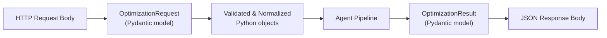

# Schemas & Validation

Pydantic request/response schemas and validation rules for the Portfolio Optimizer API.

## Section Contents

| Page | Description |
|------|-------------|
| [Request Schemas](request-schemas.md) | `OptimizationRequest` and all nested input models |
| [Response Schemas](response-schemas.md) | `OptimizationResult` and all nested output models |
| [Validation Rules](validation-rules.md) | Field validators, business rules, and constraint bounds |

## Schema Overview

The Portfolio Optimizer uses **Pydantic v2** for all request and response validation. Schemas serve as the contract between the API and its clients, and are also used to generate OpenAPI documentation automatically.

## Key Models

| Model | Direction | Description |
|-------|-----------|-------------|
| `OptimizationRequest` | Input | Tickers, budget, constraints, flags |
| `ConstraintConfig` | Input (nested) | Weight bounds, sector limits, risk parameters |
| `OptimizationResult` | Output | Run ID, status, solver results, explanation |
| `SolverResult` | Output (nested) | Weights, Sharpe ratio, volatility, return |
| `ComparisonTable` | Output (nested) | Side-by-side solver metrics |
| `FrontierPoint` | Output (nested) | Single point on the efficient frontier |
| `ProgressEvent` | WebSocket | Real-time progress update |

## Cross-References

- **API endpoint** → [Optimize Endpoint](../04-api-reference/optimize-endpoint.md)
- **WebSocket events** → [WebSocket Endpoint](../04-api-reference/websocket-endpoint.md)
- **Frontend TypeScript types** → [Type Definitions](../11-frontend/type-definitions.md)
- **Validation in agent** → [Node: Constraint Validation](../05-agent-layer/node-constraint-validation.md)
