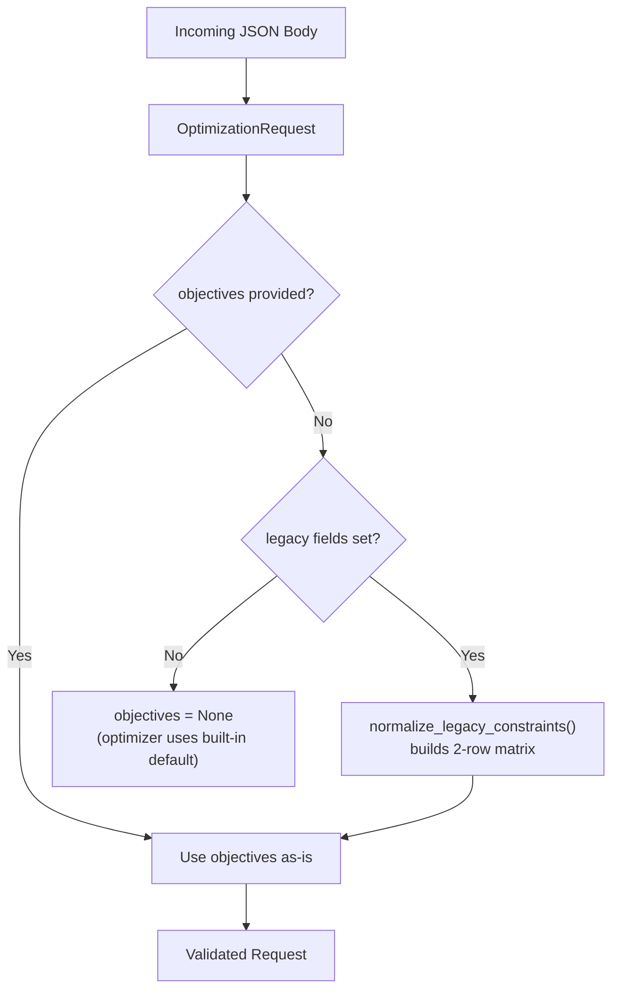
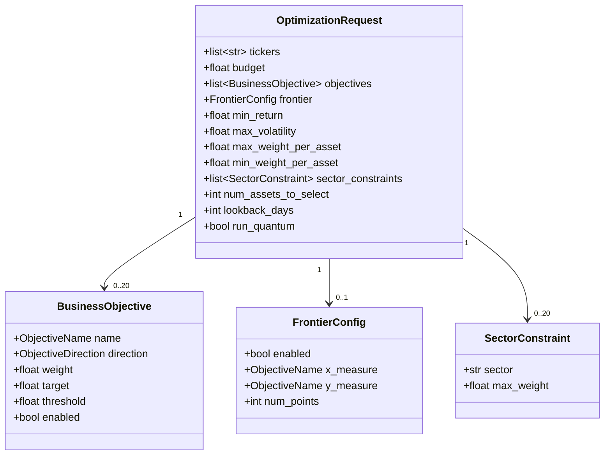

# Request Schemas

This page documents all Pydantic v2 request schemas used by the Portfolio Optimizer API.
These models live in `backend/app/schemas/requests.py` and are used by FastAPI to parse,
validate, and coerce incoming JSON request bodies before they reach any business logic.

## Overview

The request schema layer has two generations of API:

- **Legacy API** — scalar fields `min_return` and `max_volatility` (still accepted, auto-normalized)
- **Multi-objective API** — the `objectives` matrix and `frontier` configuration (current)

When a client sends only legacy fields, the `normalize_legacy_constraints()` model validator
automatically converts them into the unified multi-objective representation so the rest of
the pipeline always operates on the same data structure.



---

## Type Aliases

### `ObjectiveName`

A `Literal` type alias constraining the set of valid business-objective measure names:

```python
ObjectiveName = Literal[
    "return",
    "volatility",
    "sharpe",
    "max_drawdown",
    "diversification_hhi",
    "esg_score",
    "sector_concentration",
]
```

These names match the keys used by the classical optimizer's scalarization layer
(`backend/app/classical/optimizer.py`) and the frontier sweep module
(`backend/app/classical/frontier.py`). Adding a new measure requires a corresponding
implementation in both places.

### `ObjectiveDirection`

```python
ObjectiveDirection = Literal["maximize", "minimize"]
```

Specifies whether the optimizer should maximize or minimize a given objective measure.

---

## `BusinessObjective`

**Source:** `backend/app/schemas/requests.py`

A single row in the multi-objective optimization matrix. Each row represents one
user-selected business goal with its direction, relative importance, and optional
hard constraints.

### Fields

| Field | Type | Required | Default | Description |
|-------|------|----------|---------|-------------|
| `name` | `ObjectiveName` | ✅ | — | Canonical measure name (one of the 7 supported objectives) |
| `direction` | `ObjectiveDirection` | ✅ | — | Whether to maximize or minimize this measure |
| `weight` | `float` | ✅ | — | Relative importance in the scalarized composite (0.0–1.0) |
| `target` | `float \| None` | ❌ | `None` | Optional soft anchor used in LLM commentary and frontier knee-point labels |
| `threshold` | `float \| None` | ❌ | `None` | Optional hard limit enforced as a constraint |
| `enabled` | `bool` | ❌ | `True` | When `False`, the row is ignored by the optimizer but retained in the payload |

### Field Validation

- **`weight`**: Must be in `[0.0, 1.0]` (inclusive). Values outside this range raise a `ValidationError`.
- **`name`**: Must be one of the 7 canonical `ObjectiveName` literals. Any other string raises a `ValidationError`.
- **`direction`**: Must be `"maximize"` or `"minimize"`. Any other string raises a `ValidationError`.

### Threshold Semantics

The `threshold` field enforces a hard constraint in the optimizer:

- For `"maximize"` objectives: the portfolio value must be **≥ threshold**
- For `"minimize"` objectives: the portfolio value must be **≤ threshold**

The `target` field is softer — it is used only as a reference value in LLM-generated
commentary and frontier knee-point annotations, not as a hard constraint.

### Example

```python
from app.schemas.requests import BusinessObjective

# Maximize return with a minimum threshold of 8%
obj = BusinessObjective(
    name="return",
    direction="maximize",
    weight=0.6,
    target=0.12,       # soft anchor: "aim for 12%"
    threshold=0.08,    # hard floor: "must be at least 8%"
    enabled=True,
)

# Minimize volatility — disabled for this run but kept in payload
obj_disabled = BusinessObjective(
    name="volatility",
    direction="minimize",
    weight=0.4,
    enabled=False,
)
```

---

## `FrontierConfig`

**Source:** `backend/app/schemas/requests.py`

Configuration for the efficient-frontier sweep. When `enabled` is `True`, the backend
executes an epsilon-constraint sweep across `num_points` levels of the `y_measure`,
minimizing (or maximizing) the `x_measure` at each level to produce a Pareto-efficient
frontier between the two measures.

### Fields

| Field | Type | Required | Default | Constraints | Description |
|-------|------|----------|---------|-------------|-------------|
| `enabled` | `bool` | ❌ | `False` | — | Whether to compute and return an efficient frontier |
| `x_measure` | `ObjectiveName` | ❌ | `"volatility"` | — | Measure plotted on the X-axis |
| `y_measure` | `ObjectiveName` | ❌ | `"return"` | — | Measure plotted on the Y-axis |
| `num_points` | `int` | ❌ | `25` | `ge=5`, `le=100` | Number of parametric solves to trace the frontier |

### `validate_distinct_axes` Validator

A `@model_validator(mode="after")` ensures that `x_measure` and `y_measure` are
**different** when `enabled=True`. If both axes are the same measure, a `ValidationError`
is raised with the message:

```
Frontier x_measure and y_measure must be different (both are '<measure>').
```

> **Note:** When `enabled=False`, the validator does not fire — identical axes are
> silently accepted. This allows UI round-trips where the frontier config is preserved
> in the payload even when the sweep is disabled.

### Example

```python
from app.schemas.requests import FrontierConfig

# Standard risk-return frontier
frontier = FrontierConfig(
    enabled=True,
    x_measure="volatility",
    y_measure="return",
    num_points=25,
)

# ESG vs return frontier with higher resolution
esg_frontier = FrontierConfig(
    enabled=True,
    x_measure="esg_score",
    y_measure="return",
    num_points=50,
)

# This raises ValidationError — same axis on both sides
# FrontierConfig(enabled=True, x_measure="return", y_measure="return")
```

---

## `SectorConstraint`

**Source:** `backend/app/schemas/requests.py`

A maximum allocation constraint for a specific market sector. Used to prevent
over-concentration in any single sector.

### Fields

| Field | Type | Required | Constraints | Description |
|-------|------|----------|-------------|-------------|
| `sector` | `str` | ✅ | `min_length=1`, `max_length=100` | Sector name (e.g., `"Technology"`, `"Healthcare"`) |
| `max_weight` | `float` | ✅ | `ge=0.0`, `le=1.0` | Maximum allocation fraction for this sector |

### Example

```python
from app.schemas.requests import SectorConstraint

# Limit Technology sector to 60% of portfolio
tech_constraint = SectorConstraint(
    sector="Technology",
    max_weight=0.60,
)

# Limit Healthcare to 25%
health_constraint = SectorConstraint(
    sector="Healthcare",
    max_weight=0.25,
)
```

---

## `OptimizationRequest`

**Source:** `backend/app/schemas/requests.py`

The main request body for `POST /api/v1/optimize`. This is the top-level schema that
combines all portfolio universe, budget, constraint, and objective configuration.

### Fields

#### Core Fields

| Field | Type | Required | Default | Constraints | Description |
|-------|------|----------|---------|-------------|-------------|
| `tickers` | `list[str]` | ✅ | — | `min_length=2`, `max_length=50` | Ticker symbols to include in the optimization universe |
| `budget` | `float` | ✅ | — | `gt=0.0`, `le=1_000_000_000.0` | Total investment budget in USD |

#### Multi-Objective Fields (Current API)

| Field | Type | Required | Default | Constraints | Description |
|-------|------|----------|---------|-------------|-------------|
| `objectives` | `list[BusinessObjective] \| None` | ❌ | `None` | `max_length=20` | Multi-objective matrix; auto-built from legacy fields if omitted |
| `frontier` | `FrontierConfig \| None` | ❌ | `None` | — | Optional efficient-frontier sweep configuration |

#### Legacy Scalar Fields (Deprecated)

| Field | Type | Required | Default | Constraints | Description |
|-------|------|----------|---------|-------------|-------------|
| `min_return` | `float \| None` | ❌ | `None` | `ge=0.0`, `le=5.0` | **Deprecated** — use `objectives` instead. Minimum annualized return |
| `max_volatility` | `float \| None` | ❌ | `None` | `ge=0.0`, `le=5.0` | **Deprecated** — use `objectives` instead. Maximum annualized volatility |

#### Constraint Fields

| Field | Type | Required | Default | Constraints | Description |
|-------|------|----------|---------|-------------|-------------|
| `max_weight_per_asset` | `float \| None` | ❌ | `None` | `ge=0.0`, `le=1.0` | Maximum weight for any single asset |
| `min_weight_per_asset` | `float \| None` | ❌ | `None` | `ge=0.0`, `le=1.0` | Minimum weight for any included asset |
| `sector_constraints` | `list[SectorConstraint] \| None` | ❌ | `None` | `max_length=20` | Sector-level maximum allocation constraints |
| `num_assets_to_select` | `int \| None` | ❌ | `None` | `ge=2`, `le=50` | Number of assets to select (used in QUBO formulation) |
| `lookback_days` | `int` | ❌ | `365` | `ge=30`, `le=3650` | Historical data lookback period in calendar days |
| `run_quantum` | `bool` | ❌ | `True` | — | Whether to run quantum optimization (QAOA + VQE) in addition to classical |

### Validators

The `OptimizationRequest` model has four validators that run after field-level validation:

#### 1. `validate_tickers` (`@field_validator`)

Normalizes ticker symbols to uppercase, strips whitespace, removes duplicates, and
enforces a maximum length of 10 characters per symbol:

```python
@field_validator("tickers")
@classmethod
def validate_tickers(cls, v: list[str]) -> list[str]:
    seen: set[str] = set()
    result: list[str] = []
    for ticker in v:
        normalised = ticker.strip().upper()
        if not normalised:
            raise ValueError("Ticker symbols cannot be empty strings")
        if len(normalised) > 10:
            raise ValueError(
                f"Ticker '{normalised}' exceeds maximum length of 10 characters"
            )
        if normalised not in seen:
            seen.add(normalised)
            result.append(normalised)
    return result
```

**Behavior:**
- `["aapl", "MSFT", "aapl"]` → `["AAPL", "MSFT"]` (uppercased, deduplicated)
- `["TOOLONGTICKERXYZ"]` → `ValidationError` (exceeds 10 chars)
- `[""]` → `ValidationError` (empty string)

#### 2. `validate_weight_constraints` (`@model_validator`)

Ensures `min_weight_per_asset` is strictly less than `max_weight_per_asset` when both
are provided:

```python
@model_validator(mode="after")
def validate_weight_constraints(self) -> OptimizationRequest:
    if (
        self.min_weight_per_asset is not None
        and self.max_weight_per_asset is not None
        and self.min_weight_per_asset >= self.max_weight_per_asset
    ):
        raise ValueError(
            "min_weight_per_asset must be strictly less than max_weight_per_asset"
        )
    return self
```

#### 3. `validate_num_assets_vs_tickers` (`@model_validator`)

Ensures `num_assets_to_select` does not exceed the number of tickers in the universe:

```python
@model_validator(mode="after")
def validate_num_assets_vs_tickers(self) -> OptimizationRequest:
    if (
        self.num_assets_to_select is not None
        and self.num_assets_to_select > len(self.tickers)
    ):
        raise ValueError(
            f"num_assets_to_select ({self.num_assets_to_select}) cannot exceed "
            f"the number of tickers ({len(self.tickers)})"
        )
    return self
```

#### 4. `validate_objectives_weights_sum` (`@model_validator`)

Validates the `objectives` list when provided:

- **Duplicate names** — raises `ValidationError` if two objectives share the same `name`
- **All disabled** — raises `ValidationError` if every objective has `enabled=False`
- **Zero weight sum** — raises `ValidationError` if the sum of enabled weights is `≤ 0`
- **Over-budget sum** — raises `ValidationError` if the sum substantially exceeds `1.0` (tolerance: `1e-6`)

```python
@model_validator(mode="after")
def validate_objectives_weights_sum(self) -> OptimizationRequest:
    if self.objectives is None:
        return self
    names = [o.name for o in self.objectives]
    if len(names) != len(set(names)):
        duplicates = sorted({n for n in names if names.count(n) > 1})
        raise ValueError(f"Duplicate objective names are not allowed: {', '.join(duplicates)}")
    enabled = [o for o in self.objectives if o.enabled]
    if not enabled:
        raise ValueError("At least one objective must be enabled when `objectives` is provided.")
    total = sum(o.weight for o in enabled)
    if total <= 0.0:
        raise ValueError("Sum of enabled objective weights must be greater than 0.")
    if total > 1.0 + 1e-6:
        raise ValueError(
            f"Sum of enabled objective weights must be ≤ 1.0 (got {total:.4f}). "
            "Weights will be auto-normalised server-side if you wish to express relative priorities."
        )
    return self
```

> **Tip:** A tiny floating-point overshoot (e.g., `1.0000001`) is tolerated — the
> optimizer normalizes weights downstream. Only substantially over-budget sums (e.g.,
> three objectives each with `weight=0.9`) are rejected.

### `normalize_legacy_constraints()`

**Source:** `backend/app/schemas/requests.py`

This `@model_validator(mode="after")` runs last and handles backward compatibility.
When no `objectives` matrix is provided but at least one of `min_return` or
`max_volatility` is set, it synthesizes a balanced two-row objectives matrix:

```python
@model_validator(mode="after")
def normalize_legacy_constraints(self) -> OptimizationRequest:
    if self.objectives is not None:
        return self
    if self.min_return is None and self.max_volatility is None:
        return self  # leave objectives as None

    legacy: list[BusinessObjective] = [
        BusinessObjective(
            name="return",
            direction="maximize",
            weight=0.5,
            target=self.min_return,
            threshold=self.min_return,
            enabled=True,
        ),
        BusinessObjective(
            name="volatility",
            direction="minimize",
            weight=0.5,
            target=self.max_volatility,
            threshold=self.max_volatility,
            enabled=True,
        ),
    ]
    self.objectives = legacy
    return self
```

**Behavior:**
- `min_return=0.08` → creates a `"return"` objective with `threshold=0.08` and `weight=0.5`
- `max_volatility=0.20` → creates a `"volatility"` objective with `threshold=0.20` and `weight=0.5`
- Both legacy fields set → creates both rows with equal weights (0.5 / 0.5)
- Neither legacy field set → `objectives` remains `None`; the optimizer uses its built-in default

### `model_config`

The `OptimizationRequest` model includes a `json_schema_extra` example that is surfaced
in the OpenAPI documentation:

```python
model_config = {
    "json_schema_extra": {
        "example": {
            "tickers": ["AAPL", "MSFT", "GOOGL", "AMZN", "NVDA"],
            "budget": 100000.0,
            "objectives": [
                {"name": "return", "direction": "maximize", "weight": 0.5,
                 "target": 0.12, "threshold": 0.08, "enabled": True},
                {"name": "volatility", "direction": "minimize", "weight": 0.3,
                 "target": 0.18, "threshold": 0.25, "enabled": True},
                {"name": "diversification_hhi", "direction": "minimize", "weight": 0.2,
                 "target": None, "threshold": None, "enabled": True},
            ],
            "frontier": {
                "enabled": True,
                "x_measure": "volatility",
                "y_measure": "return",
                "num_points": 25,
            },
            "max_weight_per_asset": 0.4,
            "sector_constraints": [{"sector": "Technology", "max_weight": 0.6}],
            "num_assets_to_select": 3,
            "lookback_days": 365,
            "run_quantum": True,
        }
    }
}
```

### Complete Request Example

```json
{
  "tickers": ["AAPL", "MSFT", "GOOGL", "AMZN", "NVDA"],
  "budget": 100000.0,
  "objectives": [
    {
      "name": "return",
      "direction": "maximize",
      "weight": 0.5,
      "target": 0.12,
      "threshold": 0.08,
      "enabled": true
    },
    {
      "name": "volatility",
      "direction": "minimize",
      "weight": 0.3,
      "target": 0.18,
      "threshold": 0.25,
      "enabled": true
    },
    {
      "name": "diversification_hhi",
      "direction": "minimize",
      "weight": 0.2,
      "enabled": true
    }
  ],
  "frontier": {
    "enabled": true,
    "x_measure": "volatility",
    "y_measure": "return",
    "num_points": 25
  },
  "max_weight_per_asset": 0.4,
  "sector_constraints": [
    {"sector": "Technology", "max_weight": 0.6}
  ],
  "num_assets_to_select": 3,
  "lookback_days": 365,
  "run_quantum": true
}
```

### Legacy Request Example (Backward Compatible)

```json
{
  "tickers": ["AAPL", "MSFT", "GOOGL"],
  "budget": 50000.0,
  "min_return": 0.08,
  "max_volatility": 0.20,
  "max_weight_per_asset": 0.4,
  "lookback_days": 252
}
```

This is automatically normalized to an `objectives` matrix with two rows (return/maximize
and volatility/minimize, each with `weight=0.5`) before reaching the optimizer.

---

## Schema Relationships



---

## See Also

- [Response Schemas](response-schemas.md) — output models returned by the API
- [Validation Rules](validation-rules.md) — detailed validator behavior and error messages
- [Optimize Endpoint](../04-api-reference/optimize-endpoint.md) — how these schemas are used in the API
- [Multi-Objective Optimization](../06-classical-optimization/multi-objective.md) — how objectives are processed
- [Efficient Frontier](../06-classical-optimization/efficient-frontier.md) — how `FrontierConfig` drives the sweep
