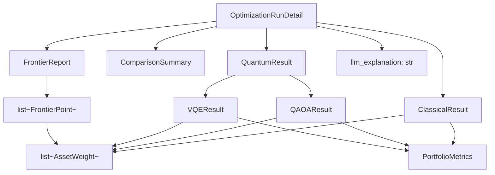
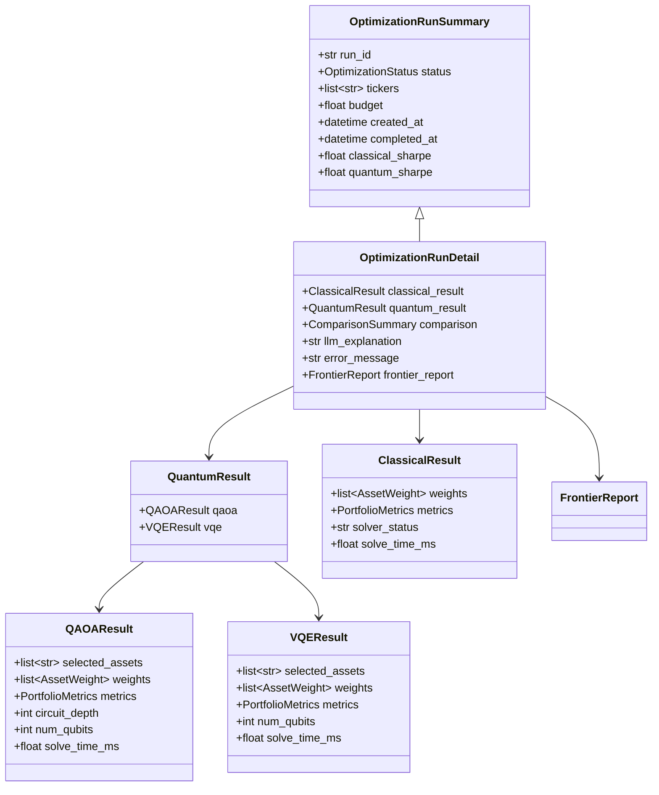

# Response Schemas

This page documents all Pydantic v2 response schemas returned by the Portfolio Optimizer API.
These models live in `backend/app/schemas/responses.py` and define the JSON structure of
every API response. They mirror the TypeScript types in `frontend/src/types/api.ts`.

## Overview

Response schemas are organized into three layers:

1. **Shared sub-models** — reusable building blocks (`AssetWeight`, `PortfolioMetrics`)
2. **Solver result models** — output from each optimizer (`ClassicalResult`, `QAOAResult`, `VQEResult`)
3. **Run lifecycle models** — API-level responses for run management



---

## Type Aliases

### `OptimizationStatus`

```python
OptimizationStatus = Literal["pending", "running", "completed", "failed"]
```

The lifecycle status of an optimization run. Used in `RunStatusResponse`,
`OptimizationRunSummary`, and `OptimizationRunDetail`.

### `FrontierMeasureName`

```python
FrontierMeasureName = Literal[
    "return",
    "volatility",
    "sharpe",
    "max_drawdown",
    "diversification_hhi",
    "esg_score",
    "sector_concentration",
]
```

The set of valid measure names for frontier axes. Mirrors `ObjectiveName` from the
request schemas.

---

## Shared Sub-Models

### `AssetWeight`

**Source:** `backend/app/schemas/responses.py`

Weight and dollar allocation for a single asset in a portfolio. Used across all
solver result types and frontier point payloads.

| Field | Type | Constraints | Description |
|-------|------|-------------|-------------|
| `ticker` | `str` | — | Ticker symbol (uppercase) |
| `weight` | `float` | `ge=0.0`, `le=1.0` | Portfolio weight fraction |
| `allocation` | `float` | `ge=0.0` | Dollar amount allocated to this asset |
| `sector` | `str \| None` | — | GICS sector name (optional) |

```python
from app.schemas.responses import AssetWeight

weight = AssetWeight(
    ticker="AAPL",
    weight=0.35,
    allocation=35000.0,
    sector="Information Technology",
)
```

### `PortfolioMetrics`

**Source:** `backend/app/schemas/responses.py`

Key performance metrics for a portfolio. Returned by all solver types.

| Field | Type | Description |
|-------|------|-------------|
| `expected_return` | `float` | Annualized expected return |
| `volatility` | `float` | Annualized volatility (standard deviation) |
| `sharpe_ratio` | `float` | Sharpe ratio (return / volatility, assuming zero risk-free rate) |
| `max_drawdown` | `float \| None` | Maximum drawdown (negative value, e.g., `-0.15` = 15% drawdown) |
| `num_assets` | `int` | Number of assets with non-zero weight in the portfolio |

```python
from app.schemas.responses import PortfolioMetrics

metrics = PortfolioMetrics(
    expected_return=0.142,
    volatility=0.187,
    sharpe_ratio=0.759,
    max_drawdown=-0.12,
    num_assets=4,
)
```

---

## Solver Result Models

### `ClassicalResult`

**Source:** `backend/app/schemas/responses.py`

Result from the Markowitz Mean-Variance Optimization (MVO) classical optimizer.

| Field | Type | Description |
|-------|------|-------------|
| `weights` | `list[AssetWeight]` | Per-asset weights and dollar allocations |
| `metrics` | `PortfolioMetrics` | Portfolio performance metrics |
| `solver_status` | `str` | CVXPY solver status string (e.g., `"optimal"`, `"optimal_inaccurate"`) |
| `solve_time_ms` | `float` | Wall-clock time for the CVXPY solve in milliseconds |

```python
from app.schemas.responses import ClassicalResult, AssetWeight, PortfolioMetrics

result = ClassicalResult(
    weights=[
        AssetWeight(ticker="AAPL", weight=0.35, allocation=35000.0),
        AssetWeight(ticker="MSFT", weight=0.30, allocation=30000.0),
        AssetWeight(ticker="GOOGL", weight=0.35, allocation=35000.0),
    ],
    metrics=PortfolioMetrics(
        expected_return=0.142,
        volatility=0.187,
        sharpe_ratio=0.759,
        num_assets=3,
    ),
    solver_status="optimal",
    solve_time_ms=45.3,
)
```

### `QAOAResult`

**Source:** `backend/app/schemas/responses.py`

Result from the QAOA (Quantum Approximate Optimization Algorithm) solver, implemented
using Qiskit. See [QAOA Solver](../07-quantum-optimization/qaoa-solver.md) for details.

| Field | Type | Description |
|-------|------|-------------|
| `selected_assets` | `list[str]` | Ticker symbols selected by the QUBO bitstring solution |
| `weights` | `list[AssetWeight]` | Per-asset weights (equal-weighted among selected assets) |
| `metrics` | `PortfolioMetrics` | Portfolio performance metrics |
| `circuit_depth` | `int` | Depth of the QAOA quantum circuit |
| `num_qubits` | `int` | Number of qubits used (equals number of candidate assets) |
| `solve_time_ms` | `float` | Wall-clock time for the QAOA solve in milliseconds |

```python
from app.schemas.responses import QAOAResult

qaoa = QAOAResult(
    selected_assets=["AAPL", "MSFT", "NVDA"],
    weights=[
        AssetWeight(ticker="AAPL", weight=0.333, allocation=33300.0),
        AssetWeight(ticker="MSFT", weight=0.333, allocation=33300.0),
        AssetWeight(ticker="NVDA", weight=0.334, allocation=33400.0),
    ],
    metrics=PortfolioMetrics(
        expected_return=0.158,
        volatility=0.210,
        sharpe_ratio=0.752,
        num_assets=3,
    ),
    circuit_depth=12,
    num_qubits=5,
    solve_time_ms=1240.0,
)
```

### `VQEResult`

**Source:** `backend/app/schemas/responses.py`

Result from the VQE (Variational Quantum Eigensolver) solver, implemented using
PennyLane. See [VQE Solver](../07-quantum-optimization/vqe-solver.md) for details.

| Field | Type | Description |
|-------|------|-------------|
| `selected_assets` | `list[str]` | Ticker symbols selected by the VQE solution |
| `weights` | `list[AssetWeight]` | Per-asset weights |
| `metrics` | `PortfolioMetrics` | Portfolio performance metrics |
| `num_qubits` | `int` | Number of qubits used |
| `solve_time_ms` | `float` | Wall-clock time for the VQE solve in milliseconds |

> **Note:** `VQEResult` does not include `circuit_depth` (unlike `QAOAResult`) because
> the VQE ansatz depth is determined by the `vqe_layers` hyperparameter rather than
> being a fixed property of the circuit.

### `QuantumResult`

**Source:** `backend/app/schemas/responses.py`

Combined quantum optimization results container. Both fields are optional because
either solver may be disabled or may fail independently.

| Field | Type | Default | Description |
|-------|------|---------|-------------|
| `qaoa` | `QAOAResult \| None` | `None` | QAOA solver result (null if not run or failed) |
| `vqe` | `VQEResult \| None` | `None` | VQE solver result (null if not run or failed) |

```python
from app.schemas.responses import QuantumResult

# Both solvers ran
quantum = QuantumResult(qaoa=qaoa_result, vqe=vqe_result)

# Only QAOA ran (VQE disabled or failed)
quantum_qaoa_only = QuantumResult(qaoa=qaoa_result, vqe=None)
```

---

## `ComparisonSummary`

**Source:** `backend/app/schemas/responses.py`

Side-by-side comparison of classical vs quantum results. All numeric fields are
optional because they require both a classical result and the corresponding quantum
result to be present.

| Field | Type | Default | Description |
|-------|------|---------|-------------|
| `sharpe_improvement_qaoa` | `float \| None` | `None` | QAOA Sharpe ratio minus classical Sharpe ratio |
| `sharpe_improvement_vqe` | `float \| None` | `None` | VQE Sharpe ratio minus classical Sharpe ratio |
| `return_diff_qaoa` | `float \| None` | `None` | QAOA expected return minus classical expected return |
| `return_diff_vqe` | `float \| None` | `None` | VQE expected return minus classical expected return |
| `volatility_diff_qaoa` | `float \| None` | `None` | QAOA volatility minus classical volatility |
| `volatility_diff_vqe` | `float \| None` | `None` | VQE volatility minus classical volatility |
| `recommendation` | `str` | — | Human-readable recommendation string (always present) |

```python
from app.schemas.responses import ComparisonSummary

comparison = ComparisonSummary(
    sharpe_improvement_qaoa=0.043,
    sharpe_improvement_vqe=-0.012,
    return_diff_qaoa=0.016,
    return_diff_vqe=-0.003,
    volatility_diff_qaoa=0.008,
    volatility_diff_vqe=0.002,
    recommendation="QAOA outperforms classical on Sharpe ratio by 4.3%. "
                   "Consider QAOA for this portfolio.",
)
```

---

## Efficient Frontier Models

### `FrontierPoint`

**Source:** `backend/app/schemas/responses.py`

A single sample on the efficient frontier. Each point corresponds to one parametric
solve of the multi-objective problem at a fixed level of the Y-measure.

| Field | Type | Default | Description |
|-------|------|---------|-------------|
| `x` | `float` | — | Value of the X-axis measure at this point |
| `y` | `float` | — | Value of the Y-axis measure at this point |
| `sharpe` | `float` | — | Sharpe ratio (always populated for ranking and tooltips) |
| `weights` | `list[AssetWeight]` | `[]` | Full asset allocation for this frontier portfolio |
| `is_dominant` | `bool` | `True` | `True` when the point is Pareto-efficient |
| `is_knee` | `bool` | `False` | `True` for the algorithmically chosen knee point |
| `solver_status` | `str` | `"optimal"` | CVXPY solver status for traceability |

The `weights` payload allows the UI to surface the full allocation when a user clicks
on a frontier point — no additional server round-trip is needed.

**Dominance:** A point is Pareto-dominant if no other point achieves a better value
on both axes simultaneously. Dominated points are included in the response for
completeness but are visually distinguished in the UI.

**Knee point:** The knee is the point of maximum curvature on the frontier — the
portfolio that offers the best trade-off between the two measures. It is identified
algorithmically using the maximum-curvature method.

```python
from app.schemas.responses import FrontierPoint, AssetWeight

point = FrontierPoint(
    x=0.187,   # volatility
    y=0.142,   # return
    sharpe=0.759,
    weights=[
        AssetWeight(ticker="AAPL", weight=0.35, allocation=35000.0),
        AssetWeight(ticker="MSFT", weight=0.30, allocation=30000.0),
        AssetWeight(ticker="GOOGL", weight=0.35, allocation=35000.0),
    ],
    is_dominant=True,
    is_knee=True,
    solver_status="optimal",
)
```

### `FrontierReport`

**Source:** `backend/app/schemas/responses.py`

The full bundle returned by the frontier sweep node. Contains everything the UI needs
to render the chart, table, export button, and LLM commentary without further server
round-trips.

| Field | Type | Default | Description |
|-------|------|---------|-------------|
| `x_measure` | `FrontierMeasureName` | — | Canonical name of the X-axis measure |
| `y_measure` | `FrontierMeasureName` | — | Canonical name of the Y-axis measure |
| `x_direction` | `Literal["maximize", "minimize"]` | — | Optimization direction for the X measure |
| `y_direction` | `Literal["maximize", "minimize"]` | — | Optimization direction for the Y measure |
| `points` | `list[FrontierPoint]` | — | All sampled points (dominant + dominated) |
| `knee_point_index` | `int \| None` | `None` | Index into `points` of the chosen knee portfolio |
| `max_sharpe_index` | `int \| None` | `None` | Index of the max-Sharpe reference portfolio |
| `min_risk_index` | `int \| None` | `None` | Index of the minimum-risk reference portfolio |
| `num_dominant` | `int` | `0` | Number of Pareto-dominant points |
| `num_dominated` | `int` | `0` | Number of dominated points |
| `solve_time_ms` | `float` | `0.0` | Total wall-clock time for the frontier sweep |
| `commentary` | `str \| None` | `None` | LLM-generated natural-language summary of the frontier |

```python
from app.schemas.responses import FrontierReport, FrontierPoint

report = FrontierReport(
    x_measure="volatility",
    y_measure="return",
    x_direction="minimize",
    y_direction="maximize",
    points=[...],  # list of FrontierPoint
    knee_point_index=12,
    max_sharpe_index=15,
    min_risk_index=0,
    num_dominant=22,
    num_dominated=3,
    solve_time_ms=3420.0,
    commentary="The efficient frontier shows a clear knee at ~18.7% volatility "
               "with 14.2% expected return. The max-Sharpe portfolio sits at "
               "19.1% volatility with 15.8% return.",
)
```

---

## Run Lifecycle Models

### `OptimizationSubmitResponse`

**Source:** `backend/app/schemas/responses.py`

Response for `POST /api/v1/optimize`. Returns immediately after the run is submitted
to the Celery task queue.

| Field | Type | Description |
|-------|------|-------------|
| `run_id` | `str` | UUID of the submitted optimization run |

```json
{
  "run_id": "550e8400-e29b-41d4-a716-446655440000"
}
```

### `RunStatusResponse`

**Source:** `backend/app/schemas/responses.py`

Lightweight status response for `GET /api/v1/runs/{run_id}/status`. Returns only
lifecycle fields without the full result payload, making it suitable for efficient
polling from the frontend.

| Field | Type | Default | Description |
|-------|------|---------|-------------|
| `run_id` | `str` | — | UUID of the optimization run |
| `status` | `OptimizationStatus` | — | Current lifecycle status |
| `created_at` | `datetime` | — | UTC timestamp when the run was submitted |
| `completed_at` | `datetime \| None` | `None` | UTC timestamp when the run finished (null if still in progress) |

```json
{
  "run_id": "550e8400-e29b-41d4-a716-446655440000",
  "status": "running",
  "created_at": "2026-06-15T10:30:00Z",
  "completed_at": null
}
```

### `OptimizationRunSummary`

**Source:** `backend/app/schemas/responses.py`

Summary row for the run history list. Used in paginated list responses.
Configured with `model_config = ConfigDict(from_attributes=True)` to support
direct construction from SQLAlchemy ORM objects.

| Field | Type | Default | Description |
|-------|------|---------|-------------|
| `run_id` | `str` | — | UUID of the optimization run |
| `status` | `OptimizationStatus` | — | Current lifecycle status |
| `tickers` | `list[str]` | — | Ticker symbols in the optimization universe |
| `budget` | `float` | — | Total investment budget in USD |
| `created_at` | `datetime` | — | UTC timestamp when the run was submitted |
| `completed_at` | `datetime \| None` | `None` | UTC timestamp when the run finished |
| `classical_sharpe` | `float \| None` | `None` | Sharpe ratio from the classical optimizer |
| `quantum_sharpe` | `float \| None` | `None` | Best Sharpe ratio from quantum solvers |

```json
{
  "run_id": "550e8400-e29b-41d4-a716-446655440000",
  "status": "completed",
  "tickers": ["AAPL", "MSFT", "GOOGL"],
  "budget": 100000.0,
  "created_at": "2026-06-15T10:30:00Z",
  "completed_at": "2026-06-15T10:30:45Z",
  "classical_sharpe": 0.759,
  "quantum_sharpe": 0.802
}
```

### `OptimizationRunDetail`

**Source:** `backend/app/schemas/responses.py`

Full detail of a completed optimization run. Extends `OptimizationRunSummary` with
all result payloads. Returned by `GET /api/v1/runs/{run_id}`.

Inherits all fields from `OptimizationRunSummary`, plus:

| Field | Type | Default | Description |
|-------|------|---------|-------------|
| `classical_result` | `ClassicalResult \| None` | `None` | Full classical optimizer result |
| `quantum_result` | `QuantumResult \| None` | `None` | Full quantum optimizer results |
| `comparison` | `ComparisonSummary \| None` | `None` | Classical vs quantum comparison |
| `llm_explanation` | `str \| None` | `None` | LLM-generated natural-language explanation |
| `error_message` | `str \| None` | `None` | Error message if the run failed |
| `frontier_report` | `FrontierReport \| None` | `None` | Efficient-frontier report (only when `frontier.enabled=True`) |

> **Backward compatibility:** The `frontier_report` field defaults to `None`, so
> existing database rows (where `frontier_report` is `NULL`) deserialize cleanly
> without any migration.

### `PaginatedRunsResponse`

**Source:** `backend/app/schemas/responses.py`

Paginated list of optimization run summaries. Returned by `GET /api/v1/runs`.

| Field | Type | Description |
|-------|------|-------------|
| `items` | `list[OptimizationRunSummary]` | Run summaries for the current page |
| `total` | `int` | Total number of runs matching the query |
| `page` | `int` | Current page number (1-based) |
| `page_size` | `int` | Number of items per page |

```json
{
  "items": [...],
  "total": 42,
  "page": 1,
  "page_size": 20
}
```

---

## Additional Response Models

### `AssetSearchResult`

**Source:** `backend/app/schemas/responses.py`

Single asset search result. Returned by `GET /api/v1/assets`.

| Field | Type | Default | Description |
|-------|------|---------|-------------|
| `ticker` | `str` | — | Ticker symbol |
| `name` | `str` | — | Company or fund name |
| `sector` | `str \| None` | `None` | GICS sector |
| `exchange` | `str \| None` | `None` | Exchange where the asset is listed |

### `ServiceStatus`

**Source:** `backend/app/schemas/responses.py`

Status of individual backend services. Used within `HealthResponse`.

| Field | Type | Description |
|-------|------|-------------|
| `database` | `Literal["up", "down"]` | PostgreSQL connectivity |
| `redis` | `Literal["up", "down"]` | Redis connectivity |
| `celery` | `Literal["up", "down"]` | Celery worker availability |

### `HealthResponse`

**Source:** `backend/app/schemas/responses.py`

Response for `GET /api/v1/health`.

| Field | Type | Description |
|-------|------|-------------|
| `status` | `Literal["healthy", "degraded", "unhealthy"]` | Overall system health |
| `version` | `str` | Application version string |
| `services` | `ServiceStatus` | Per-service status breakdown |

---

## Schema Inheritance Diagram



---

## JSON Serialization Notes

All response models use Pydantic v2's default JSON serialization. Key behaviors:

- **`datetime` fields** are serialized as ISO 8601 strings with UTC timezone (e.g., `"2026-06-15T10:30:00Z"`)
- **`None` fields** are serialized as JSON `null`
- **`list` fields** are serialized as JSON arrays
- **`float` fields** use Python's default float-to-string conversion (no rounding)
- **`from_attributes=True`** on `OptimizationRunSummary` enables direct construction from SQLAlchemy ORM model instances

---

## See Also

- [Request Schemas](request-schemas.md) — input validation models
- [Validation Rules](validation-rules.md) — detailed validator behavior
- [Runs Endpoints](../04-api-reference/runs-endpoints.md) — API endpoints that return these schemas
- [Optimize Endpoint](../04-api-reference/optimize-endpoint.md) — the submit endpoint
- [Database Models](../09-database/README.md) — how results are persisted
