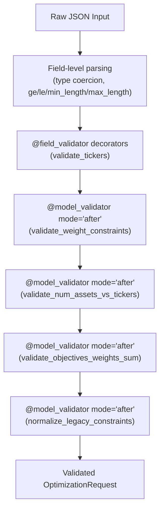

# Validation Rules

This page provides a comprehensive reference for all validation logic in the Portfolio
Optimizer's Pydantic v2 schemas. Validation is split between **field-level validators**
(applied to individual fields) and **model-level validators** (applied after all fields
are parsed, with access to the full model instance).

All validators are defined in `backend/app/schemas/requests.py`.

## Validation Architecture

Pydantic v2 runs validators in a specific order:



> **Note:** Multiple `@model_validator(mode="after")` decorators on the same class
> run in **definition order** (top to bottom in the source file). The
> `normalize_legacy_constraints` validator always runs last, ensuring it sees the
> final state of all other fields.

---

## Field-Level Constraints

These constraints are declared directly in `Field(...)` definitions and are enforced
by Pydantic before any custom validators run.

### `OptimizationRequest` Field Constraints

| Field | Constraint | Error Condition |
|-------|-----------|-----------------|
| `tickers` | `min_length=2` | Fewer than 2 tickers provided |
| `tickers` | `max_length=50` | More than 50 tickers provided |
| `budget` | `gt=0.0` | Budget is zero or negative |
| `budget` | `le=1_000_000_000.0` | Budget exceeds $1 billion |
| `objectives` | `max_length=20` | More than 20 objective rows |
| `min_return` | `ge=0.0` | Negative minimum return |
| `min_return` | `le=5.0` | Minimum return exceeds 500% |
| `max_volatility` | `ge=0.0` | Negative maximum volatility |
| `max_volatility` | `le=5.0` | Maximum volatility exceeds 500% |
| `max_weight_per_asset` | `ge=0.0`, `le=1.0` | Outside [0, 1] range |
| `min_weight_per_asset` | `ge=0.0`, `le=1.0` | Outside [0, 1] range |
| `sector_constraints` | `max_length=20` | More than 20 sector constraints |
| `num_assets_to_select` | `ge=2` | Fewer than 2 assets to select |
| `num_assets_to_select` | `le=50` | More than 50 assets to select |
| `lookback_days` | `ge=30` | Fewer than 30 days lookback |
| `lookback_days` | `le=3650` | More than 10 years lookback |

### `BusinessObjective` Field Constraints

| Field | Constraint | Error Condition |
|-------|-----------|-----------------|
| `name` | `Literal[...]` | Not one of the 7 canonical measure names |
| `direction` | `Literal["maximize", "minimize"]` | Not `"maximize"` or `"minimize"` |
| `weight` | `ge=0.0` | Negative weight |
| `weight` | `le=1.0` | Weight exceeds 1.0 |

### `FrontierConfig` Field Constraints

| Field | Constraint | Error Condition |
|-------|-----------|-----------------|
| `x_measure` | `ObjectiveName` | Not one of the 7 canonical measure names |
| `y_measure` | `ObjectiveName` | Not one of the 7 canonical measure names |
| `num_points` | `ge=5` | Fewer than 5 frontier points |
| `num_points` | `le=100` | More than 100 frontier points |

### `SectorConstraint` Field Constraints

| Field | Constraint | Error Condition |
|-------|-----------|-----------------|
| `sector` | `min_length=1` | Empty sector name |
| `sector` | `max_length=100` | Sector name exceeds 100 characters |
| `max_weight` | `ge=0.0`, `le=1.0` | Outside [0, 1] range |

---

## `@field_validator` — Ticker Normalization

**Validator:** `validate_tickers`  
**Applies to:** `OptimizationRequest.tickers`  
**Mode:** `@classmethod` (runs before model instantiation)

```python
@field_validator("tickers")
@classmethod
def validate_tickers(cls, v: list[str]) -> list[str]:
    """Normalise tickers to uppercase and remove duplicates."""
    seen: set[str] = set()
    result: list[str] = []
    for ticker in v:
        normalised = ticker.strip().upper()
        if not normalised:
            raise ValueError("Ticker symbols cannot be empty strings")
        if len(normalised) > 10:
            raise ValueError(
                f"Ticker '{normalised}' exceeds maximum length of 10 characters"
            )
        if normalised not in seen:
            seen.add(normalised)
            result.append(normalised)
    return result
```

### Behavior

| Input | Output | Notes |
|-------|--------|-------|
| `["aapl", "MSFT"]` | `["AAPL", "MSFT"]` | Uppercased |
| `["AAPL", "aapl", "MSFT"]` | `["AAPL", "MSFT"]` | Duplicate removed (case-insensitive) |
| `[" AAPL "]` | `["AAPL"]` | Whitespace stripped |
| `["TOOLONGTICKERXYZ"]` | `ValidationError` | Exceeds 10 characters |
| `[""]` | `ValidationError` | Empty string after stripping |
| `["AAPL", "MSFT"]` | `["AAPL", "MSFT"]` | Order preserved (first occurrence wins) |

### Error Messages

```
ValueError: Ticker symbols cannot be empty strings
ValueError: Ticker 'TOOLONGTICKERXYZ' exceeds maximum length of 10 characters
```

---

## `@model_validator` — Weight Constraint Ordering

**Validator:** `validate_weight_constraints`  
**Applies to:** `OptimizationRequest`  
**Mode:** `mode="after"` (runs after all fields are parsed)

```python
@model_validator(mode="after")
def validate_weight_constraints(self) -> OptimizationRequest:
    """Ensure min_weight < max_weight when both are specified."""
    if (
        self.min_weight_per_asset is not None
        and self.max_weight_per_asset is not None
        and self.min_weight_per_asset >= self.max_weight_per_asset
    ):
        raise ValueError(
            "min_weight_per_asset must be strictly less than max_weight_per_asset"
        )
    return self
```

### Behavior

| `min_weight_per_asset` | `max_weight_per_asset` | Result |
|------------------------|------------------------|--------|
| `None` | `0.4` | ✅ Valid |
| `0.05` | `None` | ✅ Valid |
| `None` | `None` | ✅ Valid |
| `0.05` | `0.4` | ✅ Valid (`0.05 < 0.4`) |
| `0.4` | `0.4` | ❌ `ValidationError` (equal, not strictly less) |
| `0.5` | `0.4` | ❌ `ValidationError` (min > max) |

---

## `@model_validator` — Asset Count vs Ticker Count

**Validator:** `validate_num_assets_vs_tickers`  
**Applies to:** `OptimizationRequest`  
**Mode:** `mode="after"`

```python
@model_validator(mode="after")
def validate_num_assets_vs_tickers(self) -> OptimizationRequest:
    """Ensure num_assets_to_select does not exceed the number of tickers."""
    if (
        self.num_assets_to_select is not None
        and self.num_assets_to_select > len(self.tickers)
    ):
        raise ValueError(
            f"num_assets_to_select ({self.num_assets_to_select}) cannot exceed "
            f"the number of tickers ({len(self.tickers)})"
        )
    return self
```

This validator runs **after** `validate_tickers`, so `len(self.tickers)` reflects the
deduplicated, normalized ticker list.

### Error Message

```
ValueError: num_assets_to_select (5) cannot exceed the number of tickers (3)
```

---

## `@model_validator` — Objective Weight Normalization

**Validator:** `validate_objectives_weights_sum`  
**Applies to:** `OptimizationRequest`  
**Mode:** `mode="after"`

This is the most complex validator. It enforces four rules on the `objectives` list:

### Rule 1: No Duplicate Objective Names

Each `ObjectiveName` may appear at most once in the objectives list. Duplicate names
would cause the optimizer to silently combine them in non-obvious ways.

```python
names = [o.name for o in self.objectives]
if len(names) != len(set(names)):
    duplicates = sorted({n for n in names if names.count(n) > 1})
    raise ValueError(
        "Duplicate objective names are not allowed: "
        f"{', '.join(duplicates)}"
    )
```

**Error message:**
```
ValueError: Duplicate objective names are not allowed: return
```

### Rule 2: At Least One Enabled Objective

If all objectives have `enabled=False`, the optimizer has nothing to optimize.

```python
enabled = [o for o in self.objectives if o.enabled]
if not enabled:
    raise ValueError(
        "At least one objective must be enabled when `objectives` is provided."
    )
```

**Error message:**
```
ValueError: At least one objective must be enabled when `objectives` is provided.
```

### Rule 3: Positive Weight Sum

The sum of weights across **enabled** objectives must be greater than zero.

```python
total = sum(o.weight for o in enabled)
if total <= 0.0:
    raise ValueError(
        "Sum of enabled objective weights must be greater than 0."
    )
```

**Error message:**
```
ValueError: Sum of enabled objective weights must be greater than 0.
```

### Rule 4: Weight Sum ≤ 1.0 (with tolerance)

The sum of enabled weights must not substantially exceed 1.0. A tiny floating-point
overshoot (up to `1e-6`) is tolerated because the optimizer normalizes weights
downstream.

```python
if total > 1.0 + 1e-6:
    raise ValueError(
        f"Sum of enabled objective weights must be ≤ 1.0 "
        f"(got {total:.4f}). Weights will be auto-normalised "
        f"server-side if you wish to express relative priorities."
    )
```

**Error message:**
```
ValueError: Sum of enabled objective weights must be ≤ 1.0 (got 2.7000). 
Weights will be auto-normalised server-side if you wish to express relative priorities.
```

### Weight Sum Tolerance Table

| Enabled Weight Sum | Result |
|--------------------|--------|
| `0.0` | ❌ `ValidationError` (Rule 3) |
| `0.5` | ✅ Valid (optimizer normalizes to 1.0) |
| `1.0` | ✅ Valid (already normalized) |
| `1.0000001` | ✅ Valid (within tolerance) |
| `1.5` | ❌ `ValidationError` (Rule 4) |
| `2.7` | ❌ `ValidationError` (Rule 4) |

---

## `@model_validator` — Frontier Axis Distinctness

**Validator:** `validate_distinct_axes`  
**Applies to:** `FrontierConfig`  
**Mode:** `mode="after"`

```python
@model_validator(mode="after")
def validate_distinct_axes(self) -> FrontierConfig:
    """Ensure the X and Y measures are distinct when enabled."""
    if self.enabled and self.x_measure == self.y_measure:
        raise ValueError(
            "Frontier x_measure and y_measure must be different "
            f"(both are '{self.x_measure}')."
        )
    return self
```

### Behavior

| `enabled` | `x_measure` | `y_measure` | Result |
|-----------|-------------|-------------|--------|
| `True` | `"volatility"` | `"return"` | ✅ Valid |
| `True` | `"return"` | `"sharpe"` | ✅ Valid |
| `True` | `"return"` | `"return"` | ❌ `ValidationError` |
| `False` | `"return"` | `"return"` | ✅ Valid (validator skipped when disabled) |
| `False` | `"volatility"` | `"return"` | ✅ Valid |

> **Design rationale:** When `enabled=False`, the validator does not fire. This allows
> UI round-trips where the frontier configuration is preserved in the payload even when
> the sweep is disabled — the client can toggle `enabled` without needing to change the
> axis configuration.

**Error message:**
```
ValueError: Frontier x_measure and y_measure must be different (both are 'return').
```

---

## `@model_validator` — Legacy Field Auto-Normalization

**Validator:** `normalize_legacy_constraints`  
**Applies to:** `OptimizationRequest`  
**Mode:** `mode="after"` (runs last)

This validator provides backward compatibility for clients using the legacy scalar API.
It synthesizes a two-row `objectives` matrix from `min_return` and `max_volatility`
when no explicit `objectives` list is provided.

```python
@model_validator(mode="after")
def normalize_legacy_constraints(self) -> OptimizationRequest:
    if self.objectives is not None:
        return self  # explicit objectives take precedence
    if self.min_return is None and self.max_volatility is None:
        return self  # nothing to translate

    legacy: list[BusinessObjective] = [
        BusinessObjective(
            name="return",
            direction="maximize",
            weight=0.5,
            target=self.min_return,
            threshold=self.min_return,
            enabled=True,
        ),
        BusinessObjective(
            name="volatility",
            direction="minimize",
            weight=0.5,
            target=self.max_volatility,
            threshold=self.max_volatility,
            enabled=True,
        ),
    ]
    self.objectives = legacy
    return self
```

### Normalization Decision Table

| `objectives` | `min_return` | `max_volatility` | Result |
|-------------|-------------|-----------------|--------|
| Provided | Any | Any | `objectives` used as-is; legacy fields ignored |
| `None` | `None` | `None` | `objectives` stays `None`; optimizer uses built-in default |
| `None` | `0.08` | `None` | Two-row matrix: return(maximize, w=0.5, threshold=0.08) + volatility(minimize, w=0.5, threshold=None) |
| `None` | `None` | `0.20` | Two-row matrix: return(maximize, w=0.5, threshold=None) + volatility(minimize, w=0.5, threshold=0.20) |
| `None` | `0.08` | `0.20` | Two-row matrix: return(maximize, w=0.5, threshold=0.08) + volatility(minimize, w=0.5, threshold=0.20) |

### Synthesized Matrix Structure

When legacy fields are present, the synthesized matrix always has:
- **Equal weights** (0.5 / 0.5) — balanced between return and risk
- **`target` = `threshold`** — the legacy scalar value serves as both a soft anchor and a hard constraint
- **Both rows enabled** — both objectives are active

This reproduces the historical Markowitz behavior while letting the rest of the pipeline
operate on the unified multi-objective representation.

---

## Pydantic v2 `model_config` Settings

### `OptimizationRequest`

```python
model_config = {
    "json_schema_extra": {
        "example": { ... }  # OpenAPI example payload
    }
}
```

The `json_schema_extra` key injects a complete example into the OpenAPI schema,
which is surfaced in the Swagger UI at `/docs`. No other Pydantic v2 config options
are set, so the model uses Pydantic's defaults:

- `validate_assignment = False` — field assignments after construction are not re-validated
- `frozen = False` — the model is mutable (required for `normalize_legacy_constraints` to set `self.objectives`)
- `extra = "ignore"` — extra fields in the JSON body are silently ignored

### `OptimizationRunSummary` (Response)

```python
model_config = ConfigDict(from_attributes=True)
```

`from_attributes=True` enables construction from SQLAlchemy ORM model instances using
`model_validate(orm_obj)`. This is used in the database repository layer when
converting `OptimizationRun` ORM objects to Pydantic response models.

### `AssetMetadataSchema` (Data Layer)

```python
model_config = ConfigDict(
    populate_by_name=True,
    str_strip_whitespace=True,
)
```

- `populate_by_name=True` — allows field population by both field name and alias
- `str_strip_whitespace=True` — automatically strips leading/trailing whitespace from all string fields

---

## Validation Error Format

When validation fails, Pydantic v2 raises a `ValidationError` with a structured error
list. FastAPI automatically converts this to a `422 Unprocessable Entity` HTTP response:

```json
{
  "detail": [
    {
      "type": "value_error",
      "loc": ["body", "tickers", 0],
      "msg": "Value error, Ticker 'TOOLONGTICKERXYZ' exceeds maximum length of 10 characters",
      "input": "TOOLONGTICKERXYZ",
      "ctx": {"error": "Ticker 'TOOLONGTICKERXYZ' exceeds maximum length of 10 characters"}
    }
  ]
}
```

The `loc` array traces the path to the invalid field:
- `["body", "tickers"]` — the `tickers` field in the request body
- `["body", "objectives", 0, "weight"]` — the `weight` field of the first objective
- `["body", "frontier"]` — the `frontier` object itself (for model-level errors)

---

## Validator Execution Order Summary

The following table shows all validators in execution order for `OptimizationRequest`:

| Order | Validator | Type | Applies To | Purpose |
|-------|-----------|------|-----------|---------|
| 1 | Field parsing | Built-in | All fields | Type coercion, `ge`/`le`/`min_length`/`max_length` |
| 2 | `validate_tickers` | `@field_validator` | `tickers` | Uppercase, dedup, max 10 chars |
| 3 | `validate_weight_constraints` | `@model_validator` | Full model | `min_weight < max_weight` |
| 4 | `validate_num_assets_vs_tickers` | `@model_validator` | Full model | `num_assets ≤ len(tickers)` |
| 5 | `validate_objectives_weights_sum` | `@model_validator` | Full model | No duplicates, ≥1 enabled, weight sum in (0, 1] |
| 6 | `normalize_legacy_constraints` | `@model_validator` | Full model | Build objectives from legacy fields |

For `FrontierConfig` (nested within `OptimizationRequest`):

| Order | Validator | Type | Purpose |
|-------|-----------|------|---------|
| 1 | Field parsing | Built-in | `num_points` bounds, measure name literals |
| 2 | `validate_distinct_axes` | `@model_validator` | `x_measure ≠ y_measure` when enabled |

---

## Common Validation Scenarios

### Scenario 1: Valid Multi-Objective Request

```python
from app.schemas.requests import OptimizationRequest, BusinessObjective, FrontierConfig

req = OptimizationRequest(
    tickers=["aapl", "MSFT", "aapl"],  # normalized to ["AAPL", "MSFT"]
    budget=100_000.0,
    objectives=[
        BusinessObjective(name="return", direction="maximize", weight=0.6),
        BusinessObjective(name="volatility", direction="minimize", weight=0.4),
    ],
    frontier=FrontierConfig(enabled=True, x_measure="volatility", y_measure="return"),
    max_weight_per_asset=0.4,
    min_weight_per_asset=0.05,
)
# req.tickers == ["AAPL", "MSFT"]
# req.objectives[0].name == "return"
# req.frontier.num_points == 25  (default)
```

### Scenario 2: Legacy Request Auto-Normalized

```python
req = OptimizationRequest(
    tickers=["AAPL", "MSFT", "GOOGL"],
    budget=50_000.0,
    min_return=0.08,
    max_volatility=0.20,
)
# req.objectives is NOT None — it was synthesized:
# [
#   BusinessObjective(name="return", direction="maximize", weight=0.5,
#                     target=0.08, threshold=0.08),
#   BusinessObjective(name="volatility", direction="minimize", weight=0.5,
#                     target=0.20, threshold=0.20),
# ]
```

### Scenario 3: Validation Failures

```python
from pydantic import ValidationError

# Duplicate objective names
try:
    OptimizationRequest(
        tickers=["AAPL", "MSFT"],
        budget=10_000.0,
        objectives=[
            BusinessObjective(name="return", direction="maximize", weight=0.5),
            BusinessObjective(name="return", direction="minimize", weight=0.5),
        ],
    )
except ValidationError as e:
    print(e)  # "Duplicate objective names are not allowed: return"

# Same frontier axes
try:
    FrontierConfig(enabled=True, x_measure="return", y_measure="return")
except ValidationError as e:
    print(e)  # "Frontier x_measure and y_measure must be different (both are 'return')."

# min_weight >= max_weight
try:
    OptimizationRequest(
        tickers=["AAPL", "MSFT"],
        budget=10_000.0,
        min_weight_per_asset=0.5,
        max_weight_per_asset=0.3,
    )
except ValidationError as e:
    print(e)  # "min_weight_per_asset must be strictly less than max_weight_per_asset"
```

---

## See Also

- [Request Schemas](request-schemas.md) — full field reference for all request models
- [Response Schemas](response-schemas.md) — output model definitions
- [Optimize Endpoint](../04-api-reference/optimize-endpoint.md) — how validation errors surface as HTTP 422 responses
- [Error Codes](../04-api-reference/error-codes.md) — complete error response format reference
- [Multi-Objective Optimization](../06-classical-optimization/multi-objective.md) — how validated objectives drive the optimizer
