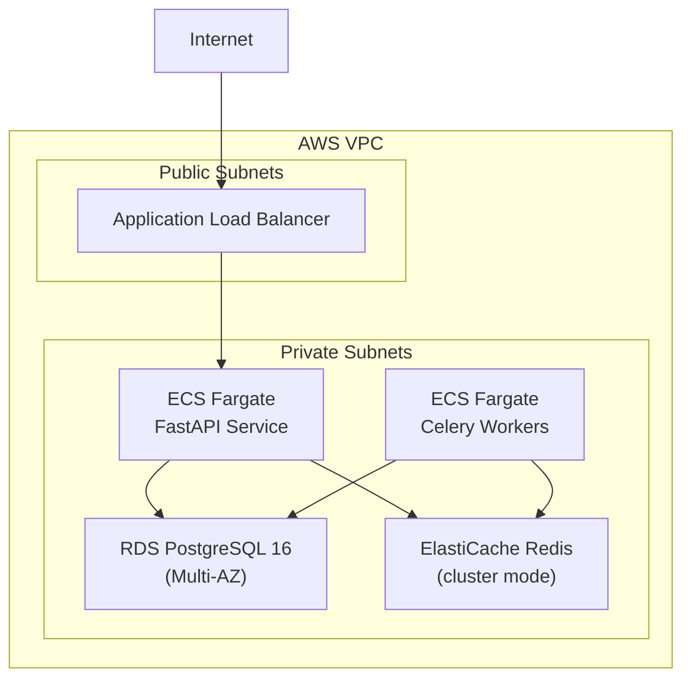

# Deployment

Deployment guides for Docker Compose (development and production), AWS ECS Fargate via Terraform, Nginx reverse proxy configuration, and production hardening checklist.

## Section Contents

| Page | Description |
|------|-------------|
| [Docker Compose](../14-infrastructure/docker-compose.md) | Service definitions, networking, volumes, and health checks |
| [Terraform Overview](../14-infrastructure/terraform-overview.md) | IaC structure, state management, and workspace organization |
| [Terraform Modules](../14-infrastructure/terraform-modules.md) | ECS, RDS, ElastiCache, VPC, and ALB module documentation |
| [AWS Architecture](../14-infrastructure/aws-architecture.md) | VPC topology, ECS Fargate services, RDS, and ALB configuration |
| [Environments](../14-infrastructure/environments.md) | dev / staging / prod environment configuration and promotion |

## Deployment Options

| Method | Use Case | Documentation |
|--------|----------|---------------|
| **Docker Compose (local)** | Development and testing | [Docker Compose](../14-infrastructure/docker-compose.md) |
| **Docker Compose (production)** | Single-server production | [Docker Compose](../14-infrastructure/docker-compose.md) |
| **AWS ECS Fargate** | Cloud production | [AWS Architecture](../14-infrastructure/aws-architecture.md) |

## AWS Production Architecture

## CI/CD Integration

Deployments are automated via GitHub Actions:

- **CI pipeline** → runs on every PR: lint, test, build
- **CD pipeline** → runs on merge to `main`: Docker build, push to ECR, ECS service update
- **Terraform pipeline** → runs on infrastructure changes: plan on PR, apply on merge

See [CI/CD Pipelines](../15-cicd/ci-workflow.md) for details.

## Cross-References

- **CI/CD workflows** → [CI Workflow](../15-cicd/ci-workflow.md) · [CD Workflow](../15-cicd/cd-workflow.md)
- **Operations runbook** → [Deployment Guide](../17-operations/deployment-guide.md)
- **Environment variables** → [Environment Variables](../01-getting-started/environment-variables.md)
- **Observability** → [Prometheus Metrics](../16-observability/prometheus-metrics.md)
