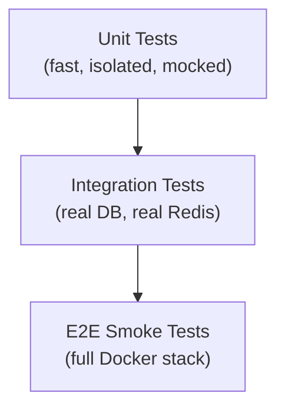

# Testing

Documentation for the full test suite — unit tests, integration tests, end-to-end smoke tests, pytest configuration, and coverage reporting.

## Section Contents

| Page | Description |
|------|-------------|
| [Backend Tests](backend-tests.md) | pytest suite, fixtures, mocking strategies, and test organization |
| [Frontend Tests](frontend-tests.md) | Vitest + React Testing Library component and hook tests |
| [Test Coverage](test-coverage.md) | Coverage configuration, thresholds, and HTML/XML reporting |
| [E2E Smoke Tests](e2e-smoke-tests.md) | End-to-end smoke test suite against a running Docker Compose stack |

## Testing Strategy



| Tier | Tool | Scope | Run Time |
|------|------|-------|----------|
| **Unit** | pytest / Vitest | Functions, components | < 30s |
| **Integration** | pytest + testcontainers | API routes, DB, Redis | 1–3 min |
| **E2E Smoke** | pytest + httpx | Full stack | 3–10 min |

## Running Tests

```bash
# Backend unit + integration tests
cd backend
pytest tests/ -v --cov=app --cov-report=html

# Frontend tests
cd frontend
npm run test

# E2E smoke tests (requires running stack)
docker compose up -d
pytest tests/e2e/ -v
```

## Coverage Thresholds

| Component | Minimum Coverage |
|-----------|----------------|
| Backend (overall) | 80% |
| Optimization engines | 90% |
| API routes | 85% |
| Frontend components | 70% |

## Cross-References

- **CI pipeline** → [CI Workflow](../15-cicd/ci-workflow.md)
- **Backend configuration** → [Backend Configuration](../03-backend/configuration.md)
- **Infrastructure for E2E** → [Docker Compose](../14-infrastructure/docker-compose.md)
