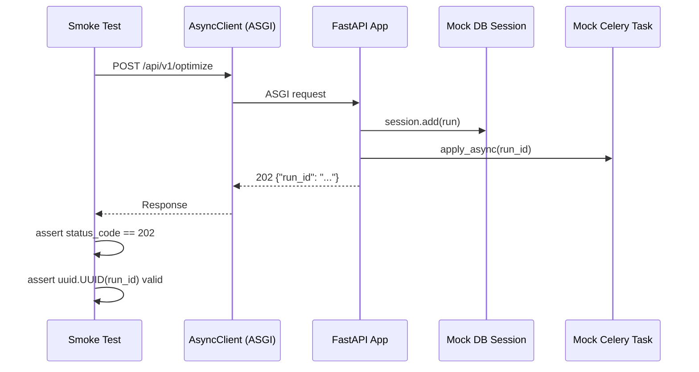
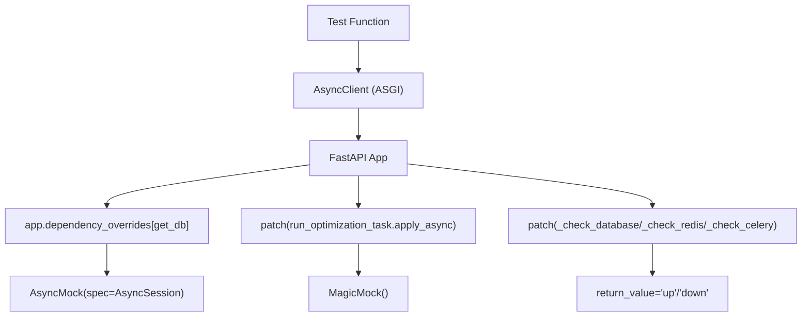

# E2E and Smoke Tests

The project includes two categories of end-to-end tests: **smoke tests** that verify the
full API pipeline works correctly, and **load tests** that verify the application handles
concurrent requests without race conditions or resource leaks.

## Directory Structure

```
tests/
├── test_e2e_smoke.py          # Full pipeline smoke tests (40 KB, ~1000 lines)
├── test_load.py               # Concurrent optimization load tests (32 KB, ~800 lines)
├── e2e/
│   ├── smoke_test.py          # ASGI + live-server smoke tests (38 KB)
│   └── locustfile.py          # Locust load test scenarios (29 KB)
└── integration/
    ├── test_agent_graph.py
    ├── test_assets_endpoint.py
    ├── test_celery_tasks.py
    ├── test_health_endpoint.py
    ├── test_optimize_endpoint.py
    └── test_runs_endpoint.py
```

---

## `test_e2e_smoke.py` — Full Pipeline Smoke Tests

`tests/test_e2e_smoke.py` (40 KB) exercises every public API endpoint end-to-end using
real HTTP requests via `httpx.ASGITransport`. No real network socket is opened — the
FastAPI app is invoked directly in-process.

### Architecture



### Fixtures

```python
@pytest_asyncio.fixture
async def client() -> AsyncClient:
    async with AsyncClient(
        transport=ASGITransport(app=app),
        base_url="http://testserver",
    ) as ac:
        yield ac
```

The `client` fixture is created fresh for each test. Mock DB sessions are installed via
`app.dependency_overrides[get_db]` and cleaned up in `finally` blocks.

### Smoke Test Scenarios

#### Health Endpoint (6 tests)

| Test | Assertion |
|------|-----------|
| `test_health_endpoint_returns_200` | HTTP 200 when all services up |
| `test_health_endpoint_body_has_status_field` | `body["status"] == "healthy"` |
| `test_health_endpoint_body_has_version_field` | Version matches `\d+\.\d+\.\d+` |
| `test_health_endpoint_body_has_services_field` | `services` has `database`, `redis`, `celery` |
| `test_health_endpoint_services_values_are_up_or_down` | Each service value is `"up"` or `"down"` |
| `test_health_endpoint_all_down_returns_503` | All down → HTTP 503, `status=unhealthy` |

#### Asset Search (8 tests)

| Test | Assertion |
|------|-----------|
| `test_asset_search_aapl_returns_result` | `q=AAPL` → at least 1 result |
| `test_asset_search_aapl_result_has_correct_ticker` | First result `ticker == "AAPL"` |
| `test_asset_search_aapl_result_has_name_field` | `name` field is non-empty string |
| `test_asset_search_aapl_result_has_technology_sector` | `sector == "Technology"` |
| `test_asset_search_by_company_name` | `q=apple` → AAPL in results |
| `test_asset_search_limit_parameter_respected` | `limit=3` → at most 3 results |
| `test_asset_search_missing_query_returns_422` | No `q` param → 422 |
| `test_asset_search_result_fields_are_correct_types` | `ticker`, `name` are strings |

#### Optimization Submit (8 tests)

```python
# Pattern used for all optimize submit tests
session = _make_write_session()
app.dependency_overrides[get_db] = _override_db(session)
try:
    with patch("app.workers.tasks.run_optimization_task.apply_async") as mock_task:
        mock_task.return_value = MagicMock()
        response = await client.post("/api/v1/optimize", json={...})
finally:
    app.dependency_overrides.pop(get_db, None)
```

| Test | Assertion |
|------|-----------|
| `test_optimize_submit_returns_202` | HTTP 202 Accepted |
| `test_optimize_submit_returns_run_id` | `"run_id"` in response body |
| `test_optimize_submit_run_id_is_valid_uuid` | `uuid.UUID(run_id)` parses without error |
| `test_optimize_submit_missing_tickers_returns_422` | No `tickers` → 422 |
| `test_optimize_submit_missing_budget_returns_422` | No `budget` → 422 |
| `test_optimize_submit_single_ticker_returns_422` | `tickers=["AAPL"]` → 422 (min 2) |
| `test_optimize_submit_full_request_returns_202` | All optional fields → 202 |
| `test_optimize_submit_quantum_request_returns_202` | `run_quantum=True` → 202 |

#### Run Status and Detail (10 tests)

| Test | Assertion |
|------|-----------|
| `test_run_status_returns_200` | `GET /runs/{id}/status` → 200 |
| `test_run_status_has_correct_fields` | `run_id`, `status`, `created_at` present |
| `test_run_status_unknown_id_returns_404` | Unknown ID → 404 |
| `test_run_status_404_has_error_code` | `error_code == "RUN_NOT_FOUND"` |
| `test_run_detail_returns_200` | `GET /runs/{id}` → 200 |
| `test_run_detail_has_all_fields` | All detail fields present |
| `test_run_detail_unknown_id_returns_404` | Unknown ID → 404 |
| `test_run_list_returns_200` | `GET /runs` → 200 |
| `test_run_list_has_pagination_fields` | `items`, `total`, `page`, `page_size` |
| `test_run_list_page_size_respected` | `page_size=2` → at most 2 items |

#### Full Flow Test (1 test)

```python
async def test_full_flow_submit_then_appears_in_list(client: AsyncClient) -> None:
    """Submit → verify run appears in run list with correct run_id."""
    # 1. Submit optimization
    run_id = (await client.post("/api/v1/optimize", json=request)).json()["run_id"]

    # 2. Verify run appears in list
    list_response = await client.get("/api/v1/runs")
    items = list_response.json()["items"]
    run_ids_in_list = [item["run_id"] for item in items]
    assert run_id in run_ids_in_list
```

#### Concurrent Submits (1 test)

```python
async def test_concurrent_submits_produce_unique_run_ids(client: AsyncClient) -> None:
    """15 concurrent submits all return unique run_ids — no UUID collisions."""
    responses = await asyncio.gather(
        *[client.post("/api/v1/optimize", json=request) for _ in range(15)]
    )
    run_ids = [r.json()["run_id"] for r in responses]
    assert len(set(run_ids)) == 15
```

---

## `tests/e2e/smoke_test.py` — ASGI + Live Server Smoke Tests

`tests/e2e/smoke_test.py` (38 KB) is a more comprehensive smoke test suite that supports
both ASGI transport (default) and real HTTP requests to a live server.

### Live Server Mode

```python
_USE_REAL_SERVER: bool = os.getenv("E2E_USE_REAL_SERVER", "0") == "1"
_BASE_URL: str = os.getenv("E2E_BASE_URL", "http://localhost:8000")

@pytest_asyncio.fixture
async def client() -> AsyncClient:
    if _USE_REAL_SERVER:
        async with AsyncClient(base_url=_BASE_URL, timeout=30.0) as ac:
            yield ac
    else:
        async with AsyncClient(
            transport=ASGITransport(app=app),
            base_url="http://testserver",
        ) as ac:
            yield ac
```

### Running Against a Live Stack

```bash
# Start the full stack first
docker compose up -d

# Run smoke tests against the live server
E2E_USE_REAL_SERVER=1 E2E_BASE_URL=http://localhost:8000 \
  python -m pytest tests/e2e/smoke_test.py -v

# Or with a remote server
E2E_USE_REAL_SERVER=1 E2E_BASE_URL=https://api.staging.example.com \
  python -m pytest tests/e2e/smoke_test.py -v
```

### Scenarios Covered (25 total)

| # | Scenario | Endpoint |
|---|----------|----------|
| 1 | Health endpoint — 200 with `status`, `version`, `services` | `GET /health` |
| 2 | Health endpoint — all-down returns 503 `status=unhealthy` | `GET /health` |
| 3 | Health endpoint — partial degradation returns 200 `status=degraded` | `GET /health` |
| 4 | Asset search — known ticker (AAPL) returns correct name and sector | `GET /api/v1/assets/search` |
| 5 | Asset search — company name query (Apple) returns AAPL | `GET /api/v1/assets/search` |
| 6 | Asset search — empty query returns 422 | `GET /api/v1/assets/search` |
| 7 | Asset search — limit parameter is respected | `GET /api/v1/assets/search` |
| 8 | Optimize submit — minimal valid request returns 202 with UUID run_id | `POST /api/v1/optimize` |
| 9 | Optimize submit — full request with all constraints returns 202 | `POST /api/v1/optimize` |
| 10 | Optimize submit — missing required field returns 422 with detail | `POST /api/v1/optimize` |
| 11 | Optimize submit — single ticker (< 2) returns 422 | `POST /api/v1/optimize` |
| 12 | Optimize submit — ticker exceeding max length returns 422 | `POST /api/v1/optimize` |
| 13 | Run status — pending run returns correct shape | `GET /api/v1/runs/{id}/status` |
| 14 | Run status — unknown run_id returns 404 `error_code=RUN_NOT_FOUND` | `GET /api/v1/runs/{id}/status` |
| 15 | Run detail — completed run returns full result shape | `GET /api/v1/runs/{id}` |
| 16 | Run detail — unknown run_id returns 404 `error_code=RUN_NOT_FOUND` | `GET /api/v1/runs/{id}` |
| 17 | Run list — returns paginated response with `items`, `total`, `page` | `GET /api/v1/runs` |
| 18 | Run list — page_size parameter is respected | `GET /api/v1/runs` |
| 19 | Run list — status filter returns only matching runs | `GET /api/v1/runs?status=completed` |
| 20 | Run list — invalid status filter returns 422 | `GET /api/v1/runs?status=invalid` |
| 21 | Full flow — submit → run appears in list with correct run_id | Multi-endpoint |
| 22 | Prometheus /metrics — returns text/plain content with metric names | `GET /metrics` |
| 23 | OpenAPI schema — /openapi.json documents all key routes | `GET /openapi.json` |
| 24 | CORS headers — preflight returns `Access-Control-Allow-Origin` | `OPTIONS /api/v1/optimize` |
| 25 | Concurrent submits — all return unique run_ids (no collisions) | `POST /api/v1/optimize` ×N |

---

## `test_load.py` — Concurrent Optimization Load Tests

`tests/test_load.py` (32 KB) verifies that the application handles concurrent requests
correctly without race conditions, resource leaks, or degraded responses.

### Design Principles

```python
# Concurrency level — kept at 10 for fast, deterministic CI execution
CONCURRENCY = 10
```

All tests use `asyncio.gather()` to fire requests concurrently:

```python
responses = await asyncio.gather(
    *[client.get("/health") for _ in range(CONCURRENCY)]
)
```

Each test verifies **both** that all requests succeed **and** that response bodies have
the correct shape — not just status codes.

### Load Test Scenarios

#### Scenario 1: Concurrent Health Checks (3 tests)

```python
async def test_concurrent_health_checks_all_succeed(client: AsyncClient) -> None:
    """10 concurrent GET /health requests all return 200."""
    with (
        patch("app.api.health._check_database", return_value="up"),
        patch("app.api.health._check_redis", return_value="up"),
        patch("app.api.health._check_celery", return_value="up"),
    ):
        responses = await asyncio.gather(
            *[client.get("/health") for _ in range(CONCURRENCY)]
        )
    for response in responses:
        assert response.status_code == 200
```

Tests: all healthy, all return `status=healthy`; degraded state (one service down).

#### Scenario 2: Concurrent Asset Searches (4 tests)

| Test | Assertion |
|------|-----------|
| `test_concurrent_asset_searches_all_succeed` | All 10 return 200 |
| `test_concurrent_asset_searches_all_return_results` | All return non-empty lists |
| `test_concurrent_asset_searches_different_queries` | 10 different tickers, all 200 |
| `test_concurrent_asset_searches_results_are_consistent` | Same query → identical results |

#### Scenario 3: Concurrent Optimization Submits (3 tests)

The critical concurrency test verifies UUID uniqueness under load:

```python
async def test_concurrent_optimize_submits_produce_unique_run_ids(
    client: AsyncClient,
) -> None:
    """10 concurrent submits produce 10 unique run_ids — no UUID collisions."""
    app.dependency_overrides[get_db] = _override_db_factory()
    try:
        with patch("app.workers.tasks.run_optimization_task.apply_async") as mock_task:
            mock_task.return_value = MagicMock()
            responses = await asyncio.gather(
                *[client.post("/api/v1/optimize", json=request) for _ in range(CONCURRENCY)]
            )
    finally:
        app.dependency_overrides.pop(get_db, None)

    run_ids = [r.json()["run_id"] for r in responses]
    assert len(set(run_ids)) == CONCURRENCY, (
        f"Expected {CONCURRENCY} unique run_ids, got {len(set(run_ids))}. "
        f"Duplicates: {[rid for rid in run_ids if run_ids.count(rid) > 1]}"
    )
```

#### Scenario 4: Concurrent Run Status Polls (2 tests)

Tests 10 concurrent `GET /api/v1/runs/{id}/status` requests for the same run ID.
Verifies consistent response shape under concurrent read load.

#### Scenario 5: Concurrent Run List Queries (2 tests)

Tests 10 concurrent `GET /api/v1/runs` requests. Verifies pagination fields are
consistent across all responses.

#### Scenario 6: Mixed Concurrent Load (2 tests)

```python
async def test_mixed_concurrent_load(client: AsyncClient) -> None:
    """Health + search + optimize requests fired simultaneously."""
    health_tasks = [client.get("/health") for _ in range(3)]
    search_tasks = [client.get("/api/v1/assets/search", params={"q": "AAPL"}) for _ in range(4)]
    optimize_tasks = [client.post("/api/v1/optimize", json=request) for _ in range(3)]

    all_responses = await asyncio.gather(*health_tasks, *search_tasks, *optimize_tasks)
    # All 10 requests succeed
    for response in all_responses:
        assert response.status_code in (200, 202)
```

#### Scenario 7: Concurrent 404 Requests (1 test)

10 concurrent requests for unknown run IDs — all return structured 404 error bodies.

#### Scenario 8: Concurrent Validation Errors (1 test)

10 concurrent invalid requests — all return 422 with `detail` field.

#### Scenario 9: Sequential Burst (1 test)

Rapid sequential requests without delay to test throughput under sustained load.

---

## `tests/e2e/locustfile.py` — Locust Load Test Scenarios

`tests/e2e/locustfile.py` defines realistic user traffic patterns for load testing
using [Locust](https://locust.io/).

### User Classes

| Class | Weight | Wait Time | Behavior |
|-------|--------|-----------|----------|
| `HealthCheckUser` | 1 | 5–15 s | Polls `/health` (simulates monitoring agents) |
| `AssetSearchUser` | 3 | 0.5–3 s | Searches for tickers and company names |
| `OptimizationUser` | 2 | 2–10 s | Submits optimization + polls status |
| `RunHistoryUser` | 2 | 1–5 s | Browses paginated run history |
| `MixedUser` | 5 | 1–8 s | Combines all behaviors |

### Running Locust

```bash
# Interactive web UI (http://localhost:8089)
locust -f tests/e2e/locustfile.py --host http://localhost:8000

# Headless CI mode
locust -f tests/e2e/locustfile.py \
    --host http://localhost:8000 \
    --headless \
    --users 50 \
    --spawn-rate 5 \
    --run-time 60s \
    --html tests/e2e/load_report.html
```

### Test Data

```python
_TICKERS = ["AAPL", "MSFT", "GOOGL", "AMZN", "NVDA", "META", "TSLA", ...]
_SEARCH_QUERIES = ["Apple", "Microsoft", "Google", "AAPL", "tech", "health", ...]
_OPTIMIZATION_REQUESTS = [
    {"tickers": ["AAPL", "MSFT"], "budget": 50_000.0, "run_quantum": False},
    {"tickers": ["AAPL", "MSFT", "GOOGL"], "budget": 100_000.0, ...},
    {"tickers": ["JPM", "BAC", "V", "MA"], "budget": 150_000.0,
     "sector_constraints": [{"sector": "Financials", "max_weight": 0.8}]},
    ...
]
```

> **Note:** All Locust optimization requests use `run_quantum=False` to keep load tests
> fast and deterministic. Quantum simulation is too slow for sustained load testing.

---

## Running All E2E Tests

### Against ASGI Transport (No External Services)

```bash
cd backend

# Run smoke tests
python -m pytest ../tests/test_e2e_smoke.py -v

# Run load tests
python -m pytest ../tests/test_load.py -v

# Run e2e/ directory smoke tests
python -m pytest ../tests/e2e/smoke_test.py -v

# Run all e2e and load tests together
python -m pytest ../tests/test_e2e_smoke.py ../tests/test_load.py ../tests/e2e/smoke_test.py -v
```

### Against a Live Stack

```bash
# 1. Start the full stack
docker compose up -d

# 2. Wait for services to be healthy
docker compose ps

# 3. Run smoke tests against live server
E2E_USE_REAL_SERVER=1 E2E_BASE_URL=http://localhost:8000 \
  python -m pytest tests/e2e/smoke_test.py -v

# 4. Run Locust load test
locust -f tests/e2e/locustfile.py \
    --host http://localhost:8000 \
    --headless \
    --users 20 \
    --spawn-rate 2 \
    --run-time 30s
```

### Integration Tests

```bash
# Run all integration tests
python -m pytest ../tests/integration/ -v

# Run a specific integration test file
python -m pytest ../tests/integration/test_optimize_endpoint.py -v
```

---

## Mocking Strategy

All E2E and load tests use the same mocking strategy to avoid real external service
connections:



| Component | Mocking Approach |
|-----------|-----------------|
| Database | `app.dependency_overrides[get_db]` with `AsyncMock(spec=AsyncSession)` |
| Celery | `patch("app.workers.tasks.run_optimization_task.apply_async")` |
| Health checks | `patch("app.api.health._check_database")` etc. |
| yfinance | `patch("app.api.v1.assets._lookup_yfinance")` |

> **Important:** Always clean up `dependency_overrides` in `finally` blocks to prevent
> test pollution:
> ```python
> app.dependency_overrides[get_db] = override
> try:
>     response = await client.post(...)
> finally:
>     app.dependency_overrides.pop(get_db, None)
> ```
