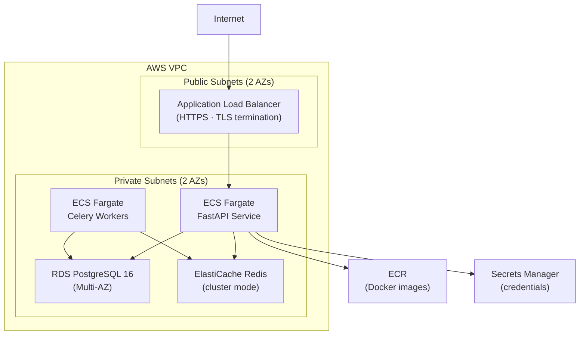

# Infrastructure

Docker Compose, Terraform IaC, and AWS architecture documentation for the Portfolio Optimizer.

## Section Contents

| Page | Description |
|------|-------------|
| [Docker Compose](docker-compose.md) | Service definitions, networking, volumes, and health checks |
| [Terraform Overview](terraform-overview.md) | IaC structure, state management, and workspace organization |
| [Terraform Modules](terraform-modules.md) | ECS, RDS, ElastiCache, VPC, and ALB module documentation |
| [AWS Architecture](aws-architecture.md) | VPC topology, ECS Fargate services, RDS, and ALB configuration |
| [Environments](environments.md) | dev / staging / prod environment configuration and promotion |

## Infrastructure Overview

## Environments

| Environment | Purpose | Terraform Workspace |
|-------------|---------|-------------------|
| `dev` | Development and testing | `dev` |
| `staging` | Pre-production validation | `staging` |
| `prod` | Production | `prod` |

## Cross-References

- **CI/CD pipelines** → [CI Workflow](../15-cicd/ci-workflow.md) · [CD Workflow](../15-cicd/cd-workflow.md)
- **Terraform workflow** → [Terraform Workflow](../15-cicd/terraform-workflow.md)
- **Operations** → [Deployment Guide](../17-operations/deployment-guide.md)
- **Observability** → [Prometheus Metrics](../16-observability/prometheus-metrics.md)
