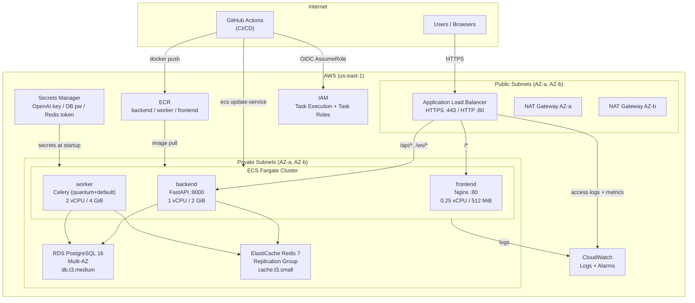
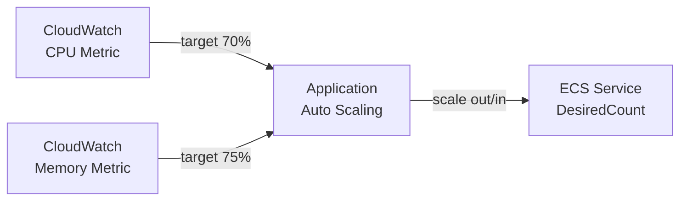
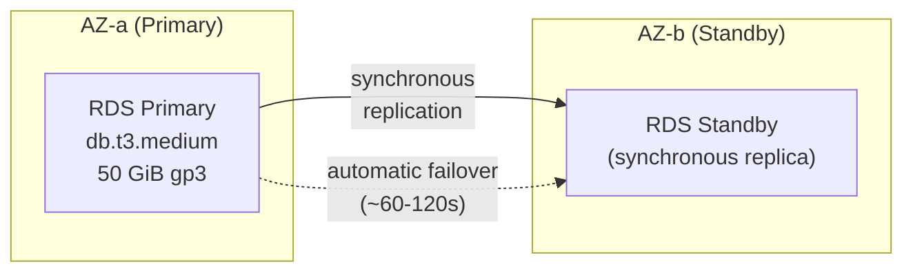
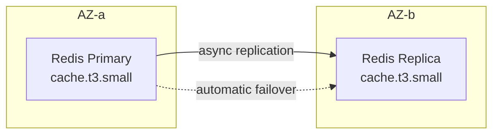
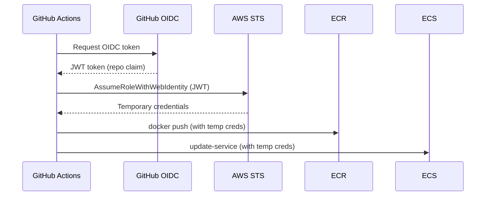
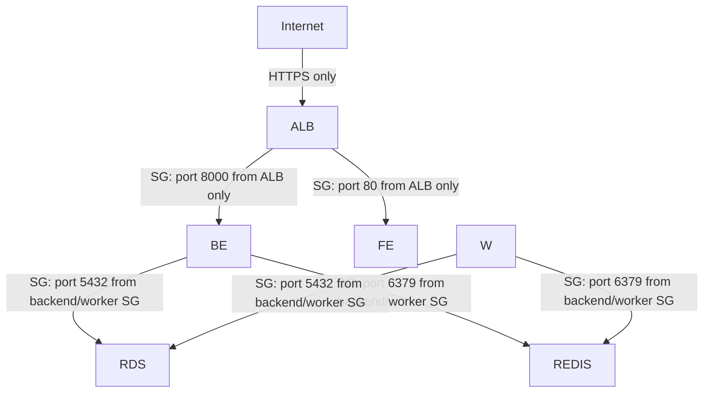

# AWS Architecture

Portfolio Optimizer runs on AWS ECS Fargate in a multi-AZ VPC. This page describes the complete production architecture: compute, networking, data stores, security, observability, and CI/CD integration.

## High-Level Architecture Diagram



## VPC and Networking

The application runs in a dedicated VPC (`10.0.0.0/16`) spanning two availability zones.

### Subnet Layout

| Subnet | CIDR | AZ | Purpose |
|--------|------|----|---------|
| Public AZ-a | `10.0.1.0/24` | us-east-1a | ALB, NAT Gateway |
| Public AZ-b | `10.0.2.0/24` | us-east-1b | ALB, NAT Gateway |
| Private AZ-a | `10.0.10.0/24` | us-east-1a | ECS tasks, RDS, ElastiCache |
| Private AZ-b | `10.0.11.0/24` | us-east-1b | ECS tasks, RDS standby, ElastiCache replica |

### Traffic Flow

- **Inbound:** Internet → ALB (public subnets) → ECS tasks (private subnets)
- **Outbound:** ECS tasks → NAT Gateway (private → public) → Internet (for yfinance market data, OpenAI API)
- **AWS services:** ECS tasks → VPC Endpoints (no NAT required for ECR, Secrets Manager, CloudWatch, SSM)

### NAT Gateway Strategy

Production uses **one NAT Gateway per AZ** (`single_nat_gateway = false`) to prevent cross-AZ traffic and eliminate the NAT as a single point of failure. Staging uses a single NAT to reduce cost.

## ECS Fargate Services

All three services run as Fargate tasks in private subnets with `network_mode = "awsvpc"` (each task gets its own ENI and private IP).

### Service Specifications

| Service | CPU | Memory | Min Tasks | Max Tasks | Port |
|---------|-----|--------|-----------|-----------|------|
| `backend` | 1024 (1 vCPU) | 2048 MiB | 2 | 10 | 8000 |
| `worker` | 2048 (2 vCPU) | 4096 MiB | 1 | 8 | — |
| `frontend` | 256 (0.25 vCPU) | 512 MiB | 2 | — | 80 |

### ECS Cluster

```
portfolio-optimizer-production-cluster
├── Capacity providers: FARGATE, FARGATE_SPOT
├── Container Insights: enabled
└── Services:
    ├── portfolio-optimizer-production-backend
    ├── portfolio-optimizer-production-worker
    └── portfolio-optimizer-production-frontend
```

Container Insights provides enhanced CloudWatch metrics at the task level (CPU, memory, network I/O, storage I/O).

### Deployment Strategy

All services use rolling deployments with circuit breaker protection:

```
minimum_healthy_percent = 100   # Never reduce below current capacity
maximum_percent         = 200   # Allow up to 2× tasks during deployment
circuit_breaker.enable  = true  # Detect failed deployments
circuit_breaker.rollback = true # Auto-rollback on failure
```

This ensures zero-downtime deployments: new tasks are started before old ones are stopped, and if the new tasks fail health checks, the deployment automatically rolls back.

### Auto-Scaling Policies



**Backend scaling:**
- Scale out when CPU > 70% or memory > 75%
- Scale-out cooldown: 60 seconds (fast response to traffic spikes)
- Scale-in cooldown: 300 seconds (conservative to avoid flapping)

**Worker scaling:**
- Scale out when CPU > 75%
- Scale-in cooldown: **600 seconds** (quantum jobs are expensive to restart)

## Application Load Balancer

The ALB is internet-facing, deployed across both public subnets, and handles all inbound traffic.

### Listener Configuration

| Listener | Port | Protocol | Action |
|----------|------|----------|--------|
| HTTP | 80 | HTTP | Redirect to HTTPS (301) |
| HTTPS | 443 | HTTPS (TLS 1.3) | Forward to frontend (default) |

### Path-Based Routing

| Path Pattern | Target Group | Service |
|-------------|-------------|---------|
| `/api/*` | backend-tg (port 8000) | FastAPI |
| `/ws/*` | backend-tg (port 8000) | WebSocket |
| `/health`, `/metrics`, `/docs`, `/redoc`, `/openapi.json` | backend-tg | FastAPI |
| `/*` (default) | frontend-tg (port 80) | Nginx/React |

### TLS Configuration

```
ssl_policy = "ELBSecurityPolicy-TLS13-1-2-2021-06"
```

Supports TLS 1.2 and 1.3 only. TLS 1.0 and 1.1 are disabled. ACM certificates are managed outside Terraform and referenced by ARN.

### Health Checks

| Target Group | Health Check Path | Healthy | Unhealthy |
|-------------|------------------|---------|-----------|
| Backend | `GET /api/v1/health` | 2 consecutive 200s | 3 consecutive failures |
| Frontend | `GET /health` | 2 consecutive 200s | 3 consecutive failures |

## RDS PostgreSQL 16 (Multi-AZ)



| Setting | Production | Staging |
|---------|-----------|---------|
| Instance class | `db.t3.medium` | `db.t3.small` |
| Storage | 50 GiB gp3 (auto-scales to 150 GiB) | 20 GiB gp3 |
| Multi-AZ | ✅ Yes | ❌ No |
| Deletion protection | ✅ Yes | ❌ No |
| Backup retention | 30 days | 7 days |
| Encryption | AES-256 | AES-256 |
| Performance Insights | 7-day retention | 7-day retention |

The RDS instance is in a private subnet with no public accessibility. Only the backend and worker ECS tasks (via their security groups) can reach port 5432.

## ElastiCache Redis 7 (Replication Group)



| Setting | Production | Staging |
|---------|-----------|---------|
| Node type | `cache.t3.small` | `cache.t3.micro` |
| Nodes | 2 (primary + replica) | 1 (single node) |
| Automatic failover | ✅ Yes | ❌ No |
| Encryption at rest | ✅ Yes | ✅ Yes |
| Encryption in transit | ✅ TLS | ✅ TLS |
| AUTH token | From Secrets Manager | From Secrets Manager |
| Eviction policy | `allkeys-lru` | `allkeys-lru` |

Redis serves three purposes:
1. **Application cache** (DB 0) — market data, sector classifications (TTL: 3600s)
2. **Celery broker** (DB 1) — task queue for optimization jobs
3. **Celery result backend** (DB 2) — task results and progress events

## ECR Image Repositories

Three ECR repositories store Docker images for each service:

| Repository | Image | Scan on Push | Retention |
|-----------|-------|-------------|-----------|
| `{prefix}-backend` | FastAPI + Python | ✅ | 20 tagged images |
| `{prefix}-worker` | Celery + Python | ✅ | 20 tagged images |
| `{prefix}-frontend` | Nginx + React SPA | ✅ | 20 tagged images |

Images are tagged with Git SHA (`sha-{commit}`) by the CI/CD pipeline. Untagged images (intermediate build layers) are automatically expired after 1 day.

## IAM OIDC for GitHub Actions

The bootstrap module creates an IAM OIDC provider for GitHub Actions, enabling keyless authentication:



The trust policy restricts role assumption to a specific GitHub repository:

```json
{
  "Condition": {
    "StringEquals": {
      "token.actions.githubusercontent.com:aud": "sts.amazonaws.com"
    },
    "StringLike": {
      "token.actions.githubusercontent.com:sub": "repo:{org}/{repo}:*"
    }
  }
}
```

The GitHub Actions role has permissions for:
- ECR image push/pull
- ECS service updates and task definition registration
- Terraform state access (S3 + DynamoDB)
- Full provisioning access for `terraform apply`

## AWS Secrets Manager

Three secrets are stored in Secrets Manager and injected into ECS tasks at startup:

| Secret Path | Injected As | Used By |
|-------------|-------------|---------|
| `{prefix}/openai-api-key` | `OPENAI_API_KEY` | Backend, Worker |
| `{prefix}/db-password` | `DB_PASSWORD` | Backend, Worker |
| `{prefix}/redis-auth-token` | `REDIS_AUTH_TOKEN` | Backend, Worker |

Secrets are referenced in the ECS task definition's `secrets` array:

```json
{
  "secrets": [
    {
      "name": "OPENAI_API_KEY",
      "valueFrom": "arn:aws:secretsmanager:us-east-1:123456789:secret:portfolio-optimizer-production/openai-api-key"
    }
  ]
}
```

The ECS agent fetches the secret value at task startup and injects it as an environment variable. The container never has direct access to the Secrets Manager API for the initial injection — that's handled by the `task_execution_role`.

## CloudWatch Observability

### Log Groups

| Log Group | Service | Retention |
|-----------|---------|-----------|
| `/ecs/{prefix}/backend` | FastAPI | 90 days (prod) |
| `/ecs/{prefix}/worker` | Celery | 90 days (prod) |
| `/ecs/{prefix}/frontend` | Nginx | 90 days (prod) |
| `/aws/vpc/{prefix}/flow-logs` | VPC | 14 days |

All ECS logs use the `awslogs` log driver with stream prefix matching the service name.

### Alarms and Notifications

| Alarm | Threshold | Action |
|-------|-----------|--------|
| ALB 5xx error rate | > 5% over 10 min | SNS notification |
| ALB p99 response time | > 5s over 15 min | SNS notification |
| Backend CPU | > 80% over 15 min | SNS notification |
| Backend memory | > 85% over 15 min | SNS notification |
| Worker CPU | > 85% over 15 min | SNS notification |
| Worker memory | > 90% over 15 min | SNS notification |

Alarms notify an SNS topic (`alarm_sns_topic_arn`) which can be subscribed to by email, PagerDuty, Slack (via Lambda), or other notification channels.

## Security Architecture

### Defense in Depth



**Layers of security:**
1. **Network isolation** — all application resources in private subnets, no public IPs
2. **Security groups** — least-privilege ingress rules, source-SG references (not CIDR)
3. **Encryption in transit** — TLS 1.3 on ALB, TLS on Redis, SSL on RDS
4. **Encryption at rest** — RDS (AES-256), ElastiCache (AES-256), ECR (AES-256), S3 state bucket (AES-256)
5. **Secrets management** — no secrets in environment variables or code; all from Secrets Manager
6. **IAM least privilege** — task execution role and task role have minimal required permissions
7. **VPC flow logs** — all traffic logged for security auditing

## Related Documentation

- [Terraform Overview](terraform-overview.md) — root module and provider configuration
- [Terraform Modules](terraform-modules.md) — detailed module documentation
- [Environments](environments.md) — staging vs production configuration
- [Celery Configuration](../10-task-queue/celery-configuration.md) — worker queue configuration

## CI/CD Cross-References

- [CD Workflow](../15-cicd/cd-workflow.md) — GitHub Actions pipeline that deploys to this ECS architecture
- [Terraform Workflow](../15-cicd/terraform-workflow.md) — Pipeline that provisions and updates this infrastructure
- [GitHub Secrets](../15-cicd/github-secrets.md) — OIDC role and ECR credentials used by the CD pipeline
- [Deployment Guide](../17-operations/deployment-guide.md) — Step-by-step procedures for deploying to this architecture
