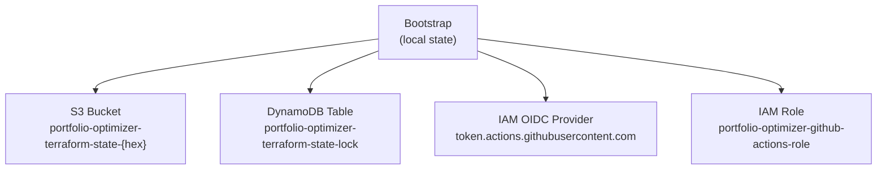

# Environments

Portfolio Optimizer uses a two-environment deployment model: **staging** and **production**. Each environment has its own Terraform entry point under `infra/terraform/environments/`, its own remote state, and its own `terraform.tfvars` file.

## Directory Structure

```
infra/terraform/
├── bootstrap/                    # One-time state backend setup
│   ├── main.tf                   # S3 bucket, DynamoDB table, GitHub OIDC
│   ├── variables.tf
│   └── outputs.tf
└── environments/
    ├── staging/
    │   ├── main.tf               # Calls root module with staging values
    │   ├── variables.tf          # Variable declarations
    │   ├── outputs.tf            # Staging-specific outputs
    │   └── terraform.tfvars      # ⚠️ NOT committed to VCS (contains secrets)
    │   └── backend.hcl           # ⚠️ NOT committed to VCS (state config)
    └── production/
        ├── main.tf               # Calls root module with production values
        ├── variables.tf          # Variable declarations
        ├── outputs.tf            # Production-specific outputs
        └── terraform.tfvars      # ⚠️ NOT committed to VCS (contains secrets)
        └── backend.hcl           # ⚠️ NOT committed to VCS (state config)
```

> **Security note:** `terraform.tfvars` and `backend.hcl` are never committed to version control because they contain sensitive values (API keys, database passwords) and account-specific configuration. Add them to `.gitignore`.

## Bootstrap Module

Before any environment can be deployed, the bootstrap module must be applied **once** to create the S3 bucket and DynamoDB table used for Terraform remote state.

### What Bootstrap Creates



### S3 State Bucket

```hcl
resource "aws_s3_bucket" "terraform_state" {
  bucket = "${var.project_name}-terraform-state-${random_id.suffix.hex}"

  lifecycle {
    prevent_destroy = true
  }
}
```

**Security features:**
- **Versioning enabled** — every state file change is versioned; previous states can be recovered
- **AES-256 encryption** — state files encrypted at rest
- **Public access blocked** — all four public access block settings enabled
- **Lifecycle rule** — non-current versions expire after 90 days
- `prevent_destroy = true` — Terraform refuses to delete the bucket (must be removed manually)

### DynamoDB State Lock Table

```hcl
resource "aws_dynamodb_table" "terraform_state_lock" {
  name         = "${var.project_name}-terraform-state-lock"
  billing_mode = "PAY_PER_REQUEST"
  hash_key     = "LockID"

  point_in_time_recovery { enabled = true }
  server_side_encryption  { enabled = true }

  lifecycle {
    prevent_destroy = true
  }
}
```

The DynamoDB table prevents concurrent `terraform apply` runs from corrupting the state file. When Terraform acquires a lock, it writes a record with `LockID = "{bucket}/{key}"`. Any other `terraform apply` that tries to acquire the same lock will fail with a clear error message.

### GitHub Actions OIDC

The bootstrap module optionally creates an IAM OIDC provider and role for GitHub Actions:

```hcl
resource "aws_iam_openid_connect_provider" "github" {
  url = "https://token.actions.githubusercontent.com"

  client_id_list = ["sts.amazonaws.com"]

  thumbprint_list = [
    "6938fd4d98bab03faadb97b34396831e3780aea1",
    "1c58a3a8518e8759bf075b76b750d4f2df264fcd"
  ]
}
```

The GitHub Actions role trust policy restricts access to a specific repository:

```hcl
Condition = {
  StringEquals = {
    "token.actions.githubusercontent.com:aud" = "sts.amazonaws.com"
  }
  StringLike = {
    "token.actions.githubusercontent.com:sub" = "repo:${var.github_org}/${var.github_repo}:*"
  }
}
```

### Running Bootstrap

```bash
cd infra/terraform/bootstrap

terraform init

terraform apply \
  -var="project_name=portfolio-optimizer" \
  -var="aws_region=us-east-1" \
  -var="github_org=your-github-org" \
  -var="github_repo=portfolio-optimizer"
```

Bootstrap outputs the values needed for `backend.hcl`:

```
Outputs:

state_bucket_name     = "portfolio-optimizer-terraform-state-a1b2c3d4"
state_lock_table_name = "portfolio-optimizer-terraform-state-lock"
github_actions_role_arn = "arn:aws:iam::123456789012:role/portfolio-optimizer-github-actions-role"

backend_hcl_content = <<EOT
  bucket         = "portfolio-optimizer-terraform-state-a1b2c3d4"
  key            = "portfolio-optimizer/production/terraform.tfstate"
  region         = "us-east-1"
  dynamodb_table = "portfolio-optimizer-terraform-state-lock"
  encrypt        = true
EOT
```

## `backend.hcl` — Remote State Configuration

Each environment has its own `backend.hcl` file that configures the S3 backend. The `key` path is different for each environment to keep state files separate:

**Production `backend.hcl`:**
```hcl
bucket         = "portfolio-optimizer-terraform-state-a1b2c3d4"
key            = "portfolio-optimizer/production/terraform.tfstate"
region         = "us-east-1"
dynamodb_table = "portfolio-optimizer-terraform-state-lock"
encrypt        = true
```

**Staging `backend.hcl`:**
```hcl
bucket         = "portfolio-optimizer-terraform-state-a1b2c3d4"
key            = "portfolio-optimizer/staging/terraform.tfstate"
region         = "us-east-1"
dynamodb_table = "portfolio-optimizer-terraform-state-lock"
encrypt        = true
```

Both environments share the same S3 bucket and DynamoDB table but use different state file keys. This is the recommended pattern — it avoids managing multiple buckets while keeping state completely isolated.

## Staging Environment

**Path:** `infra/terraform/environments/staging/`

Staging mirrors the production topology but uses smaller/cheaper instances and a single NAT Gateway to reduce cost. It is used for integration testing, QA, and pre-production validation.

### `main.tf` Structure

```hcl
terraform {
  required_version = ">= 1.8.0"
  required_providers {
    aws = { source = "hashicorp/aws", version = "~> 5.50" }
  }
  backend "s3" {}
}

provider "aws" {
  region = var.aws_region
  default_tags {
    tags = {
      Project     = "portfolio-optimizer"
      Environment = "staging"
      ManagedBy   = "terraform"
    }
  }
}

module "portfolio_optimizer" {
  source = "../../"
  # ... staging-specific values
}
```

### Staging Configuration Values

```hcl
# Networking — single NAT to save cost
vpc_cidr             = "10.1.0.0/16"
public_subnet_cidrs  = ["10.1.1.0/24", "10.1.2.0/24"]
private_subnet_cidrs = ["10.1.10.0/24", "10.1.11.0/24"]
single_nat_gateway   = true   # Cost saving

# RDS — single-AZ, no deletion protection
db_instance_class        = "db.t3.small"
db_allocated_storage     = 20
db_multi_az              = false
db_deletion_protection   = false
db_backup_retention_days = 7

# ElastiCache — single node
redis_node_type       = "cache.t3.micro"
redis_num_cache_nodes = 1

# ECS — smaller tasks, minimal replicas
backend_cpu     = 512
backend_memory  = 1024
worker_cpu      = 1024
worker_memory   = 2048
frontend_cpu    = 256
frontend_memory = 512

backend_desired_count  = 1
worker_desired_count   = 1
frontend_desired_count = 1

# Auto-scaling — minimal range
backend_min_capacity = 1
backend_max_capacity = 4
worker_min_capacity  = 1
worker_max_capacity  = 3

# App config — more lenient for testing
log_level               = "DEBUG"
quantum_timeout_seconds = 120   # More lenient
cache_ttl_seconds       = 300   # Shorter TTL for testing
cloudwatch_log_retention_days = 14
```

### Staging `terraform.tfvars` Template

```hcl
# infra/terraform/environments/staging/terraform.tfvars
# ⚠️ DO NOT COMMIT — contains sensitive values

aws_region = "us-east-1"

# Image tags (set by CI/CD pipeline)
backend_image_tag  = "sha-abc1234"
worker_image_tag   = "sha-abc1234"
frontend_image_tag = "sha-abc1234"

# Secrets (set from secure secret store)
openai_api_key   = "sk-..."
db_password      = "..."
redis_auth_token = "..."

# DNS (optional)
acm_certificate_arn = "arn:aws:acm:us-east-1:..."
domain_name         = "staging.portfolio-optimizer.example.com"

# Monitoring
alarm_sns_topic_arn = "arn:aws:sns:us-east-1:..."
```

## Production Environment

**Path:** `infra/terraform/environments/production/`

Production uses the full HA configuration: Multi-AZ RDS, Redis replication group, multiple NAT gateways, larger Fargate tasks, and higher replica counts.

### `main.tf` Structure

```hcl
terraform {
  required_version = ">= 1.8.0"
  required_providers {
    aws = { source = "hashicorp/aws", version = "~> 5.50" }
  }
  # Remote state in S3 with DynamoDB locking
  # Configure via backend.hcl (not committed to VCS)
  backend "s3" {}
}

provider "aws" {
  region = var.aws_region
  default_tags {
    tags = {
      Project     = "portfolio-optimizer"
      Environment = "production"
      ManagedBy   = "terraform"
    }
  }
}

module "portfolio_optimizer" {
  source = "../../"
  # ... production-specific values
}
```

### Production Configuration Values

```hcl
# Networking — multi-NAT for HA
vpc_cidr             = "10.0.0.0/16"
public_subnet_cidrs  = ["10.0.1.0/24", "10.0.2.0/24"]
private_subnet_cidrs = ["10.0.10.0/24", "10.0.11.0/24"]
single_nat_gateway   = false   # HA: one NAT per AZ

# RDS — Multi-AZ, deletion protection, 30-day backups
db_instance_class        = "db.t3.medium"
db_allocated_storage     = 50
db_multi_az              = true
db_deletion_protection   = true
db_backup_retention_days = 30

# ElastiCache — 2 nodes for HA
redis_node_type       = "cache.t3.small"
redis_num_cache_nodes = 2

# ECS — production-sized tasks
backend_cpu     = 1024
backend_memory  = 2048
worker_cpu      = 2048
worker_memory   = 4096
frontend_cpu    = 256
frontend_memory = 512

backend_desired_count  = 2
worker_desired_count   = 2
frontend_desired_count = 2

# Auto-scaling — full range
backend_min_capacity = 2
backend_max_capacity = 10
worker_min_capacity  = 1
worker_max_capacity  = 8

# App config — production settings
log_level               = "INFO"
quantum_timeout_seconds = 60
cache_ttl_seconds       = 3600
cloudwatch_log_retention_days = 90
ecr_image_retention_count     = 20
```

### Production `terraform.tfvars` Template

```hcl
# infra/terraform/environments/production/terraform.tfvars
# ⚠️ DO NOT COMMIT — contains sensitive values

aws_region = "us-east-1"

# Image tags (set by CI/CD pipeline)
backend_image_tag  = "sha-abc1234"
worker_image_tag   = "sha-abc1234"
frontend_image_tag = "sha-abc1234"

# Secrets (set from secure secret store)
openai_api_key   = "sk-..."
db_password      = "..."
redis_auth_token = "..."

# DNS
acm_certificate_arn = "arn:aws:acm:us-east-1:..."
domain_name         = "portfolio-optimizer.example.com"

# Monitoring
alarm_sns_topic_arn = "arn:aws:sns:us-east-1:..."
```

## Staging vs Production Comparison

| Setting | Staging | Production |
|---------|---------|-----------|
| VPC CIDR | `10.1.0.0/16` | `10.0.0.0/16` |
| NAT Gateways | 1 (single) | 2 (one per AZ) |
| RDS instance | `db.t3.small` | `db.t3.medium` |
| RDS storage | 20 GiB | 50 GiB |
| RDS Multi-AZ | ❌ | ✅ |
| RDS deletion protection | ❌ | ✅ |
| RDS backup retention | 7 days | 30 days |
| Redis node type | `cache.t3.micro` | `cache.t3.small` |
| Redis nodes | 1 | 2 (HA) |
| Backend CPU | 512 (0.5 vCPU) | 1024 (1 vCPU) |
| Backend memory | 1024 MiB | 2048 MiB |
| Worker CPU | 1024 (1 vCPU) | 2048 (2 vCPU) |
| Worker memory | 2048 MiB | 4096 MiB |
| Backend replicas | 1 | 2 |
| Backend max scale | 4 | 10 |
| Worker max scale | 3 | 8 |
| Log level | DEBUG | INFO |
| Cache TTL | 300s | 3600s |
| Quantum timeout | 120s | 60s |
| Log retention | 14 days | 90 days |
| ECR image retention | 10 | 20 |

## Deployment Workflow

### First-Time Setup

```bash
# 1. Bootstrap the state backend (run once)
cd infra/terraform/bootstrap
terraform init
terraform apply -var="project_name=portfolio-optimizer" \
                -var="github_org=your-org" \
                -var="github_repo=portfolio-optimizer"

# 2. Copy the backend_hcl_content output to each environment's backend.hcl
# (adjust the key for staging vs production)

# 3. Deploy staging
cd infra/terraform/environments/staging
terraform init -backend-config=backend.hcl
terraform plan -var-file="terraform.tfvars"
terraform apply -var-file="terraform.tfvars"

# 4. Deploy production
cd infra/terraform/environments/production
terraform init -backend-config=backend.hcl
terraform plan -var-file="terraform.tfvars"
terraform apply -var-file="terraform.tfvars"
```

### Updating an Environment

```bash
cd infra/terraform/environments/production

# Preview changes
terraform plan -var-file="terraform.tfvars"

# Apply changes
terraform apply -var-file="terraform.tfvars"

# Update only image tags (common for deployments)
terraform apply \
  -var-file="terraform.tfvars" \
  -var="backend_image_tag=sha-newcommit" \
  -var="worker_image_tag=sha-newcommit" \
  -var="frontend_image_tag=sha-newcommit"
```

### Destroying an Environment

```bash
# Staging only — production has deletion protection
cd infra/terraform/environments/staging
terraform destroy -var-file="terraform.tfvars"
```

> **Warning:** Production RDS and the state S3 bucket have `prevent_destroy = true` and `deletion_protection = true`. These must be manually disabled before `terraform destroy` will succeed.

## State File Isolation

Each environment's state is stored at a separate S3 key:

```
s3://portfolio-optimizer-terraform-state-{hex}/
├── portfolio-optimizer/
│   ├── staging/
│   │   └── terraform.tfstate
│   └── production/
│       └── terraform.tfstate
```

This means:
- A `terraform apply` in staging cannot affect production state
- State locks are per-key, so staging and production can be deployed concurrently
- State history is versioned independently per environment

## Related Documentation

- [Terraform Overview](terraform-overview.md) — root module structure
- [Terraform Modules](terraform-modules.md) — all 11 modules documented
- [AWS Architecture](aws-architecture.md) — full AWS resource topology
- [Getting Started: Docker](../01-getting-started/quickstart-docker.md) — local development setup
