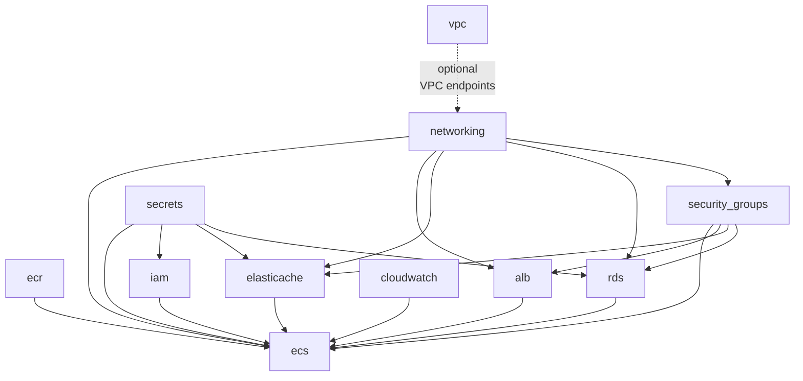
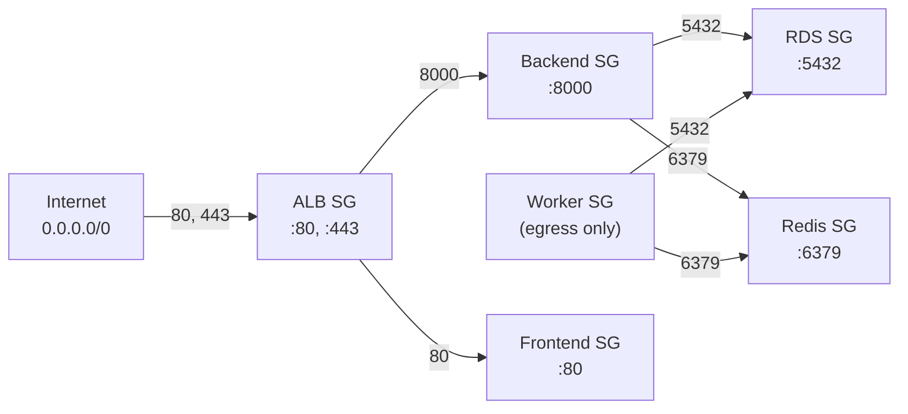
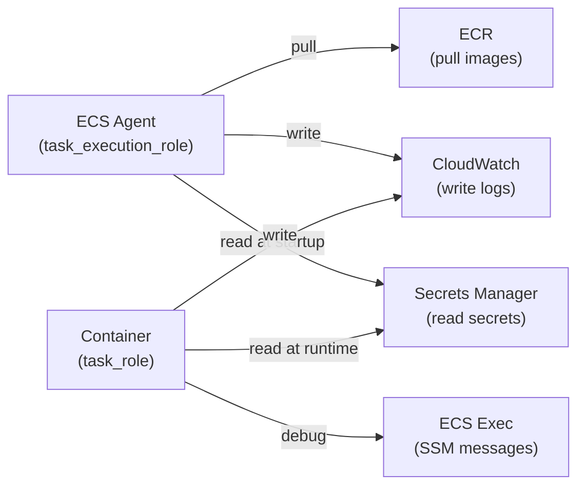

# Terraform Modules

The Portfolio Optimizer infrastructure is composed of eleven Terraform modules, each responsible for a distinct layer of the AWS stack. All modules live under `infra/terraform/modules/` and are instantiated by the root `main.tf`.

> **Design principle:** Security groups are created in a single centralized module (`security_groups`) before all other modules to avoid circular dependency issues between ECS, RDS, and ElastiCache.

## Module Dependency Map



---

## `networking` Module

**Path:** `infra/terraform/modules/networking/`

Provisions the foundational network layer: VPC, public/private subnets across two AZs, NAT gateways, route tables, and VPC flow logs.

### Resources Created

| Resource | Description |
|----------|-------------|
| `aws_vpc` | Main VPC with DNS hostnames and DNS support enabled |
| `aws_internet_gateway` | Internet gateway attached to the VPC |
| `aws_subnet` (public) | One public subnet per AZ (`map_public_ip_on_launch = true`) |
| `aws_subnet` (private) | One private subnet per AZ (no public IPs) |
| `aws_eip` | Elastic IPs for NAT gateways |
| `aws_nat_gateway` | NAT gateway(s) in public subnets |
| `aws_route_table` (public) | Routes `0.0.0.0/0` → Internet Gateway |
| `aws_route_table` (private) | Routes `0.0.0.0/0` → NAT Gateway |
| `aws_route_table_association` | Associates subnets with route tables |
| `aws_cloudwatch_log_group` | Log group for VPC flow logs |
| `aws_iam_role` | IAM role for VPC flow logs delivery |
| `aws_flow_log` | VPC flow log capturing ALL traffic |

### NAT Gateway Strategy

```hcl
# Single NAT (staging — cost saving)
single_nat_gateway = true   # One NAT for all private subnets

# Multi-NAT (production — high availability)
single_nat_gateway = false  # One NAT per AZ
```

In production, each private subnet routes through its own NAT gateway in the same AZ, preventing cross-AZ traffic and eliminating the NAT as a single point of failure.

### Inputs

| Variable | Type | Description |
|----------|------|-------------|
| `name_prefix` | string | Resource name prefix |
| `vpc_cidr` | string | VPC CIDR block |
| `availability_zones` | list(string) | AZs to deploy into |
| `public_subnet_cidrs` | list(string) | Public subnet CIDRs |
| `private_subnet_cidrs` | list(string) | Private subnet CIDRs |
| `enable_nat_gateway` | bool | Whether to create NAT gateways |
| `single_nat_gateway` | bool | Use one NAT for all AZs |
| `tags` | map(string) | Resource tags |

### Outputs

| Output | Description |
|--------|-------------|
| `vpc_id` | VPC identifier |
| `vpc_cidr_block` | VPC CIDR block |
| `public_subnet_ids` | List of public subnet IDs |
| `private_subnet_ids` | List of private subnet IDs |
| `internet_gateway_id` | Internet gateway ID |
| `nat_gateway_ids` | List of NAT gateway IDs |
| `nat_gateway_public_ips` | Public IPs of NAT gateways |

---

## `security_groups` Module

**Path:** `infra/terraform/modules/security_groups/`

Creates all application security groups in one place to prevent circular dependencies. The module defines six security groups with carefully scoped ingress rules.

### Security Groups



| Security Group | Ingress | Egress |
|---------------|---------|--------|
| `alb` | TCP 80, 443 from `0.0.0.0/0` | All |
| `backend` | TCP 8000 from ALB SG | All (internet for yfinance, OpenAI) |
| `worker` | None (outbound only) | All |
| `frontend` | TCP 80 from ALB SG | All |
| `rds` | TCP 5432 from backend SG + worker SG | All |
| `redis` | TCP 6379 from backend SG + worker SG | All |

### Inputs

| Variable | Type | Description |
|----------|------|-------------|
| `name_prefix` | string | Resource name prefix |
| `vpc_id` | string | VPC to create SGs in |
| `tags` | map(string) | Resource tags |

### Outputs

| Output | Description |
|--------|-------------|
| `alb_sg_id` | ALB security group ID |
| `backend_sg_id` | Backend ECS security group ID |
| `worker_sg_id` | Worker ECS security group ID |
| `frontend_sg_id` | Frontend ECS security group ID |
| `rds_sg_id` | RDS security group ID |
| `redis_sg_id` | Redis security group ID |

---

## `ecr` Module

**Path:** `infra/terraform/modules/ecr/`

Creates three Elastic Container Registry repositories for the backend, worker, and frontend Docker images.

### Resources Created

| Resource | Description |
|----------|-------------|
| `aws_ecr_repository` | One repository per service (backend, worker, frontend) |
| `aws_ecr_lifecycle_policy` | Expires untagged images after 1 day; retains last N tagged images |
| `aws_ecr_repository_policy` | Allows ECS task execution role to pull images |

### Repository Configuration

```hcl
repositories = {
  backend  = "backend"
  worker   = "worker"
  frontend = "frontend"
}
```

Each repository is named `{name_prefix}-{service}`, e.g., `portfolio-optimizer-production-backend`.

**Security features:**
- `scan_on_push = true` — automatic vulnerability scanning on every push
- `encryption_type = "AES256"` — images encrypted at rest

**Lifecycle policy rules:**
1. Untagged images expire after **1 day**
2. Tagged images with prefixes `v`, `latest`, `release`, `sha-` are retained up to `image_retention_count` (default: 10 in staging, 20 in production)

### Inputs

| Variable | Type | Description |
|----------|------|-------------|
| `name_prefix` | string | Repository name prefix |
| `repositories` | map(string) | Map of key → repository name suffix |
| `image_retention_count` | number | Number of tagged images to retain |
| `tags` | map(string) | Resource tags |

### Outputs

| Output | Description |
|--------|-------------|
| `repository_urls` | Map of key → repository URL |
| `repository_arns` | List of all repository ARNs |
| `repository_names` | Map of key → repository name |

---

## `rds` Module

**Path:** `infra/terraform/modules/rds/`

Provisions a PostgreSQL 16 RDS instance with enhanced monitoring, Performance Insights, and Multi-AZ support for production.

### Resources Created

| Resource | Description |
|----------|-------------|
| `aws_db_subnet_group` | Subnet group spanning private subnets |
| `aws_db_parameter_group` | Custom parameter group for PostgreSQL 16 |
| `aws_db_instance` | PostgreSQL 16.3 RDS instance |
| `aws_iam_role` | Enhanced monitoring IAM role |
| `aws_iam_role_policy_attachment` | Attaches `AmazonRDSEnhancedMonitoringRole` |

### PostgreSQL Configuration

The custom parameter group enables query performance monitoring:

```hcl
parameter { name = "log_connections";              value = "1" }
parameter { name = "log_disconnections";           value = "1" }
parameter { name = "log_min_duration_statement";   value = "1000" }  # Log slow queries > 1s
parameter { name = "shared_preload_libraries";     value = "pg_stat_statements" }
parameter { name = "pg_stat_statements.track";     value = "all" }
```

### Instance Settings

| Setting | Value |
|---------|-------|
| Engine | PostgreSQL 16.3 |
| Storage type | `gp3` |
| Storage encryption | Enabled (AES-256) |
| Max allocated storage | 3× allocated (auto-scaling) |
| Backup window | `03:00-04:00 UTC` |
| Maintenance window | `Mon:04:00-Mon:05:00 UTC` |
| Enhanced monitoring | 60-second intervals |
| Performance Insights | Enabled, 7-day retention |
| Auto minor version upgrade | Enabled |

### Inputs

| Variable | Type | Description |
|----------|------|-------------|
| `name_prefix` | string | Resource name prefix |
| `vpc_id` | string | VPC ID |
| `private_subnet_ids` | list(string) | Private subnet IDs for subnet group |
| `rds_security_group_id` | string | Security group ID (from `security_groups` module) |
| `db_name` | string | Database name |
| `db_username` | string | Master username |
| `db_password_secret_arn` | string | Secrets Manager ARN for password |
| `db_instance_class` | string | Instance type (e.g., `db.t3.medium`) |
| `db_allocated_storage` | number | Initial storage in GiB |
| `db_multi_az` | bool | Enable Multi-AZ (production: `true`) |
| `db_deletion_protection` | bool | Prevent accidental deletion |
| `db_backup_retention_days` | number | Automated backup retention |
| `tags` | map(string) | Resource tags |

### Outputs

| Output | Description |
|--------|-------------|
| `db_endpoint` | RDS hostname (sensitive) |
| `db_port` | PostgreSQL port (5432) |
| `db_identifier` | RDS instance identifier |
| `db_arn` | RDS instance ARN |
| `db_subnet_group_name` | DB subnet group name |

---

## `elasticache` Module

**Path:** `infra/terraform/modules/elasticache/`

Provisions a Redis 7 ElastiCache replication group with encryption at rest and in transit.

### Resources Created

| Resource | Description |
|----------|-------------|
| `aws_elasticache_subnet_group` | Subnet group for private subnets |
| `aws_elasticache_parameter_group` | Custom Redis 7 parameter group |
| `aws_elasticache_replication_group` | Redis 7.1 replication group |

### Redis Configuration

```hcl
parameter { name = "maxmemory-policy";       value = "allkeys-lru" }
parameter { name = "activerehashing";        value = "yes" }
parameter { name = "lazyfree-lazy-eviction"; value = "yes" }
```

The `allkeys-lru` eviction policy matches the development Redis configuration — all keys are treated as cache entries and the least-recently-used are evicted when memory is full.

### Replication Group Settings

| Setting | Value |
|---------|-------|
| Engine | Redis 7.1 |
| Encryption at rest | Enabled |
| Encryption in transit | Enabled (TLS) |
| AUTH token | From Secrets Manager |
| Automatic failover | Enabled when `num_cache_nodes > 1` |
| Multi-AZ | Enabled when `num_cache_nodes > 1` |
| Snapshot retention | 3 days |
| Snapshot window | `04:00-05:00 UTC` |
| Maintenance window | `sun:05:00-sun:06:00 UTC` |

In production, `redis_num_cache_nodes = 2` enables automatic failover with a replica in a second AZ.

### Inputs

| Variable | Type | Description |
|----------|------|-------------|
| `name_prefix` | string | Resource name prefix |
| `vpc_id` | string | VPC ID |
| `private_subnet_ids` | list(string) | Private subnet IDs |
| `redis_security_group_id` | string | Security group ID |
| `redis_node_type` | string | Node type (e.g., `cache.t3.micro`) |
| `redis_num_cache_nodes` | number | Number of nodes (1=single, 2+=HA) |
| `redis_auth_token_secret_arn` | string | Secrets Manager ARN for AUTH token |
| `tags` | map(string) | Resource tags |

### Outputs

| Output | Description |
|--------|-------------|
| `redis_endpoint` | Primary endpoint address (sensitive) |
| `redis_port` | Redis port (6379) |
| `redis_replication_group_id` | Replication group ID |
| `redis_connection_url` | `rediss://` connection URL (sensitive) |

---

## `ecs` Module

**Path:** `infra/terraform/modules/ecs/`

The largest module — creates the ECS cluster, task definitions for all three services, ECS services with deployment circuit breakers, and Application Auto Scaling policies.

### Resources Created

| Resource | Description |
|----------|-------------|
| `aws_ecs_cluster` | ECS cluster with Container Insights enabled |
| `aws_ecs_cluster_capacity_providers` | FARGATE + FARGATE_SPOT capacity providers |
| `aws_ecs_task_definition` (×3) | Task definitions for backend, worker, frontend |
| `aws_ecs_service` (×3) | ECS services with ALB integration |
| `aws_appautoscaling_target` (×2) | Auto-scaling targets for backend and worker |
| `aws_appautoscaling_policy` (×3) | CPU and memory scaling policies |

### ECS Cluster

```hcl
resource "aws_ecs_cluster" "main" {
  name = "${var.name_prefix}-cluster"

  setting {
    name  = "containerInsights"
    value = "enabled"
  }
}
```

Container Insights provides enhanced CloudWatch metrics for CPU, memory, network, and storage at the task level.

### Task Definitions

**Backend task** (`{name_prefix}-backend`):
- Port 8000 exposed
- Health check: `curl -f http://localhost:8000/health`
- Stop timeout: 30 seconds (graceful shutdown)
- `nofile` ulimit: 65536 (for high connection counts)
- Secrets injected from Secrets Manager: `OPENAI_API_KEY`, `DB_PASSWORD`, `REDIS_AUTH_TOKEN`

**Worker task** (`{name_prefix}-worker`):
- No port mapping (outbound only)
- Command: `celery -A app.workers.celery_app worker --queues=quantum,default --max-tasks-per-child=100`
- Stop timeout: **120 seconds** (allows in-flight quantum jobs to complete)
- `nofile` ulimit: 65536

**Frontend task** (`{name_prefix}-frontend`):
- Port 80 exposed (Nginx serving React SPA)
- Health check: `wget -qO- http://localhost/health`
- Stop timeout: 30 seconds

### ECS Services

All services use `launch_type = "FARGATE"` with `network_mode = "awsvpc"` and run in private subnets.

**Deployment configuration:**
```hcl
deployment_configuration {
  minimum_healthy_percent = 100
  maximum_percent         = 200

  deployment_circuit_breaker {
    enable   = true
    rollback = true
  }
}
```

The circuit breaker automatically rolls back a deployment if the new tasks fail to reach a healthy state, preventing broken deployments from taking down the service.

**ECS Exec** is enabled on the backend service for interactive debugging:
```hcl
enable_execute_command = true
```

### Auto-Scaling Policies

| Service | Metric | Target | Scale-in Cooldown | Scale-out Cooldown |
|---------|--------|--------|-------------------|--------------------|
| Backend | CPU | 70% | 300s | 60s |
| Backend | Memory | 75% | 300s | 60s |
| Worker | CPU | 75% | 600s | 60s |

The worker has a longer scale-in cooldown (600s) because quantum jobs are expensive to restart — scaling in too aggressively would terminate tasks mid-computation.

### Inputs (Key)

| Variable | Type | Description |
|----------|------|-------------|
| `name_prefix` | string | Resource name prefix |
| `backend_cpu` / `backend_memory` | number | Fargate task sizing |
| `worker_cpu` / `worker_memory` | number | Fargate task sizing |
| `backend_desired_count` | number | Initial replica count |
| `backend_min_capacity` | number | Auto-scaling minimum |
| `backend_max_capacity` | number | Auto-scaling maximum |
| `task_execution_role_arn` | string | ECS agent IAM role |
| `task_role_arn` | string | Container IAM role |

### Outputs

| Output | Description |
|--------|-------------|
| `cluster_name` | ECS cluster name |
| `cluster_arn` | ECS cluster ARN |
| `backend_service_name` | Backend ECS service name |
| `worker_service_name` | Worker ECS service name |
| `frontend_service_name` | Frontend ECS service name |

---

## `alb` Module

**Path:** `infra/terraform/modules/alb/`

Creates an internet-facing Application Load Balancer with target groups for backend and frontend, HTTP→HTTPS redirect, and path-based routing rules.

### Resources Created

| Resource | Description |
|----------|-------------|
| `aws_lb` | Internet-facing ALB in public subnets |
| `aws_lb_target_group` (×2) | Backend (port 8000) and frontend (port 80) |
| `aws_lb_listener` (HTTP) | Redirects to HTTPS if cert provided, else forwards |
| `aws_lb_listener` (HTTPS) | TLS 1.3 listener (conditional on ACM cert) |
| `aws_lb_listener_rule` | Routes `/api/*`, `/ws/*` to backend |

### Routing Rules

| Path Pattern | Target | Priority |
|-------------|--------|---------|
| `/api/*`, `/ws/*`, `/health`, `/metrics`, `/docs`, `/redoc`, `/openapi.json` | Backend (port 8000) | 10 |
| Everything else | Frontend (port 80) | Default |

### HTTPS Configuration

```hcl
ssl_policy = "ELBSecurityPolicy-TLS13-1-2-2021-06"
```

Uses the TLS 1.3 security policy which supports TLS 1.2 and 1.3 only, disabling older insecure protocols.

### Health Checks

| Target Group | Path | Healthy Threshold | Unhealthy Threshold |
|-------------|------|-------------------|---------------------|
| Backend | `/api/v1/health` | 2 | 3 |
| Frontend | `/health` | 2 | 3 |

### Inputs

| Variable | Type | Description |
|----------|------|-------------|
| `name_prefix` | string | Resource name prefix |
| `vpc_id` | string | VPC ID |
| `public_subnet_ids` | list(string) | Public subnets for ALB |
| `alb_security_group_id` | string | ALB security group |
| `certificate_arn` | string | ACM certificate ARN (empty = HTTP only) |
| `domain_name` | string | Application domain name |
| `tags` | map(string) | Resource tags |

### Outputs

| Output | Description |
|--------|-------------|
| `alb_arn` | ALB ARN |
| `alb_arn_suffix` | ARN suffix (for CloudWatch metrics) |
| `alb_dns_name` | ALB DNS name |
| `alb_zone_id` | Hosted zone ID (for Route 53 alias) |
| `target_group_backend_arn` | Backend target group ARN |
| `target_group_frontend_arn` | Frontend target group ARN |
| `https_listener_arn` | HTTPS listener ARN (empty if no cert) |

---

## `secrets` Module

**Path:** `infra/terraform/modules/secrets/`

Stores three sensitive application secrets in AWS Secrets Manager.

### Secrets Created

| Secret Name | Description |
|-------------|-------------|
| `{name_prefix}/openai-api-key` | OpenAI API key for LLM explanation node |
| `{name_prefix}/db-password` | PostgreSQL master password |
| `{name_prefix}/redis-auth-token` | Redis AUTH token for ElastiCache |

All secrets have a configurable `recovery_window_in_days` (default: 7) before permanent deletion.

### Inputs

| Variable | Type | Description |
|----------|------|-------------|
| `name_prefix` | string | Secret name prefix |
| `openai_api_key` | string (sensitive) | OpenAI API key value |
| `db_password` | string (sensitive) | PostgreSQL password value |
| `redis_auth_token` | string (sensitive) | Redis AUTH token value |
| `recovery_window_in_days` | number | Deletion recovery window |
| `tags` | map(string) | Resource tags |

### Outputs

| Output | Description |
|--------|-------------|
| `openai_api_key_secret_arn` | OpenAI key secret ARN (sensitive) |
| `db_password_secret_arn` | DB password secret ARN (sensitive) |
| `redis_auth_token_secret_arn` | Redis token secret ARN (sensitive) |
| `all_secret_arns` | List of all ARNs (for IAM policy) |

---

## `iam` Module

**Path:** `infra/terraform/modules/iam/`

Creates two IAM roles with least-privilege policies for ECS task execution and runtime container access.

### Two-Role Model



**`task_execution_role`** — assumed by the ECS agent (not the container):
- `AmazonECSTaskExecutionRolePolicy` (managed) — ECR pull + CloudWatch logs
- Custom `secrets_read_policy` — `secretsmanager:GetSecretValue` on specific secret ARNs
- Custom `ecr_pull_policy` — belt-and-suspenders ECR access
- Custom `cloudwatch_logs_policy` — `logs:PutLogEvents` on specific log group ARNs

**`task_role`** — assumed by the running container:
- `secrets_read_policy` — allows runtime secret refresh
- `cloudwatch_logs_policy` — allows application-level log writes
- `ecs_exec_policy` — `ssmmessages:*` for interactive debugging via `aws ecs execute-command`

### Inputs

| Variable | Type | Description |
|----------|------|-------------|
| `name_prefix` | string | Role name prefix |
| `aws_account_id` | string | AWS account ID |
| `aws_region` | string | AWS region |
| `secrets_arns` | list(string) | Secret ARNs to grant access to |
| `ecr_repository_arns` | list(string) | ECR repository ARNs |
| `cloudwatch_log_group_arns` | list(string) | Log group ARNs |
| `tags` | map(string) | Resource tags |

### Outputs

| Output | Description |
|--------|-------------|
| `task_execution_role_arn` | ECS agent role ARN |
| `task_execution_role_name` | ECS agent role name |
| `task_role_arn` | Container role ARN |
| `task_role_name` | Container role name |
| `secrets_read_policy_arn` | Secrets read policy ARN |

---

## `cloudwatch` Module

**Path:** `infra/terraform/modules/cloudwatch/`

Creates CloudWatch log groups for all ECS services and metric alarms for operational monitoring.

### Log Groups

| Log Group | Retention |
|-----------|-----------|
| `/ecs/{name_prefix}/backend` | Configurable (default: 30 days) |
| `/ecs/{name_prefix}/worker` | Configurable (default: 30 days) |
| `/ecs/{name_prefix}/frontend` | Configurable (default: 30 days) |

### Alarms

| Alarm | Metric | Threshold | Evaluation Periods |
|-------|--------|-----------|-------------------|
| `{prefix}-alb-5xx-errors` | ALB 5xx error rate | > 5% | 2 × 5min |
| `{prefix}-alb-response-time-p99` | ALB p99 response time | > 5s | 3 × 5min |
| `{prefix}-backend-cpu-high` | Backend CPU utilization | > 80% | 3 × 5min |
| `{prefix}-backend-memory-high` | Backend memory utilization | > 85% | 3 × 5min |
| `{prefix}-worker-cpu-high` | Worker CPU utilization | > 85% | 3 × 5min |
| `{prefix}-worker-memory-high` | Worker memory utilization | > 90% | 3 × 5min |

All alarms send notifications to an SNS topic when `alarm_sns_topic_arn` is provided.

### Inputs

| Variable | Type | Description |
|----------|------|-------------|
| `name_prefix` | string | Resource name prefix |
| `log_retention_days` | number | Log retention period |
| `alb_arn_suffix` | string | ALB ARN suffix for metrics |
| `backend_service_name` | string | ECS backend service name |
| `worker_service_name` | string | ECS worker service name |
| `ecs_cluster_name` | string | ECS cluster name |
| `alarm_sns_topic_arn` | string | SNS topic for alarm notifications |
| `tags` | map(string) | Resource tags |

### Outputs

| Output | Description |
|--------|-------------|
| `log_group_backend` | Backend log group name |
| `log_group_worker` | Worker log group name |
| `log_group_frontend` | Frontend log group name |
| `log_group_arns` | List of all log group ARNs |
| `alarm_backend_cpu_arn` | Backend CPU alarm ARN |
| `alarm_backend_memory_arn` | Backend memory alarm ARN |
| `alarm_worker_cpu_arn` | Worker CPU alarm ARN |
| `alarm_worker_memory_arn` | Worker memory alarm ARN |

---

## `vpc` Module

**Path:** `infra/terraform/modules/vpc/`

An extended VPC module that adds DHCP options, VPC endpoints (Gateway and Interface types), and optional secondary CIDR blocks on top of the core VPC resource.

### VPC Endpoints

The module creates two types of VPC endpoints to reduce NAT Gateway data-transfer costs:

**Gateway endpoints (free):**
- `com.amazonaws.{region}.s3` — ECR stores image layers in S3; this endpoint routes ECR pulls without NAT
- `com.amazonaws.{region}.dynamodb` — optional, for DynamoDB access

**Interface endpoints (hourly charge ~$0.01/hr/AZ):**

| Endpoint | Service | Purpose |
|----------|---------|---------|
| `ecr-api` | `ecr.api` | ECR API calls |
| `ecr-dkr` | `ecr.dkr` | Docker registry protocol |
| `secretsmanager` | `secretsmanager` | Secret retrieval at task startup |
| `logs` | `logs` | CloudWatch Logs delivery |
| `monitoring` | `monitoring` | CloudWatch custom metrics |
| `ssm` | `ssm` | Systems Manager |
| `ssmmessages` | `ssmmessages` | ECS Exec (interactive debugging) |
| `sts` | `sts` | IAM role assumption |
| `ecs` | `ecs` | ECS control plane |
| `ecs-agent` | `ecs-agent` | ECS agent communication |
| `ecs-telemetry` | `ecs-telemetry` | ECS telemetry |

Interface endpoints are enabled via `enable_interface_endpoints = true` and require `private_dns_enabled = true` so existing DNS names resolve to the endpoint ENIs.

### Key Inputs

| Variable | Type | Description |
|----------|------|-------------|
| `vpc_cidr` | string | Primary VPC CIDR |
| `secondary_cidr_blocks` | list(string) | Optional additional CIDRs |
| `enable_flow_logs` | bool | Enable VPC flow logs |
| `enable_s3_endpoint` | bool | Create S3 gateway endpoint |
| `enable_interface_endpoints` | bool | Create all interface endpoints |
| `private_subnet_ids` | list(string) | Subnets for interface endpoints |
| `endpoint_security_group_ids` | list(string) | SGs for interface endpoints |

---

## Related Documentation

- [Terraform Overview](terraform-overview.md) — root module structure and provider configuration
- [AWS Architecture](aws-architecture.md) — how these modules combine into the full AWS topology
- [Environments](environments.md) — staging vs production variable differences
