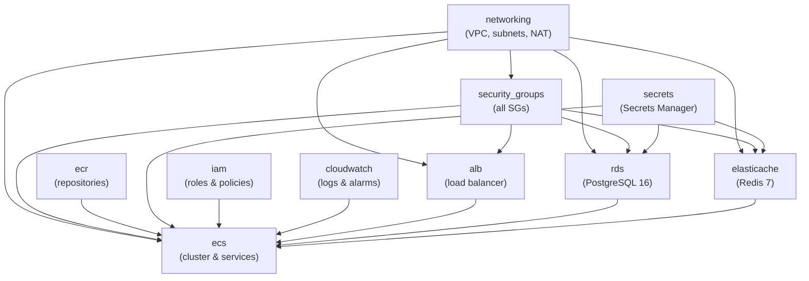

# Terraform Overview

The Portfolio Optimizer infrastructure is defined as code using Terraform. The root module at `infra/terraform/` orchestrates eleven sub-modules to provision a complete AWS ECS Fargate deployment, from VPC networking through to CloudWatch alarms.

> **Terraform version:** `>= 1.8.0` | **AWS provider:** `~> 5.50` | **State backend:** S3 + DynamoDB

## Directory Structure

```
infra/terraform/
├── main.tf                    # Root module — wires all sub-modules
├── variables.tf               # All input variable declarations
├── outputs.tf                 # Root module outputs
├── bootstrap/                 # One-time state backend setup
│   ├── main.tf
│   ├── variables.tf
│   └── outputs.tf
├── environments/
│   ├── staging/               # Staging environment entry point
│   │   ├── main.tf
│   │   ├── variables.tf
│   │   └── outputs.tf
│   └── production/            # Production environment entry point
│       ├── main.tf
│       ├── variables.tf
│       └── outputs.tf
└── modules/
    ├── networking/            # VPC, subnets, NAT, route tables, flow logs
    ├── security_groups/       # All security groups (centralized)
    ├── ecr/                   # ECR repositories
    ├── rds/                   # PostgreSQL 16
    ├── elasticache/           # Redis 7 replication group
    ├── ecs/                   # ECS cluster + Fargate services
    ├── alb/                   # Application Load Balancer
    ├── secrets/               # AWS Secrets Manager
    ├── iam/                   # Task execution and task roles
    ├── cloudwatch/            # Log groups and alarms
    └── vpc/                   # Core VPC with endpoints
```

## Provider Configuration

The root `main.tf` declares the required providers and configures the AWS provider with default tags:

```hcl
terraform {
  required_version = ">= 1.8.0"

  required_providers {
    aws = {
      source  = "hashicorp/aws"
      version = "~> 5.50"
    }
    random = {
      source  = "hashicorp/random"
      version = "~> 3.6"
    }
  }

  # Remote state — configure backend in each environment's backend.hcl
  # backend "s3" {}
}

provider "aws" {
  region = var.aws_region

  default_tags {
    tags = local.common_tags
  }
}
```

The `random` provider is used in the bootstrap module to generate a unique suffix for the S3 state bucket name.

## Remote State (S3 Backend)

The root module declares an empty `backend "s3" {}` block. The actual backend configuration is supplied at `terraform init` time via a `backend.hcl` file that is **not committed to version control** (it contains account-specific values):

```hcl
# backend.hcl (example — not committed to VCS)
bucket         = "portfolio-optimizer-terraform-state-a1b2c3d4"
key            = "portfolio-optimizer/production/terraform.tfstate"
region         = "us-east-1"
dynamodb_table = "portfolio-optimizer-terraform-state-lock"
encrypt        = true
```

Initialize with:

```bash
cd infra/terraform/environments/production
terraform init -backend-config=backend.hcl
```

The S3 bucket and DynamoDB table are created by the [bootstrap module](environments.md#bootstrap-module). See [Environments](environments.md) for full details.

## `local.name_prefix` Convention

All AWS resource names follow a consistent `{project_name}-{environment}` prefix:

```hcl
locals {
  name_prefix = "${var.project_name}-${var.environment}"
  # e.g., "portfolio-optimizer-production"
  # e.g., "portfolio-optimizer-staging"
}
```

This prefix is passed to every sub-module and used in resource `Name` tags and identifiers. For example:
- ECS cluster: `portfolio-optimizer-production-cluster`
- RDS instance: `portfolio-optimizer-production-postgres`
- ALB: `portfolio-optimizer-production-alb`
- CloudWatch log group: `/ecs/portfolio-optimizer-production/backend`

## `local.common_tags`

Every AWS resource receives a standard set of tags via the provider's `default_tags` block:

```hcl
locals {
  common_tags = {
    Project     = var.project_name
    Environment = var.environment
    ManagedBy   = "terraform"
    Repository  = "portfolio-optimizer"
  }
}
```

These tags enable cost allocation by environment, automated compliance checks, and resource discovery. Individual modules may add additional tags (e.g., `Service = "backend"`) using `merge(var.tags, {...})`.

## Data Sources

The root module queries three AWS data sources used across sub-modules:

```hcl
data "aws_availability_zones" "available" {
  state = "available"
}

data "aws_caller_identity" "current" {}

data "aws_region" "current" {}
```

The first two AZs in the region are selected for all multi-AZ resources:

```hcl
locals {
  azs = slice(data.aws_availability_zones.available.names, 0, 2)
}
```

## Sub-Module Instantiation Order

Terraform resolves dependencies automatically, but the logical instantiation order is:



Security groups are created before all other modules to avoid circular dependencies — RDS and ElastiCache need to reference the backend/worker SGs in their ingress rules, but those SGs are also needed by ECS.

## All Sub-Modules Instantiated

### `module.networking`

```hcl
module "networking" {
  source = "./modules/networking"

  name_prefix          = local.name_prefix
  vpc_cidr             = var.vpc_cidr
  availability_zones   = local.azs
  public_subnet_cidrs  = var.public_subnet_cidrs
  private_subnet_cidrs = var.private_subnet_cidrs
  enable_nat_gateway   = var.enable_nat_gateway
  single_nat_gateway   = var.single_nat_gateway

  tags = local.common_tags
}
```

### `module.security_groups`

```hcl
module "security_groups" {
  source = "./modules/security_groups"

  name_prefix = local.name_prefix
  vpc_id      = module.networking.vpc_id

  tags = local.common_tags
}
```

### `module.ecr`

```hcl
module "ecr" {
  source = "./modules/ecr"

  name_prefix = local.name_prefix
  repositories = {
    backend  = "backend"
    worker   = "worker"
    frontend = "frontend"
  }
  image_retention_count = var.ecr_image_retention_count

  tags = local.common_tags
}
```

### `module.secrets`

```hcl
module "secrets" {
  source = "./modules/secrets"

  name_prefix      = local.name_prefix
  openai_api_key   = var.openai_api_key
  db_password      = var.db_password
  redis_auth_token = var.redis_auth_token

  tags = local.common_tags
}
```

### `module.rds`

```hcl
module "rds" {
  source = "./modules/rds"

  name_prefix            = local.name_prefix
  vpc_id                 = module.networking.vpc_id
  private_subnet_ids     = module.networking.private_subnet_ids
  rds_security_group_id  = module.security_groups.rds_sg_id
  db_name                = var.db_name
  db_username            = var.db_username
  db_password_secret_arn = module.secrets.db_password_secret_arn
  db_instance_class      = var.db_instance_class
  db_allocated_storage   = var.db_allocated_storage
  db_multi_az            = var.db_multi_az
  db_deletion_protection = var.db_deletion_protection
  db_backup_retention_days = var.db_backup_retention_days

  tags = local.common_tags
}
```

### `module.elasticache`

```hcl
module "elasticache" {
  source = "./modules/elasticache"

  name_prefix                 = local.name_prefix
  vpc_id                      = module.networking.vpc_id
  private_subnet_ids          = module.networking.private_subnet_ids
  redis_security_group_id     = module.security_groups.redis_sg_id
  redis_node_type             = var.redis_node_type
  redis_num_cache_nodes       = var.redis_num_cache_nodes
  redis_auth_token_secret_arn = module.secrets.redis_auth_token_secret_arn

  tags = local.common_tags
}
```

### `module.alb`

```hcl
module "alb" {
  source = "./modules/alb"

  name_prefix           = local.name_prefix
  vpc_id                = module.networking.vpc_id
  public_subnet_ids     = module.networking.public_subnet_ids
  alb_security_group_id = module.security_groups.alb_sg_id
  certificate_arn       = var.acm_certificate_arn
  domain_name           = var.domain_name

  tags = local.common_tags
}
```

### `module.iam`

```hcl
module "iam" {
  source = "./modules/iam"

  name_prefix               = local.name_prefix
  aws_account_id            = data.aws_caller_identity.current.account_id
  aws_region                = var.aws_region
  secrets_arns              = module.secrets.all_secret_arns
  ecr_repository_arns       = module.ecr.repository_arns
  cloudwatch_log_group_arns = module.cloudwatch.log_group_arns

  tags = local.common_tags
}
```

### `module.cloudwatch`

```hcl
module "cloudwatch" {
  source = "./modules/cloudwatch"

  name_prefix          = local.name_prefix
  log_retention_days   = var.cloudwatch_log_retention_days
  alb_arn_suffix       = module.alb.alb_arn_suffix
  backend_service_name = "${local.name_prefix}-backend"
  worker_service_name  = "${local.name_prefix}-worker"
  ecs_cluster_name     = "${local.name_prefix}-cluster"
  alarm_sns_topic_arn  = var.alarm_sns_topic_arn

  tags = local.common_tags
}
```

### `module.ecs`

The ECS module receives outputs from nearly every other module:

```hcl
module "ecs" {
  source = "./modules/ecs"

  name_prefix                   = local.name_prefix
  vpc_id                        = module.networking.vpc_id
  private_subnet_ids            = module.networking.private_subnet_ids
  alb_target_group_backend_arn  = module.alb.target_group_backend_arn
  alb_target_group_frontend_arn = module.alb.target_group_frontend_arn

  backend_security_group_id  = module.security_groups.backend_sg_id
  worker_security_group_id   = module.security_groups.worker_sg_id
  frontend_security_group_id = module.security_groups.frontend_sg_id

  backend_image_uri  = "${module.ecr.repository_urls["backend"]}:${var.backend_image_tag}"
  worker_image_uri   = "${module.ecr.repository_urls["worker"]}:${var.worker_image_tag}"
  frontend_image_uri = "${module.ecr.repository_urls["frontend"]}:${var.frontend_image_tag}"

  task_execution_role_arn = module.iam.task_execution_role_arn
  task_role_arn           = module.iam.task_role_arn

  openai_api_key_secret_arn   = module.secrets.openai_api_key_secret_arn
  db_password_secret_arn      = module.secrets.db_password_secret_arn
  redis_auth_token_secret_arn = module.secrets.redis_auth_token_secret_arn

  db_host     = module.rds.db_endpoint
  db_port     = module.rds.db_port
  db_name     = var.db_name
  db_username = var.db_username

  redis_endpoint = module.elasticache.redis_endpoint
  redis_port     = module.elasticache.redis_port

  cloudwatch_log_group_backend  = module.cloudwatch.log_group_backend
  cloudwatch_log_group_worker   = module.cloudwatch.log_group_worker
  cloudwatch_log_group_frontend = module.cloudwatch.log_group_frontend

  # ... task sizing, desired counts, auto-scaling, app config
  tags = local.common_tags
}
```

## Root Module Variables

Key variables with their defaults:

| Variable | Type | Default | Description |
|----------|------|---------|-------------|
| `project_name` | string | `portfolio-optimizer` | Prefix for all resource names |
| `environment` | string | — | `development`, `staging`, or `production` |
| `aws_region` | string | `us-east-1` | AWS deployment region |
| `vpc_cidr` | string | `10.0.0.0/16` | VPC CIDR block |
| `db_instance_class` | string | `db.t3.medium` | RDS instance type |
| `db_multi_az` | bool | `true` | Enable RDS Multi-AZ |
| `redis_node_type` | string | `cache.t3.micro` | ElastiCache node type |
| `backend_cpu` | number | `1024` | Backend Fargate CPU units |
| `backend_memory` | number | `2048` | Backend Fargate memory (MiB) |
| `worker_cpu` | number | `2048` | Worker Fargate CPU units |
| `worker_memory` | number | `4096` | Worker Fargate memory (MiB) |
| `backend_desired_count` | number | `2` | Backend task replicas |
| `backend_max_capacity` | number | `10` | Backend auto-scaling max |
| `worker_max_capacity` | number | `8` | Worker auto-scaling max |
| `cloudwatch_log_retention_days` | number | `30` | Log retention period |

## Root Module Outputs

Key outputs available after `terraform apply`:

| Output | Description |
|--------|-------------|
| `vpc_id` | VPC identifier |
| `alb_dns_name` | ALB DNS name (use for Route 53 alias) |
| `application_url` | Full application URL (HTTPS if cert provided) |
| `ecs_cluster_name` | ECS cluster name |
| `ecr_backend_repository_url` | ECR URL for backend image pushes |
| `ecr_worker_repository_url` | ECR URL for worker image pushes |
| `ecr_frontend_repository_url` | ECR URL for frontend image pushes |
| `rds_endpoint` | RDS hostname (sensitive) |
| `redis_endpoint` | ElastiCache primary endpoint (sensitive) |
| `task_execution_role_arn` | IAM role ARN for ECS agent |
| `cloudwatch_log_group_backend` | Backend log group name |

## Usage

```bash
# Deploy to production
cd infra/terraform/environments/production
terraform init -backend-config=backend.hcl
terraform plan -var-file="terraform.tfvars"
terraform apply -var-file="terraform.tfvars"

# Deploy to staging
cd infra/terraform/environments/staging
terraform init -backend-config=backend.hcl
terraform plan -var-file="terraform.tfvars"
terraform apply -var-file="terraform.tfvars"
```

## Related Documentation

- [Terraform Modules](terraform-modules.md) — detailed documentation for each of the 11 modules
- [AWS Architecture](aws-architecture.md) — high-level AWS resource topology
- [Environments](environments.md) — staging vs production configuration differences and bootstrap

## CI/CD Cross-References

- [Terraform Workflow](../15-cicd/terraform-workflow.md) — GitHub Actions pipeline that runs `terraform plan` and `terraform apply`
- [CD Workflow](../15-cicd/cd-workflow.md) — Application deployment pipeline that runs after infrastructure is provisioned
- [GitHub Secrets](../15-cicd/github-secrets.md) — AWS OIDC role and Terraform state bucket credentials
- [Environments](environments.md) — How Terraform workspaces map to dev/staging/prod environments
