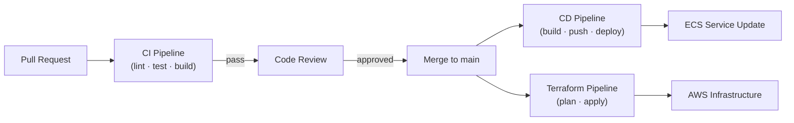

# CI/CD Pipelines

GitHub Actions workflows for continuous integration, continuous deployment, and infrastructure management for the Portfolio Optimizer.

## Section Contents

| Page | Description |
|------|-------------|
| [CI Workflow](ci-workflow.md) | Lint, type check, test, and build pipeline (runs on every PR) |
| [CD Workflow](cd-workflow.md) | Docker build, push to ECR, and ECS service update (runs on merge to main) |
| [Terraform Workflow](terraform-workflow.md) | Infrastructure plan (on PR) and apply (on merge) pipeline |
| [GitHub Secrets](github-secrets.md) | Required secrets, OIDC configuration, and secret rotation |

## Pipeline Overview

## CI Pipeline Stages

| Stage | Tool | Trigger |
|-------|------|---------|
| Lint (Python) | Ruff | Every PR |
| Type check | mypy | Every PR |
| Backend tests | pytest | Every PR |
| Frontend lint | ESLint | Every PR |
| Frontend tests | Vitest | Every PR |
| Docker build (dry run) | docker build | Every PR |
| Security scan | pip-audit + npm audit | Every PR |

## CD Pipeline Stages

| Stage | Tool | Trigger |
|-------|------|---------|
| Docker build + push | docker buildx + ECR | Merge to main |
| ECS task definition update | AWS CLI | Merge to main |
| ECS service update | AWS CLI | Merge to main |
| Smoke test | httpx | Post-deploy |

## Cross-References

- **Infrastructure** → [Terraform Overview](../14-infrastructure/terraform-overview.md)
- **Testing** → [Backend Tests](../13-testing/backend-tests.md)
- **Operations** → [Deployment Guide](../17-operations/deployment-guide.md)
- **Observability** → [Prometheus Metrics](../16-observability/prometheus-metrics.md)
