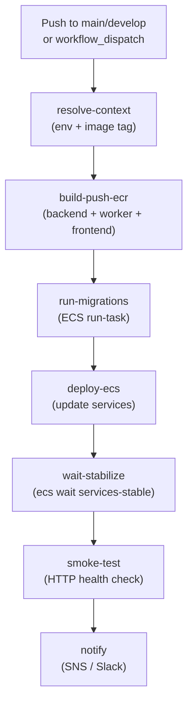
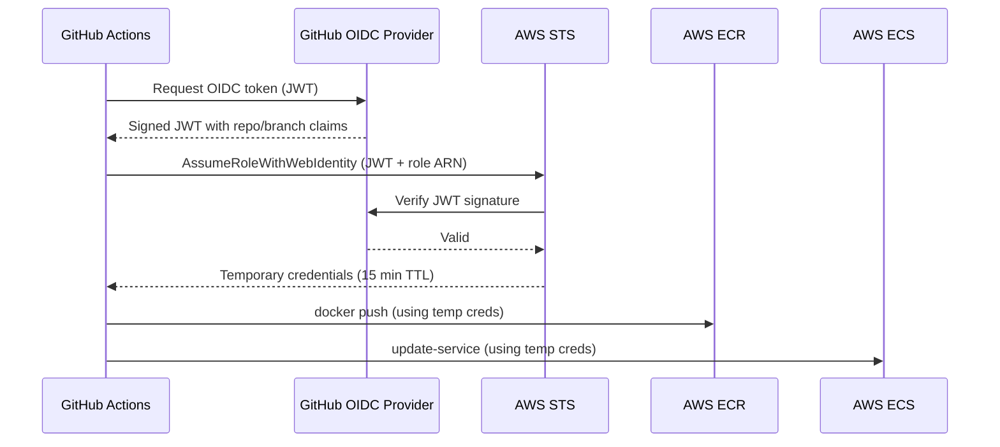
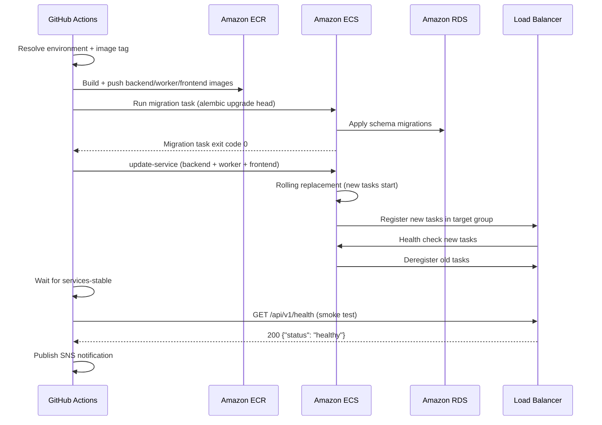

# CD Workflow (`cd.yml`)

The Continuous Deployment workflow automates the full release pipeline from a passing CI build to a live environment on AWS ECS Fargate. It uses OpenID Connect (OIDC) for keyless AWS authentication, builds and pushes images to ECR, runs database migrations, deploys ECS services, waits for stabilization, runs smoke tests, and sends a deployment notification.

## Overview



## Triggers

```yaml
on:
  push:
    branches:
      - main      # deploys to production
      - develop   # deploys to staging
  workflow_dispatch:
    inputs:
      environment:
        description: "Target environment (staging | production)"
        required: true
        type: choice
        options: [staging, production]
      image_tag:
        description: "Image tag to deploy (default: latest SHA)"
        required: false
```

| Trigger | Environment | Notes |
|---------|-------------|-------|
| Push to `main` | `production` | Automatic after CI passes |
| Push to `develop` | `staging` | Automatic after CI passes |
| `workflow_dispatch` | User-selected | Manual re-deploy or rollback |

> **Branch protection:** The `main` and `develop` branches require all CI checks to pass before a push is accepted. This means the CD workflow only fires on code that has already passed linting, testing, and security scanning.

## Concurrency Group

```yaml
concurrency:
  group: deploy-${{ github.event.inputs.environment || (github.ref == 'refs/heads/main' && 'production' || 'staging') }}
  cancel-in-progress: false
```

Only one deployment per environment runs at a time. Unlike CI, `cancel-in-progress` is set to `false` — a deployment in progress is never cancelled mid-flight, which could leave the environment in a partially-deployed state. New deployments queue behind the running one.

## OIDC Authentication

The CD workflow uses GitHub's OIDC provider to obtain short-lived AWS credentials. **No long-lived AWS access keys are stored as secrets.**

```yaml
permissions:
  id-token: write   # required for OIDC token request
  contents: read

steps:
  - name: Configure AWS credentials via OIDC
    uses: aws-actions/configure-aws-credentials@v4
    with:
      role-to-assume: ${{ vars.AWS_DEPLOY_ROLE_ARN }}
      aws-region: ${{ vars.AWS_REGION }}
      role-session-name: GitHubActions-CD-${{ github.run_id }}
```

### How OIDC Works



The IAM role (`AWS_DEPLOY_ROLE_ARN`) has a trust policy that restricts assumption to:
- The specific GitHub organization and repository
- Optionally, specific branches (e.g., `repo:org/repo:ref:refs/heads/main`)

This is provisioned by the bootstrap Terraform module in `infra/terraform/bootstrap/main.tf`.

## Jobs

### `resolve-context`

Determines the deployment environment and image tag from the trigger context.

```yaml
resolve-context:
  runs-on: ubuntu-latest
  outputs:
    environment: ${{ steps.ctx.outputs.environment }}
    image_tag: ${{ steps.ctx.outputs.image_tag }}
    alb_url: ${{ steps.ctx.outputs.alb_url }}
  steps:
    - name: Resolve deployment context
      id: ctx
      run: |
        if [ "${{ github.event_name }}" = "workflow_dispatch" ]; then
          ENV="${{ github.event.inputs.environment }}"
          TAG="${{ github.event.inputs.image_tag || github.sha }}"
        elif [ "${{ github.ref }}" = "refs/heads/main" ]; then
          ENV="production"
          TAG="${{ github.sha }}"
        else
          ENV="staging"
          TAG="${{ github.sha }}"
        fi

        if [ "$ENV" = "production" ]; then
          ALB_URL="${{ vars.PRODUCTION_ALB_URL }}"
        else
          ALB_URL="${{ vars.STAGING_ALB_URL }}"
        fi

        echo "environment=$ENV" >> $GITHUB_OUTPUT
        echo "image_tag=$TAG" >> $GITHUB_OUTPUT
        echo "alb_url=$ALB_URL" >> $GITHUB_OUTPUT
```

The image tag defaults to the full Git SHA (`github.sha`), providing an immutable, traceable reference for every deployed image.

### `build-push-ecr`

Builds and pushes all three production images to Amazon ECR.

```yaml
build-push-ecr:
  runs-on: ubuntu-latest
  needs: resolve-context
  environment: ${{ needs.resolve-context.outputs.environment }}
  steps:
    - uses: actions/checkout@v4

    - name: Configure AWS credentials via OIDC
      uses: aws-actions/configure-aws-credentials@v4
      with:
        role-to-assume: ${{ vars.AWS_DEPLOY_ROLE_ARN }}
        aws-region: ${{ vars.AWS_REGION }}

    - name: Login to Amazon ECR
      id: login-ecr
      uses: aws-actions/amazon-ecr-login@v2

    - name: Set up Docker Buildx
      uses: docker/setup-buildx-action@v3

    - name: Build and push backend image
      uses: docker/build-push-action@v6
      with:
        context: ./backend
        target: production
        push: true
        tags: |
          ${{ vars.ECR_REGISTRY }}/portfolio-optimizer-backend:${{ needs.resolve-context.outputs.image_tag }}
          ${{ vars.ECR_REGISTRY }}/portfolio-optimizer-backend:latest
        cache-from: type=gha
        cache-to: type=gha,mode=max

    - name: Build and push worker image
      uses: docker/build-push-action@v6
      with:
        context: ./backend
        target: production
        push: true
        tags: |
          ${{ vars.ECR_REGISTRY }}/portfolio-optimizer-worker:${{ needs.resolve-context.outputs.image_tag }}
          ${{ vars.ECR_REGISTRY }}/portfolio-optimizer-worker:latest
        cache-from: type=gha
        cache-to: type=gha,mode=max

    - name: Build and push frontend image
      uses: docker/build-push-action@v6
      with:
        context: ./frontend
        target: production
        push: true
        tags: |
          ${{ vars.ECR_REGISTRY }}/portfolio-optimizer-frontend:${{ needs.resolve-context.outputs.image_tag }}
          ${{ vars.ECR_REGISTRY }}/portfolio-optimizer-frontend:latest
        build-args: |
          VITE_API_BASE_URL=https://${{ needs.resolve-context.outputs.alb_url }}
          VITE_WS_BASE_URL=wss://${{ needs.resolve-context.outputs.alb_url }}
        cache-from: type=gha
        cache-to: type=gha,mode=max
```

Each image is tagged with both the Git SHA (immutable) and `latest` (mutable convenience tag). The backend and worker share the same `backend/Dockerfile` production stage — they differ only in the ECS task definition command (`uvicorn` vs `celery worker`).

### `run-migrations`

Runs Alembic database migrations as a one-off ECS task before updating the running services.

```yaml
run-migrations:
  runs-on: ubuntu-latest
  needs: [resolve-context, build-push-ecr]
  environment: ${{ needs.resolve-context.outputs.environment }}
  steps:
    - name: Configure AWS credentials via OIDC
      uses: aws-actions/configure-aws-credentials@v4
      with:
        role-to-assume: ${{ vars.AWS_DEPLOY_ROLE_ARN }}
        aws-region: ${{ vars.AWS_REGION }}

    - name: Run database migrations
      run: |
        TASK_ARN=$(aws ecs run-task \
          --cluster ${{ vars.ECS_CLUSTER_NAME }} \
          --task-definition ${{ vars.ECS_MIGRATION_TASK_DEF }} \
          --launch-type FARGATE \
          --network-configuration "awsvpcConfiguration={
            subnets=[${{ vars.ECS_SUBNET_IDS }}],
            securityGroups=[${{ vars.ECS_SECURITY_GROUP_ID }}],
            assignPublicIp=DISABLED
          }" \
          --overrides '{
            "containerOverrides": [{
              "name": "backend",
              "command": ["alembic", "upgrade", "head"]
            }]
          }' \
          --query 'tasks[0].taskArn' \
          --output text)

        echo "Migration task ARN: $TASK_ARN"

        # Wait for the migration task to complete
        aws ecs wait tasks-stopped \
          --cluster ${{ vars.ECS_CLUSTER_NAME }} \
          --tasks "$TASK_ARN"

        # Check exit code
        EXIT_CODE=$(aws ecs describe-tasks \
          --cluster ${{ vars.ECS_CLUSTER_NAME }} \
          --tasks "$TASK_ARN" \
          --query 'tasks[0].containers[0].exitCode' \
          --output text)

        if [ "$EXIT_CODE" != "0" ]; then
          echo "Migration failed with exit code $EXIT_CODE"
          exit 1
        fi

        echo "Migrations completed successfully"
```

Running migrations before updating services ensures the database schema is compatible with the new code before any traffic is routed to new containers. The migration task uses the same backend image but overrides the command to `alembic upgrade head`.

> **Safety:** Alembic migrations are designed to be backward-compatible. The old service version continues running against the new schema while the new version starts up. Avoid destructive schema changes (column drops, renames) in the same migration as additive changes.

### `deploy-ecs`

Updates the ECS services to use the new image tag.

```yaml
deploy-ecs:
  runs-on: ubuntu-latest
  needs: [resolve-context, run-migrations]
  environment: ${{ needs.resolve-context.outputs.environment }}
  steps:
    - name: Configure AWS credentials via OIDC
      uses: aws-actions/configure-aws-credentials@v4
      with:
        role-to-assume: ${{ vars.AWS_DEPLOY_ROLE_ARN }}
        aws-region: ${{ vars.AWS_REGION }}

    - name: Update backend ECS service
      run: |
        aws ecs update-service \
          --cluster ${{ vars.ECS_CLUSTER_NAME }} \
          --service ${{ vars.ECS_BACKEND_SERVICE }} \
          --force-new-deployment

    - name: Update worker ECS service
      run: |
        aws ecs update-service \
          --cluster ${{ vars.ECS_CLUSTER_NAME }} \
          --service ${{ vars.ECS_WORKER_SERVICE }} \
          --force-new-deployment

    - name: Update frontend ECS service
      run: |
        aws ecs update-service \
          --cluster ${{ vars.ECS_CLUSTER_NAME }} \
          --service ${{ vars.ECS_FRONTEND_SERVICE }} \
          --force-new-deployment
```

`--force-new-deployment` triggers a rolling update even if the task definition hasn't changed. ECS performs a rolling replacement: new tasks start, pass health checks, then old tasks are stopped. The ALB routes traffic only to healthy tasks throughout the deployment.

### `wait-stabilize`

Waits for all three ECS services to reach a stable state (all desired tasks running and healthy).

```yaml
wait-stabilize:
  runs-on: ubuntu-latest
  needs: [resolve-context, deploy-ecs]
  environment: ${{ needs.resolve-context.outputs.environment }}
  steps:
    - name: Configure AWS credentials via OIDC
      uses: aws-actions/configure-aws-credentials@v4
      with:
        role-to-assume: ${{ vars.AWS_DEPLOY_ROLE_ARN }}
        aws-region: ${{ vars.AWS_REGION }}

    - name: Wait for services to stabilize
      run: |
        echo "Waiting for backend service to stabilize..."
        aws ecs wait services-stable \
          --cluster ${{ vars.ECS_CLUSTER_NAME }} \
          --services ${{ vars.ECS_BACKEND_SERVICE }}

        echo "Waiting for worker service to stabilize..."
        aws ecs wait services-stable \
          --cluster ${{ vars.ECS_CLUSTER_NAME }} \
          --services ${{ vars.ECS_WORKER_SERVICE }}

        echo "Waiting for frontend service to stabilize..."
        aws ecs wait services-stable \
          --cluster ${{ vars.ECS_CLUSTER_NAME }} \
          --services ${{ vars.ECS_FRONTEND_SERVICE }}

        echo "All services stable"
```

`aws ecs wait services-stable` polls every 15 seconds for up to 10 minutes. If any service fails to stabilize (e.g., containers crash-looping), the wait command exits with a non-zero code, failing the deployment and triggering the notification step.

### `smoke-test`

Runs a lightweight HTTP health check against the deployed environment.

```yaml
smoke-test:
  runs-on: ubuntu-latest
  needs: [resolve-context, wait-stabilize]
  environment: ${{ needs.resolve-context.outputs.environment }}
  steps:
    - name: Run smoke tests
      run: |
        ALB_URL="${{ needs.resolve-context.outputs.alb_url }}"

        echo "Running smoke tests against $ALB_URL"

        # Health endpoint
        HTTP_STATUS=$(curl -s -o /dev/null -w "%{http_code}" \
          --max-time 30 \
          "https://${ALB_URL}/api/v1/health")

        if [ "$HTTP_STATUS" != "200" ]; then
          echo "Health check failed: HTTP $HTTP_STATUS"
          exit 1
        fi

        echo "Health check passed: HTTP $HTTP_STATUS"

        # Verify response structure
        RESPONSE=$(curl -s --max-time 30 "https://${ALB_URL}/api/v1/health")
        echo "Health response: $RESPONSE"

        # Check status field
        STATUS=$(echo "$RESPONSE" | python3 -c "import sys,json; d=json.load(sys.stdin); print(d.get('status',''))")
        if [ "$STATUS" != "healthy" ]; then
          echo "Health status is not 'healthy': $STATUS"
          exit 1
        fi

        echo "Smoke tests passed"
```

The smoke test hits the `/api/v1/health` endpoint (see [Health Endpoint](../04-api-reference/health-endpoint.md)) and validates that the response contains `"status": "healthy"`. This confirms the backend container is running, the database connection is live, and the Redis connection is live.

### `notify`

Sends a deployment notification regardless of success or failure.

```yaml
notify:
  runs-on: ubuntu-latest
  needs: [resolve-context, smoke-test]
  if: always()
  environment: ${{ needs.resolve-context.outputs.environment }}
  steps:
    - name: Configure AWS credentials via OIDC
      uses: aws-actions/configure-aws-credentials@v4
      with:
        role-to-assume: ${{ vars.AWS_DEPLOY_ROLE_ARN }}
        aws-region: ${{ vars.AWS_REGION }}

    - name: Send deployment notification
      run: |
        DEPLOY_STATUS="${{ needs.smoke-test.result }}"
        ENV="${{ needs.resolve-context.outputs.environment }}"
        TAG="${{ needs.resolve-context.outputs.image_tag }}"

        MESSAGE="Deployment to $ENV: $DEPLOY_STATUS
        Image tag: $TAG
        Triggered by: ${{ github.actor }}
        Commit: ${{ github.sha }}
        Run: ${{ github.server_url }}/${{ github.repository }}/actions/runs/${{ github.run_id }}"

        aws sns publish \
          --topic-arn ${{ vars.ALARM_SNS_TOPIC_ARN }} \
          --subject "[$ENV] Deployment $DEPLOY_STATUS" \
          --message "$MESSAGE"
```

The `if: always()` condition ensures the notification fires even when earlier jobs fail. The SNS topic (`ALARM_SNS_TOPIC_ARN`) can be subscribed to email, Slack (via Lambda), PagerDuty, or any other notification channel.

## Deployment Flow Summary



## Required Secrets and Variables

See [GitHub Secrets & Variables](github-secrets.md) for the complete reference. The CD workflow specifically requires:

| Name | Type | Used In |
|------|------|---------|
| `AWS_DEPLOY_ROLE_ARN` | Variable | OIDC role assumption |
| `AWS_REGION` | Variable | All AWS CLI calls |
| `ECR_REGISTRY` | Variable | Image push destination |
| `ECS_CLUSTER_NAME` | Variable | ECS service updates |
| `ECS_BACKEND_SERVICE` | Variable | Backend service name |
| `ECS_WORKER_SERVICE` | Variable | Worker service name |
| `ECS_FRONTEND_SERVICE` | Variable | Frontend service name |
| `ECS_MIGRATION_TASK_DEF` | Variable | Migration task definition |
| `ECS_SUBNET_IDS` | Variable | Migration task networking |
| `ECS_SECURITY_GROUP_ID` | Variable | Migration task networking |
| `PRODUCTION_ALB_URL` | Variable | Smoke test URL (production) |
| `STAGING_ALB_URL` | Variable | Smoke test URL (staging) |
| `ALARM_SNS_TOPIC_ARN` | Variable | Deployment notifications |

## Rollback

To roll back to a previous deployment, use `workflow_dispatch` with the previous Git SHA as the `image_tag` input. The images are retained in ECR for `ecr_image_retention_count` images (default: 10 for staging, 20 for production) as configured in `infra/terraform/variables.tf`.

```bash
# Example: trigger a rollback via GitHub CLI
gh workflow run cd.yml \
  --field environment=production \
  --field image_tag=abc1234def5678
```

## Related Pages

- [CI Workflow](ci-workflow.md) — quality gates that must pass before CD triggers
- [Terraform Workflow](terraform-workflow.md) — infrastructure provisioning
- [GitHub Secrets & Variables](github-secrets.md) — all required configuration
- [Health Endpoint](../04-api-reference/health-endpoint.md) — smoke test target
