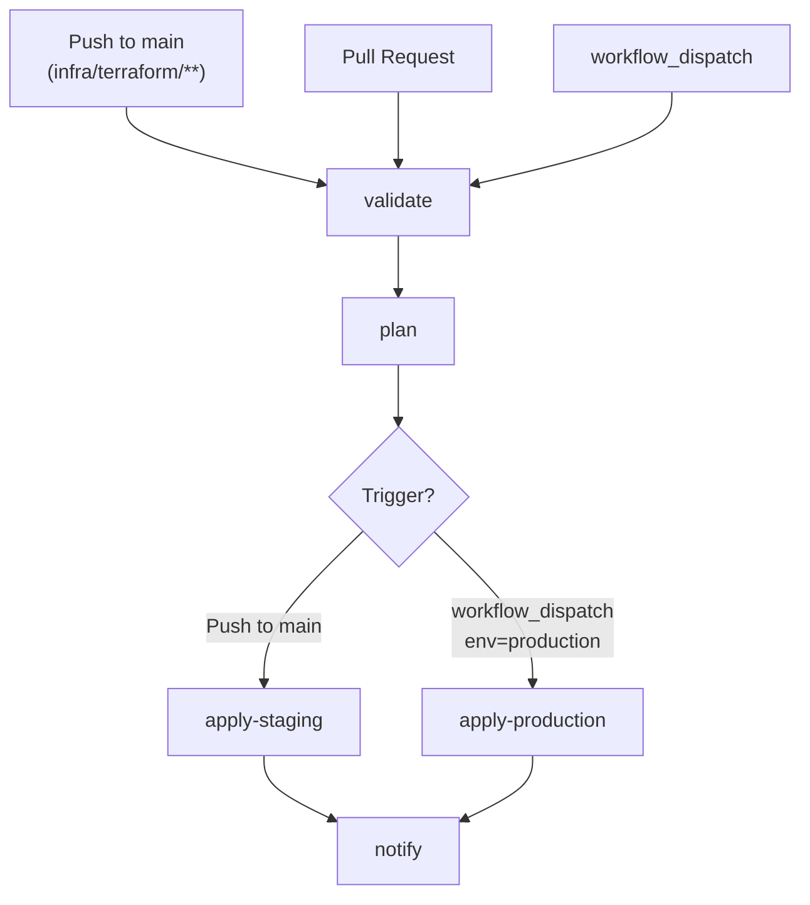
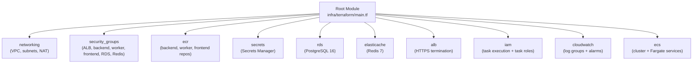

# Terraform Workflow (`terraform.yml`)

The Terraform workflow automates infrastructure validation, planning, and provisioning for the Portfolio Optimizer's AWS infrastructure. It validates all Terraform modules on every relevant change, posts plan output as a PR comment for review, and applies changes to staging automatically on `main` pushes or to production on manual dispatch.

## Overview



## Triggers

```yaml
on:
  push:
    branches: [main]
    paths:
      - "infra/terraform/**"
  pull_request:
    branches: [main, develop]
    paths:
      - "infra/terraform/**"
  workflow_dispatch:
    inputs:
      environment:
        description: "Target environment (staging | production)"
        required: true
        type: choice
        options: [staging, production]
      action:
        description: "Terraform action (plan | apply)"
        required: true
        type: choice
        options: [plan, apply]
```

The `paths` filter ensures the workflow only runs when Terraform files change. Pushes that modify only application code (backend, frontend) do not trigger infrastructure changes.

| Trigger | Jobs Run | Notes |
|---------|----------|-------|
| PR to `main`/`develop` | `validate` + `plan` | Plan posted as PR comment |
| Push to `main` (infra paths) | `validate` + `plan` + `apply-staging` | Auto-applies to staging |
| `workflow_dispatch` (staging) | `validate` + `plan` + `apply-staging` | Manual staging apply |
| `workflow_dispatch` (production) | `validate` + `plan` + `apply-production` | Manual production apply |

> **Production safety:** Production infrastructure changes are **never applied automatically**. They always require a manual `workflow_dispatch` trigger with `environment=production` and `action=apply`. This prevents accidental production changes from a `main` push.

## Concurrency Group

```yaml
concurrency:
  group: terraform-${{ github.event.inputs.environment || 'staging' }}
  cancel-in-progress: false
```

Only one Terraform operation per environment runs at a time. `cancel-in-progress: false` prevents a running `apply` from being interrupted, which could leave infrastructure in a partially-applied state.

## OIDC Authentication

Like the CD workflow, the Terraform workflow uses GitHub OIDC for keyless AWS authentication. The role used here (`AWS_ROLE_ARN`) requires broader permissions than the deploy role — it needs full Terraform provisioning access.

```yaml
permissions:
  id-token: write
  contents: read
  pull-requests: write  # required to post plan comments on PRs

steps:
  - name: Configure AWS credentials via OIDC
    uses: aws-actions/configure-aws-credentials@v4
    with:
      role-to-assume: ${{ secrets.AWS_ROLE_ARN }}
      aws-region: ${{ vars.AWS_REGION }}
      role-session-name: GitHubActions-Terraform-${{ github.run_id }}
```

The `pull-requests: write` permission is required for the plan job to post comments on PRs.

The IAM role for Terraform (`AWS_ROLE_ARN`) is created by the bootstrap module at `infra/terraform/bootstrap/main.tf` and includes permissions for:

```hcl
# From infra/terraform/bootstrap/main.tf
Statement = [
  { Sid = "TerraformStateAccess",   Action = ["s3:GetObject", "s3:PutObject", ...] },
  { Sid = "TerraformStateLocking",  Action = ["dynamodb:GetItem", "dynamodb:PutItem", ...] },
  { Sid = "ECRAccess",              Action = ["ecr:GetAuthorizationToken", "ecr:PutImage", ...] },
  { Sid = "ECSDeployAccess",        Action = ["ecs:UpdateService", "ecs:RegisterTaskDefinition", ...] },
  { Sid = "TerraformProvisionAccess", Action = ["ec2:*", "ecs:*", "rds:*", "elasticache:*", ...] }
]
```

## Terraform State Backend

Remote state is stored in S3 with DynamoDB locking, provisioned by the bootstrap module:

```hcl
# infra/terraform/environments/production/backend.hcl.example
bucket         = "your-terraform-state-bucket-name"
key            = "portfolio-optimizer/production/terraform.tfstate"
region         = "us-east-1"
dynamodb_table = "terraform-state-lock"
encrypt        = true
```

The S3 bucket name is stored as `TF_STATE_BUCKET` and the DynamoDB table name as `TF_STATE_LOCK_TABLE` in GitHub Variables. These are injected at `terraform init` time.

## Jobs

### `validate`

Validates Terraform formatting and configuration across all modules.

```yaml
validate:
  runs-on: ubuntu-latest
  steps:
    - uses: actions/checkout@v4

    - name: Setup Terraform
      uses: hashicorp/setup-terraform@v3
      with:
        terraform_version: "~> 1.8.0"

    - name: Configure AWS credentials via OIDC
      uses: aws-actions/configure-aws-credentials@v4
      with:
        role-to-assume: ${{ secrets.AWS_ROLE_ARN }}
        aws-region: ${{ vars.AWS_REGION }}

    - name: Terraform fmt check (root module)
      working-directory: infra/terraform
      run: terraform fmt -check -recursive

    - name: Validate root module
      working-directory: infra/terraform
      run: |
        terraform init -backend=false
        terraform validate

    - name: Validate staging environment
      working-directory: infra/terraform/environments/staging
      run: |
        terraform init -backend=false
        terraform validate

    - name: Validate production environment
      working-directory: infra/terraform/environments/production
      run: |
        terraform init -backend=false
        terraform validate

    - name: Validate bootstrap module
      working-directory: infra/terraform/bootstrap
      run: |
        terraform init -backend=false
        terraform validate
```

**`terraform fmt -check -recursive`** validates that all `.tf` files are formatted according to Terraform's canonical style. The `-recursive` flag checks all subdirectories, covering all modules under `infra/terraform/modules/`.

**`terraform validate`** checks the configuration for syntax errors and internal consistency without accessing any remote state or provider APIs. The `-backend=false` flag skips backend initialization, allowing validation without S3 credentials.

The modules validated include:

| Module | Path |
|--------|------|
| Root | `infra/terraform/` |
| Networking | `infra/terraform/modules/networking/` |
| Security Groups | `infra/terraform/modules/security_groups/` |
| ECR | `infra/terraform/modules/ecr/` |
| RDS | `infra/terraform/modules/rds/` |
| ElastiCache | `infra/terraform/modules/elasticache/` |
| ALB | `infra/terraform/modules/alb/` |
| IAM | `infra/terraform/modules/iam/` |
| ECS | `infra/terraform/modules/ecs/` |
| CloudWatch | `infra/terraform/modules/cloudwatch/` |
| Secrets | `infra/terraform/modules/secrets/` |
| VPC | `infra/terraform/modules/vpc/` |
| Bootstrap | `infra/terraform/bootstrap/` |

### `plan`

Generates a Terraform plan and posts it as a PR comment.

```yaml
plan:
  runs-on: ubuntu-latest
  needs: validate
  steps:
    - uses: actions/checkout@v4

    - name: Setup Terraform
      uses: hashicorp/setup-terraform@v3
      with:
        terraform_version: "~> 1.8.0"

    - name: Configure AWS credentials via OIDC
      uses: aws-actions/configure-aws-credentials@v4
      with:
        role-to-assume: ${{ secrets.AWS_ROLE_ARN }}
        aws-region: ${{ vars.AWS_REGION }}

    - name: Determine environment directory
      id: env
      run: |
        if [ "${{ github.event.inputs.environment }}" = "production" ]; then
          echo "dir=infra/terraform/environments/production" >> $GITHUB_OUTPUT
          echo "env=production" >> $GITHUB_OUTPUT
        else
          echo "dir=infra/terraform/environments/staging" >> $GITHUB_OUTPUT
          echo "env=staging" >> $GITHUB_OUTPUT
        fi

    - name: Terraform init
      working-directory: ${{ steps.env.outputs.dir }}
      run: |
        terraform init \
          -backend-config="bucket=${{ vars.TF_STATE_BUCKET }}" \
          -backend-config="key=portfolio-optimizer/${{ steps.env.outputs.env }}/terraform.tfstate" \
          -backend-config="region=${{ vars.AWS_REGION }}" \
          -backend-config="dynamodb_table=${{ vars.TF_STATE_LOCK_TABLE }}" \
          -backend-config="encrypt=true"

    - name: Terraform plan
      id: plan
      working-directory: ${{ steps.env.outputs.dir }}
      env:
        TF_VAR_openai_api_key: ${{ secrets.OPENAI_API_KEY }}
        TF_VAR_db_password: ${{ secrets.DB_PASSWORD }}
        TF_VAR_redis_auth_token: ${{ secrets.REDIS_AUTH_TOKEN }}
        TF_VAR_acm_certificate_arn: ${{ vars.ACM_CERTIFICATE_ARN }}
        TF_VAR_domain_name: ${{ vars.DOMAIN_NAME }}
        TF_VAR_alarm_sns_topic_arn: ${{ vars.ALARM_SNS_TOPIC_ARN }}
      run: |
        terraform plan \
          -var="aws_region=${{ vars.AWS_REGION }}" \
          -out=tfplan \
          -no-color 2>&1 | tee plan_output.txt

    - name: Post plan as PR comment
      if: github.event_name == 'pull_request'
      uses: actions/github-script@v7
      with:
        script: |
          const fs = require('fs');
          const planOutput = fs.readFileSync('${{ steps.env.outputs.dir }}/plan_output.txt', 'utf8');
          const truncated = planOutput.length > 60000
            ? planOutput.substring(0, 60000) + '\n\n... (truncated)'
            : planOutput;

          const body = `## Terraform Plan — ${{ steps.env.outputs.env }}

          <details><summary>Show Plan</summary>

          \`\`\`hcl
          ${truncated}
          \`\`\`

          </details>

          **Triggered by:** @${{ github.actor }}
          **Commit:** \`${{ github.sha }}\``;

          github.rest.issues.createComment({
            issue_number: context.issue.number,
            owner: context.repo.owner,
            repo: context.repo.repo,
            body: body
          });

    - name: Upload plan artifact
      uses: actions/upload-artifact@v4
      with:
        name: tfplan-${{ steps.env.outputs.env }}
        path: ${{ steps.env.outputs.dir }}/tfplan
        retention-days: 7
```

Sensitive variables are passed via `TF_VAR_*` environment variables rather than `-var` flags to avoid them appearing in logs. The plan output is truncated to 60,000 characters to stay within GitHub's PR comment size limit.

### `apply-staging`

Applies the Terraform plan to the staging environment. Runs automatically on `main` pushes.

```yaml
apply-staging:
  runs-on: ubuntu-latest
  needs: plan
  if: |
    github.ref == 'refs/heads/main' ||
    (github.event_name == 'workflow_dispatch' &&
     github.event.inputs.environment == 'staging' &&
     github.event.inputs.action == 'apply')
  environment:
    name: staging
    url: https://${{ vars.STAGING_ALB_URL }}
  steps:
    - uses: actions/checkout@v4

    - name: Setup Terraform
      uses: hashicorp/setup-terraform@v3
      with:
        terraform_version: "~> 1.8.0"

    - name: Configure AWS credentials via OIDC
      uses: aws-actions/configure-aws-credentials@v4
      with:
        role-to-assume: ${{ secrets.AWS_ROLE_ARN }}
        aws-region: ${{ vars.AWS_REGION }}

    - name: Download plan artifact
      uses: actions/download-artifact@v4
      with:
        name: tfplan-staging
        path: infra/terraform/environments/staging/

    - name: Terraform init
      working-directory: infra/terraform/environments/staging
      run: |
        terraform init \
          -backend-config="bucket=${{ vars.TF_STATE_BUCKET }}" \
          -backend-config="key=portfolio-optimizer/staging/terraform.tfstate" \
          -backend-config="region=${{ vars.AWS_REGION }}" \
          -backend-config="dynamodb_table=${{ vars.TF_STATE_LOCK_TABLE }}" \
          -backend-config="encrypt=true"

    - name: Terraform apply
      working-directory: infra/terraform/environments/staging
      env:
        TF_VAR_openai_api_key: ${{ secrets.OPENAI_API_KEY }}
        TF_VAR_db_password: ${{ secrets.DB_PASSWORD }}
        TF_VAR_redis_auth_token: ${{ secrets.REDIS_AUTH_TOKEN }}
        TF_VAR_acm_certificate_arn: ${{ vars.ACM_CERTIFICATE_ARN }}
        TF_VAR_domain_name: ${{ vars.DOMAIN_NAME }}
        TF_VAR_alarm_sns_topic_arn: ${{ vars.ALARM_SNS_TOPIC_ARN }}
      run: terraform apply -auto-approve tfplan
```

The staging environment in `infra/terraform/environments/staging/main.tf` uses cost-optimized settings:
- Single NAT Gateway (`single_nat_gateway = true`)
- Smaller RDS instance (`db.t3.small`, single-AZ)
- Single ElastiCache node (`cache.t3.micro`)
- Minimal ECS desired counts (1 per service)
- Shorter log retention (14 days)

### `apply-production`

Applies the Terraform plan to the production environment. **Requires manual `workflow_dispatch`.**

```yaml
apply-production:
  runs-on: ubuntu-latest
  needs: plan
  if: |
    github.event_name == 'workflow_dispatch' &&
    github.event.inputs.environment == 'production' &&
    github.event.inputs.action == 'apply'
  environment:
    name: production
    url: https://${{ vars.PRODUCTION_ALB_URL }}
  steps:
    - uses: actions/checkout@v4

    - name: Setup Terraform
      uses: hashicorp/setup-terraform@v3
      with:
        terraform_version: "~> 1.8.0"

    - name: Configure AWS credentials via OIDC
      uses: aws-actions/configure-aws-credentials@v4
      with:
        role-to-assume: ${{ secrets.AWS_ROLE_ARN }}
        aws-region: ${{ vars.AWS_REGION }}

    - name: Download plan artifact
      uses: actions/download-artifact@v4
      with:
        name: tfplan-production
        path: infra/terraform/environments/production/

    - name: Terraform init
      working-directory: infra/terraform/environments/production
      run: |
        terraform init \
          -backend-config="bucket=${{ vars.TF_STATE_BUCKET }}" \
          -backend-config="key=portfolio-optimizer/production/terraform.tfstate" \
          -backend-config="region=${{ vars.AWS_REGION }}" \
          -backend-config="dynamodb_table=${{ vars.TF_STATE_LOCK_TABLE }}" \
          -backend-config="encrypt=true"

    - name: Terraform apply
      working-directory: infra/terraform/environments/production
      env:
        TF_VAR_openai_api_key: ${{ secrets.OPENAI_API_KEY }}
        TF_VAR_db_password: ${{ secrets.DB_PASSWORD }}
        TF_VAR_redis_auth_token: ${{ secrets.REDIS_AUTH_TOKEN }}
        TF_VAR_acm_certificate_arn: ${{ vars.ACM_CERTIFICATE_ARN }}
        TF_VAR_domain_name: ${{ vars.DOMAIN_NAME }}
        TF_VAR_alarm_sns_topic_arn: ${{ vars.ALARM_SNS_TOPIC_ARN }}
      run: terraform apply -auto-approve tfplan
```

The production environment uses HA settings:
- Multi-NAT Gateway (`single_nat_gateway = false`)
- Multi-AZ RDS (`db.t3.medium`, `db_multi_az = true`, 30-day backups)
- Two ElastiCache nodes (`cache.t3.small`)
- 2 desired ECS tasks per service
- Auto-scaling: backend 2–10 tasks, worker 1–8 tasks
- 90-day CloudWatch log retention

## Infrastructure Modules

The Terraform root module at `infra/terraform/main.tf` orchestrates these sub-modules:



## Required Secrets

| Secret/Variable | Type | Description |
|-----------------|------|-------------|
| `AWS_ROLE_ARN` | Secret | IAM role ARN for Terraform OIDC |
| `AWS_REGION` | Variable | AWS region (e.g., `us-east-1`) |
| `TF_STATE_BUCKET` | Variable | S3 bucket name for Terraform state |
| `TF_STATE_LOCK_TABLE` | Variable | DynamoDB table for state locking |
| `OPENAI_API_KEY` | Secret | OpenAI API key (stored in Secrets Manager) |
| `DB_PASSWORD` | Secret | PostgreSQL master password |
| `REDIS_AUTH_TOKEN` | Secret | Redis AUTH token |
| `ACM_CERTIFICATE_ARN` | Variable | ACM certificate ARN for HTTPS |
| `DOMAIN_NAME` | Variable | Application domain name |
| `ALARM_SNS_TOPIC_ARN` | Variable | SNS topic for CloudWatch alarms |

See [GitHub Secrets & Variables](github-secrets.md) for the complete reference and setup instructions.

## Bootstrap: First-Time Setup

Before the Terraform workflow can run, the S3 state backend and OIDC role must exist. These are created once manually using the bootstrap module:

```bash
cd infra/terraform/bootstrap

terraform init

terraform apply \
  -var="project_name=portfolio-optimizer" \
  -var="aws_region=us-east-1" \
  -var="github_org=your-github-org" \
  -var="github_repo=portfolio-optimizer" \
  -var="create_github_oidc_provider=true" \
  -var="create_github_oidc_role=true"
```

The bootstrap outputs the S3 bucket name, DynamoDB table name, and IAM role ARN that must be stored as GitHub Variables/Secrets.

## Terraform Version

The workflow pins Terraform to `~> 1.8.0` (matching `required_version = ">= 1.8.0"` in all modules). The AWS provider is pinned to `~> 5.50` for stability.

## Related Pages

- [CI Workflow](ci-workflow.md) — application code quality gates
- [CD Workflow](cd-workflow.md) — ECS deployment pipeline
- [GitHub Secrets & Variables](github-secrets.md) — all required configuration
