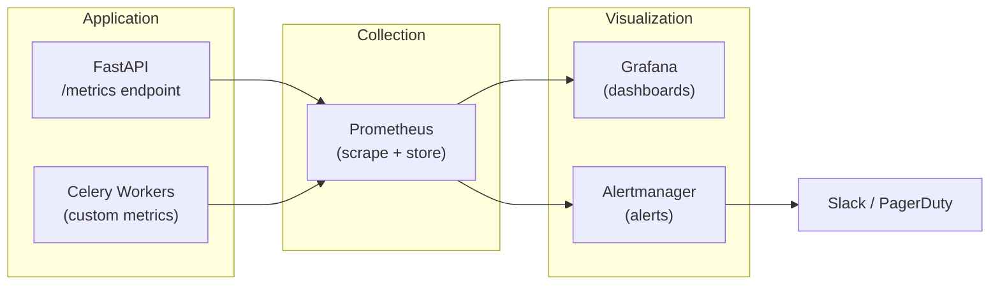

# Monitoring & Observability

Documentation for the observability stack — Prometheus metrics, Grafana dashboards, structured logging, Alertmanager rules, and health check endpoints.

## Section Contents

| Page | Description |
|------|-------------|
| [Prometheus Metrics](../16-observability/prometheus-metrics.md) | Custom metrics, instrumentation, and scrape configuration |
| [Grafana Dashboards](../16-observability/grafana-dashboards.md) | Dashboard panels, queries, and provisioning |
| [Alertmanager](../16-observability/alertmanager.md) | Alert rules, severity levels, and notification routing |
| [Logging Guide](../16-observability/logging-guide.md) | Structured JSON log format, log levels, and querying |

## Observability Stack

## Key Metrics

| Metric | Type | Description |
|--------|------|-------------|
| `optimization_requests_total` | Counter | Total optimization requests by status |
| `optimization_duration_seconds` | Histogram | End-to-end optimization latency |
| `quantum_solver_duration_seconds` | Histogram | Quantum solver execution time |
| `celery_task_queue_length` | Gauge | Current queue depth by queue name |
| `cache_hit_ratio` | Gauge | Redis cache hit rate for price data |

## Cross-References

- **Operations runbook** → [Runbook](../17-operations/runbook.md)
- **Troubleshooting** → [Troubleshooting Guide](../17-operations/troubleshooting.md)
- **Health endpoints** → [Health Endpoint](../04-api-reference/health-endpoint.md)
- **Infrastructure** → [Docker Compose](../14-infrastructure/docker-compose.md)
