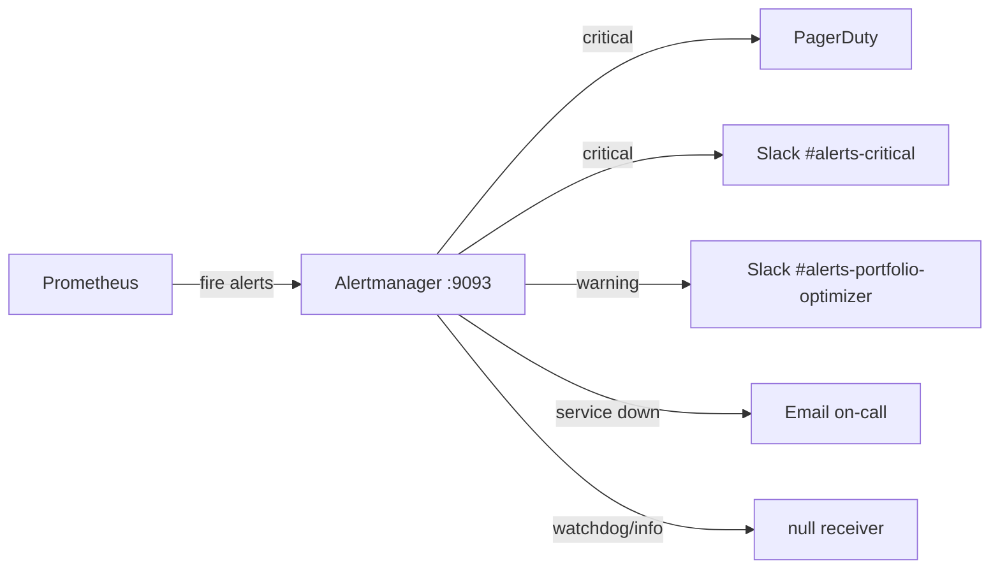
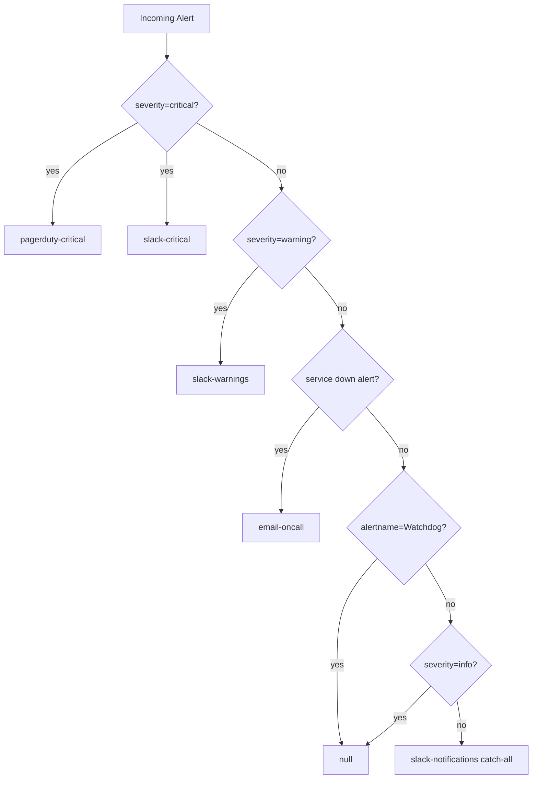

# Alertmanager

Alertmanager receives alerts fired by Prometheus, groups related alerts to reduce noise, routes them to the appropriate notification channels, and suppresses redundant notifications using inhibition rules.

Configuration file: `infra/alertmanager/alertmanager.yml`  
Alert rules: `infra/monitoring/prometheus_rules.yml`

---

## Architecture



---

## Global Configuration

```yaml
# infra/alertmanager/alertmanager.yml (excerpt)
global:
  resolve_timeout: 5m
  smtp_smarthost: "${ALERTMANAGER_SMTP_HOST:-smtp.example.com:587}"
  smtp_from: "${ALERTMANAGER_SMTP_FROM:-alerts@portfolio-optimizer.example.com}"
  smtp_auth_username: "${ALERTMANAGER_SMTP_USERNAME}"
  smtp_auth_password: "${ALERTMANAGER_SMTP_PASSWORD}"
  smtp_require_tls: true
  slack_api_url: "${ALERTMANAGER_SLACK_WEBHOOK_URL}"
```

`resolve_timeout: 5m` means Alertmanager waits 5 minutes after an alert stops firing before sending a "resolved" notification. This prevents flapping alerts from generating excessive resolved/firing cycles.

### Required Environment Variables

| Variable | Description |
|---|---|
| `ALERTMANAGER_SLACK_WEBHOOK_URL` | Slack incoming webhook URL |
| `ALERTMANAGER_SLACK_CHANNEL` | Slack channel (default: `#alerts-portfolio-optimizer`) |
| `ALERTMANAGER_PAGERDUTY_SERVICE_KEY` | PagerDuty Events API v1 service key |
| `ALERTMANAGER_SMTP_HOST` | SMTP server host:port |
| `ALERTMANAGER_SMTP_FROM` | Sender email address |
| `ALERTMANAGER_SMTP_USERNAME` | SMTP authentication username |
| `ALERTMANAGER_SMTP_PASSWORD` | SMTP authentication password |
| `ALERTMANAGER_EMAIL_TO` | On-call recipient email address |

---

## Routing Configuration

Alerts flow from the root route down to the first matching child route. The root route acts as a catch-all that sends all unmatched alerts to Slack.



### Root Route (Catch-All)

```yaml
route:
  receiver: "slack-notifications"
  group_by: ["alertname", "environment", "severity"]
  group_wait: 30s
  group_interval: 5m
  repeat_interval: 4h
```

- **`group_by`**: Alerts with the same `alertname`, `environment`, and `severity` are batched into a single notification.
- **`group_wait: 30s`**: Wait 30 seconds before sending the first notification for a new group, allowing related alerts to be batched.
- **`group_interval: 5m`**: Wait 5 minutes before sending a notification about new alerts added to an already-firing group.
- **`repeat_interval: 4h`**: Re-send a notification every 4 hours for alerts that remain firing.

### Child Routes

| Route | Match | Receiver | group_wait | repeat_interval |
|---|---|---|---|---|
| Critical → PagerDuty | `severity: critical` | `pagerduty-critical` | 10s | 1h |
| Critical → Slack | `severity: critical` | `slack-critical` | 10s | 1h |
| Warning → Slack | `severity: warning` | `slack-warnings` | 1m | 6h |
| Service Down → Email | `alertname =~ BackendDown\|RedisDown\|...` | `email-oncall` | 10s | 30m |
| Watchdog | `alertname: Watchdog` | `null` | 0s | 10m |
| Info | `severity: info` | `null` | — | — |

> **`continue: true`** is set on the critical → PagerDuty route, which means the alert continues matching subsequent routes. This is how critical alerts reach **both** PagerDuty (for paging) and Slack (for visibility) simultaneously.

---

## Notification Channels (Receivers)

### `slack-notifications` (catch-all)

Sends all unmatched alerts to the configured Slack channel with colour-coded severity:

- `good` (green) for resolved alerts
- `danger` (red) for critical
- `warning` (yellow) for warning
- `#439FE0` (blue) for info

### `slack-critical`

Uses the 🚨 rotating light emoji and `danger` colour. Sent for all `severity: critical` alerts in addition to PagerDuty.

### `slack-warnings`

Uses the ⚠️ warning emoji and `warning` colour. Sent for all `severity: warning` alerts.

### `pagerduty-critical`

Pages on-call engineers via PagerDuty Events API v1. Maps `severity: critical` to PagerDuty severity `critical`.

```yaml
pagerduty_configs:
  - service_key: "${ALERTMANAGER_PAGERDUTY_SERVICE_KEY}"
    send_resolved: true
    description: "{{ .CommonAnnotations.summary }}"
    details:
      environment: "{{ .CommonLabels.environment }}"
      severity: "{{ .CommonLabels.severity }}"
      runbook_url: "{{ .CommonAnnotations.runbook_url }}"
```

### `email-oncall`

Sends HTML email notifications for service availability alerts (`BackendDown`, `RedisDown`, `PostgresDown`, `CeleryWorkerDown`). Provides an audit trail independent of Slack.

### `null`

A no-op receiver that silently discards alerts. Used for the `Watchdog` heartbeat alert and `severity: info` alerts.

---

## Alert Rules

All alert rules are defined in `infra/monitoring/prometheus_rules.yml` under the `portfolio_optimizer_alerting_rules` group.

### Service Availability

| Alert | Expression | For | Severity |
|---|---|---|---|
| `BackendDown` | `up{job="portfolio-optimizer-backend"} == 0` | 2m | critical |
| `RedisDown` | `up{job="redis"} == 0` | 2m | critical |
| `PostgresDown` | `up{job="postgres"} == 0` | 2m | critical |
| `CeleryWorkerDown` | `up{job="celery-worker"} == 0` | 5m | warning |

These alerts fire when Prometheus cannot scrape the target's `/metrics` endpoint. The `for` duration prevents transient scrape failures from generating false positives.

### High Error Rate

| Alert | Expression | For | Severity |
|---|---|---|---|
| `HighErrorRate5xxWarning` | `job:http_error_rate_5xx:rate5m > 0.05` | 5m | warning |
| `HighErrorRate5xxCritical` | `job:http_error_rate_5xx:rate5m > 0.10` | 2m | critical |

Both alerts use the pre-computed recording rule `job:http_error_rate_5xx:rate5m` (5xx errors as a fraction of total requests). The warning threshold is 5% sustained for 5 minutes; the critical threshold is 10% sustained for 2 minutes.

### Slow Optimization

| Alert | Expression | For | Severity |
|---|---|---|---|
| `HighLatencyWarning` | `job:http_request_duration_seconds:p95 > 2.0` | 5m | warning |
| `HighLatencyCritical` | `job:http_request_duration_seconds:p95 > 5.0` | 2m | critical |
| `ClassicalOptimizationSlow` | `histogram_quantile(0.95, ...) > 30` (classical solver) | 5m | warning |
| `QuantumOptimizationFailureRate` | Quantum failure rate > 20% | 10m | warning |

`ClassicalOptimizationSlow` fires when the p95 duration for Markowitz MVO exceeds 30 seconds, which may indicate an oversized asset universe or CVXPY solver regression.

`QuantumOptimizationFailureRate` fires when more than 20% of QAOA/VQE runs fail over a 10-minute window. This typically indicates a Celery worker issue or quantum circuit configuration problem.

### Worker Queue Backup

| Alert | Expression | For | Severity |
|---|---|---|---|
| `TooManyInFlightRequests` | `sum(http_requests_inprogress{...}) > 100` | 2m | warning |

More than 100 simultaneous in-flight requests indicates either a traffic spike or slow upstream dependencies causing request queuing.

### Redis Memory Pressure

| Alert | Expression | For | Severity |
|---|---|---|---|
| `LowCacheHitRatio` | `job:cache_hit_ratio:rate5m < 0.50` | 10m | warning |
| `RedisHighMemoryUsage` | `instance:redis_memory_utilisation:ratio > 0.85` | 5m | warning |
| `RedisMemoryCritical` | `instance:redis_memory_utilisation:ratio > 0.95` | 2m | critical |

`LowCacheHitRatio` fires when the application-level cache hit ratio (from `cache_hits_total` / `cache_misses_total`) drops below 50% for 10 minutes. This may indicate cache eviction pressure or a cache invalidation bug.

`RedisHighMemoryUsage` and `RedisMemoryCritical` use the pre-computed recording rule `instance:redis_memory_utilisation:ratio` (Redis memory used / max). At 95% utilisation, the `allkeys-lru` eviction policy begins aggressively evicting keys.

### PostgreSQL Connection Exhaustion

| Alert | Expression | For | Severity |
|---|---|---|---|
| `PostgresHighConnectionCount` | `sum(pg_stat_activity_count{datname="portfolio_optimizer", state!="idle"}) > 80` | 5m | warning |

Fires when there are more than 80 active (non-idle) connections to the `portfolio_optimizer` database. The default PostgreSQL `max_connections` is 100; exceeding 80% indicates a connection leak or insufficient connection pooling.

### Watchdog (Heartbeat)

```yaml
- alert: Watchdog
  expr: vector(1)
  labels:
    severity: info
    team: platform
  annotations:
    summary: "Alerting pipeline heartbeat"
```

The `Watchdog` alert always fires. It is routed to the `null` receiver, which discards it silently. If you stop receiving Watchdog notifications in your monitoring system, the Prometheus → Alertmanager → notification pipeline is broken.

---

## Inhibition Rules

Inhibition rules suppress lower-severity alerts when a higher-severity alert is already firing for the same service. This prevents alert storms when a service goes down.

```yaml
inhibit_rules:
  # BackendDown suppresses all HTTP error/latency alerts
  - source_match:
      alertname: BackendDown
      severity: critical
    target_match_re:
      alertname: "(HighErrorRate5xxWarning|HighErrorRate5xxCritical|HighLatencyWarning|HighLatencyCritical)"
    equal: ["environment"]

  # RedisDown suppresses Redis memory alerts
  - source_match:
      alertname: RedisDown
      severity: critical
    target_match_re:
      alertname: "(RedisMemoryWarning|RedisMemoryCritical)"
    equal: ["environment"]

  # PostgresDown suppresses PostgreSQL connection alerts
  - source_match:
      alertname: PostgresDown
      severity: critical
    target_match_re:
      alertname: "(PostgresConnectionsWarning|PostgresConnectionsCritical)"
    equal: ["environment"]

  # Critical suppresses warning for the same alertname
  - source_match:
      severity: critical
    target_match:
      severity: warning
    equal: ["alertname", "environment"]
```

The `equal` field ensures inhibition only applies when both the source and target alerts share the same `environment` label, preventing cross-environment suppression.

---

## Silences

Silences mute alerts for a defined time window without modifying the alert rules. Use silences during planned maintenance windows.

### Creating a Silence via the UI

1. Open Alertmanager at `http://localhost:9093`.
2. Click **Silences → New Silence**.
3. Set the **Start** and **End** times for the maintenance window.
4. Add matchers to identify which alerts to silence:
   - `alertname = BackendDown` — silence a specific alert
   - `environment = production` — silence all production alerts
   - `severity = warning` — silence all warnings
5. Add a **Comment** explaining the reason (e.g., "Planned Redis upgrade 2026-06-15 02:00–04:00 UTC").
6. Click **Create**.

### Creating a Silence via the API

```bash
curl -X POST http://localhost:9093/api/v2/silences \
  -H "Content-Type: application/json" \
  -d '{
    "matchers": [
      {"name": "alertname", "value": "BackendDown", "isRegex": false}
    ],
    "startsAt": "2026-06-15T02:00:00Z",
    "endsAt": "2026-06-15T04:00:00Z",
    "createdBy": "ops-team",
    "comment": "Planned maintenance window"
  }'
```

### Expiring a Silence

Silences expire automatically at their `endsAt` time. To expire a silence early:

1. Open Alertmanager UI → **Silences**.
2. Find the active silence and click **Expire**.

---

## Severity Levels

| Severity | Action | Channels |
|---|---|---|
| `critical` | Immediate action required; pages on-call | PagerDuty + Slack |
| `warning` | Investigate soon; does not page | Slack |
| `info` | Informational; no action required | Suppressed (null receiver) |

---

## Related Pages

- [Prometheus Metrics](prometheus-metrics.md) — all metrics and recording rules
- [Grafana Dashboards](grafana-dashboards.md) — dashboard panels and thresholds
- [Logging Guide](logging-guide.md) — structured log fields for incident investigation
