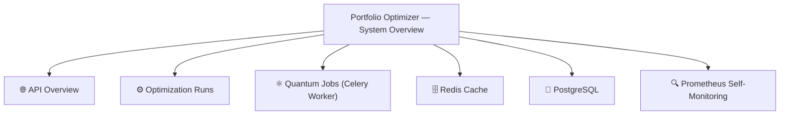

# Grafana Dashboards

The Portfolio Optimizer ships a single pre-built Grafana dashboard — **Portfolio Optimizer — System Overview** — that covers every layer of the stack: API performance, optimization run tracking, quantum job monitoring, Redis cache health, PostgreSQL activity, and Prometheus self-monitoring.

Dashboard JSON: `infra/grafana/dashboards/portfolio_optimizer.json`  
Datasource provisioning: `infra/grafana/datasources/prometheus.yml`

---

## Dashboard Overview

| Property | Value |
|---|---|
| **Title** | Portfolio Optimizer — System Overview |
| **UID** | `portfolio-optimizer-overview` |
| **Grafana version** | 11.1.0+ |
| **Default time range** | Last 1 hour |
| **Auto-refresh** | Every 30 seconds |
| **Tags** | `portfolio-optimizer`, `monitoring`, `production` |
| **Schema version** | 39 |

The dashboard is organised into six collapsible row sections:



---

## Datasource Configuration

The dashboard uses a single Prometheus datasource provisioned automatically via `infra/grafana/datasources/prometheus.yml`. Grafana reads this file on startup and creates the datasource without requiring manual UI configuration.

```yaml
# infra/grafana/datasources/prometheus.yml
apiVersion: 1
datasources:
  - name: Prometheus
    type: prometheus
    isDefault: true
    access: proxy
    url: http://prometheus:9090
    editable: false
    uid: "prometheus-portfolio-optimizer"
    jsonData:
      httpMethod: POST
      timeInterval: "15s"
      queryTimeout: "60s"
```

Key settings:
- **UID** `prometheus-portfolio-optimizer` — all dashboard panels reference this UID directly, so renaming the datasource in the UI will not break panels.
- **`timeInterval: "15s"`** — aligns Grafana's query step to the backend scrape interval, preventing gaps in time series graphs.
- **`isDefault: true`** — makes this the default datasource for new panels.
- **`editable: false`** — prevents accidental deletion via the Grafana UI (the file is the source of truth).

---

## Row 1: 🌐 API Overview

This row provides a high-level health snapshot of the FastAPI backend. All panels use the `portfolio-optimizer-backend` job.

### Stat Panels (top row)

| Panel | Query | Thresholds |
|---|---|---|
| **Request Rate** | `sum(rate(http_requests_total{job="portfolio-optimizer-backend"}[5m]))` | Green → Yellow at 50 req/s → Red at 200 req/s |
| **5xx Error Rate** | `sum(rate(http_requests_total{...status=~"5.."}[5m])) / sum(rate(...[5m]))` | Green → Yellow at 1% → Red at 5% |
| **p95 Latency** | `histogram_quantile(0.95, sum(rate(http_request_duration_seconds_bucket{...}[5m])) by (le))` | Green → Yellow at 0.5s → Red at 2.0s |
| **In-flight Requests** | `sum(http_requests_inprogress{job="portfolio-optimizer-backend"})` | Green → Yellow at 10 → Red at 50 |

### Time Series Panels

**Request Rate by Status** — stacked area chart showing request rate broken down by HTTP status code (2xx, 4xx, 5xx). Useful for spotting error spikes against baseline traffic.

```promql
sum by (status) (
  rate(http_requests_total{job="portfolio-optimizer-backend"}[5m])
)
```

**Request Latency Percentiles** — overlaid p50, p95, and p99 latency lines. The p95 line is the primary SLO indicator (alert threshold: 2s warning, 5s critical).

```promql
# p50
histogram_quantile(0.50, sum(rate(http_request_duration_seconds_bucket{...}[5m])) by (le))
# p95
histogram_quantile(0.95, sum(rate(http_request_duration_seconds_bucket{...}[5m])) by (le))
# p99
histogram_quantile(0.99, sum(rate(http_request_duration_seconds_bucket{...}[5m])) by (le))
```

**Request Rate by Endpoint** — per-handler request rate, useful for identifying which routes are receiving the most traffic.

---

## Row 2: ⚙️ Optimization Runs

This row tracks the optimization pipeline specifically — submission rate, failure rate, and latency for the `/api/v1/optimize` endpoint.

### Stat Panels

| Panel | Query | Thresholds |
|---|---|---|
| **Optimization Submissions/s** | `sum(rate(http_requests_total{handler="/api/v1/optimize", method="POST"}[5m]))` | Blue (informational) |
| **Optimization Failure Rate** | `sum(rate(...status=~"5.."}[5m])) / sum(rate(...[5m]))` | Green → Yellow at 5% → Red at 15% |
| **p95 Submit Latency** | `histogram_quantile(0.95, sum(rate(http_request_duration_seconds_bucket{handler="/api/v1/optimize"}[5m])) by (le))` | Green → Yellow at 0.5s → Red at 2.0s |

### Time Series Panels

**Optimization Endpoint Requests** — time series of POST requests to `/api/v1/optimize` broken down by status code.

**Optimization Endpoint Latency** — p50/p95/p99 latency specifically for the optimize endpoint, allowing comparison against the overall API latency.

> **Note**: The optimization endpoint is asynchronous — it returns a `run_id` immediately and the actual work happens in Celery. The latency shown here is the time to accept and enqueue the request, not the total optimization time. For end-to-end optimization duration, see the `optimization_duration_seconds` metric in the Quantum Jobs row.

---

## Row 3: ⚛️ Quantum Jobs (Celery Worker)

This row monitors the Celery worker that executes quantum optimization tasks. It requires the `celery-prometheus-exporter` sidecar to be running on port `8888`.

### Stat Panels

| Panel | Query | Thresholds |
|---|---|---|
| **Active Celery Tasks** | `sum(celery_tasks_total{state="started"})` | Green → Yellow at 5 → Red at 20 |
| **Task Failure Rate** | `sum(rate(celery_tasks_total{state="failed"}[5m])) / sum(rate(celery_tasks_total[5m]))` | Green → Yellow at 5% → Red at 15% |
| **p95 Task Runtime** | `histogram_quantile(0.95, sum(rate(celery_tasks_runtime_seconds_bucket[5m])) by (le))` | Green → Yellow at 30s → Red at 120s |
| **Celery Workers Online** | `celery_workers_total{job="celery-worker"}` | Red at 0 (no workers) → Green at 1+ |

### Time Series Panels

**Celery Task Rate by State** — stacked area chart showing task throughput broken down by state (`received`, `started`, `succeeded`, `failed`, `retried`). A growing `received` count without a corresponding `started` increase indicates worker queue backup.

```promql
sum by (state) (
  rate(celery_tasks_total{job="celery-worker"}[5m])
)
```

**Celery Task Runtime Percentiles** — p50/p95/p99 task runtime. Quantum optimization tasks (QAOA/VQE) typically run 30–120 seconds depending on circuit depth and asset count.

---

## Row 4: 🗄️ Redis Cache

This row monitors Redis health and cache effectiveness using metrics from `redis_exporter`.

### Stat Panels

| Panel | Query | Thresholds |
|---|---|---|
| **Redis Memory Used** | `redis_memory_used_bytes{job="redis"}` | Green → Yellow at 512 MB → Red at 1 GB |
| **Redis Connected Clients** | `redis_connected_clients{job="redis"}` | Green → Yellow at 50 → Red at 100 |
| **Cache Hit Rate** | `rate(redis_keyspace_hits_total[5m]) / (rate(redis_keyspace_hits_total[5m]) + rate(redis_keyspace_misses_total[5m]))` | Red below 50% → Yellow at 70% → Green at 90% |
| **Redis Commands/s** | `rate(redis_commands_processed_total{job="redis"}[5m])` | Informational |

### Time Series Panels

**Redis Memory Usage** — time series of `redis_memory_used_bytes` with a threshold line at 85% of `redis_memory_max_bytes`. Crossing this threshold triggers the `RedisHighMemoryUsage` alert.

---

## Row 5: 🐘 PostgreSQL

This row monitors PostgreSQL using metrics from `postgres_exporter`.

### Stat Panels

| Panel | Query | Thresholds |
|---|---|---|
| **PostgreSQL Status** | `pg_up{job="postgres"}` | Red at 0 → Green at 1 |
| **Active DB Connections** | `sum(pg_stat_activity_count{datname="portfolio_optimizer", state!="idle"})` | Green → Yellow at 50 → Red at 80 |

### Time Series Panels

**PostgreSQL Row Operations** — time series of insert/update/delete/fetch rates for the `portfolio_optimizer` database.

```promql
sum by (operation) (
  rate(pg_stat_database_tup_fetched_total{datname="portfolio_optimizer"}[5m])
)
```

**PostgreSQL Connection States** — stacked area chart of connection counts by state (`active`, `idle`, `idle in transaction`). A growing `idle in transaction` count indicates connection leaks.

---

## Row 6: 🔍 Prometheus Self-Monitoring

This row tracks Prometheus's own health to ensure the monitoring pipeline itself is working.

| Panel | Query | Description |
|---|---|---|
| **Prometheus Active Time Series** | `prometheus_tsdb_head_series` | Total active time series in the TSDB head block |
| **Prometheus Query Duration** | `histogram_quantile(0.95, rate(prometheus_engine_query_duration_seconds_bucket[5m]))` | p95 query execution time |

---

## Alert Thresholds Summary

The following thresholds are encoded directly in panel field configurations and correspond to the alert rules in `infra/monitoring/prometheus_rules.yml`:

| Metric | Warning | Critical |
|---|---|---|
| 5xx Error Rate | > 5% for 5m | > 10% for 2m |
| p95 Latency | > 2s for 5m | > 5s for 2m |
| In-flight Requests | > 100 for 2m | — |
| Quantum Failure Rate | > 20% for 10m | — |
| Classical Optimization p95 | > 30s for 5m | — |
| Cache Hit Ratio | < 50% for 10m | — |
| Redis Memory Utilisation | > 85% for 5m | > 95% for 2m |
| Active DB Connections | > 80 for 5m | — |

---

## Importing and Exporting Dashboards

### Import via Grafana UI

1. Open Grafana at `http://localhost:3000` (default credentials: `admin` / `admin`).
2. Navigate to **Dashboards → Import**.
3. Click **Upload JSON file** and select `infra/grafana/dashboards/portfolio_optimizer.json`.
4. In the **Prometheus** datasource dropdown, select **Prometheus** (the provisioned datasource).
5. Click **Import**.

### Import via Provisioning (Recommended for Production)

Grafana automatically loads dashboards from the provisioning directory. Mount the dashboards directory in `docker-compose.yml`:

```yaml
# docker-compose.yml (excerpt)
grafana:
  image: grafana/grafana:11.1.0
  volumes:
    - ./infra/grafana/datasources:/etc/grafana/provisioning/datasources
    - ./infra/grafana/dashboards:/etc/grafana/provisioning/dashboards
```

Create a dashboard provisioning config at `infra/grafana/dashboards/dashboards.yml`:

```yaml
apiVersion: 1
providers:
  - name: "Portfolio Optimizer"
    orgId: 1
    folder: "Portfolio Optimizer"
    type: file
    disableDeletion: false
    updateIntervalSeconds: 30
    options:
      path: /etc/grafana/provisioning/dashboards
```

Grafana will automatically pick up `portfolio_optimizer.json` and any future dashboard files placed in that directory.

### Exporting a Modified Dashboard

After making changes to a dashboard in the Grafana UI:

1. Open the dashboard.
2. Click the **Share** icon (top toolbar) → **Export**.
3. Enable **Export for sharing externally** to replace the datasource UID with a template variable.
4. Click **Save to file** and replace `infra/grafana/dashboards/portfolio_optimizer.json`.
5. Commit the updated JSON to version control.

> **Important**: Always export with **Export for sharing externally** enabled. This replaces the hardcoded datasource UID (`prometheus-portfolio-optimizer`) with the `DS_PROMETHEUS` input variable, making the dashboard portable across Grafana instances.

---

## Related Pages

- [Prometheus Metrics](prometheus-metrics.md) — all metrics and PromQL examples
- [Alertmanager](alertmanager.md) — alert rules and notification routing
- [Logging Guide](logging-guide.md) — structured log fields

## Operations Cross-References

- [Runbook](../17-operations/runbook.md) — Dashboard panels referenced during incident response
- [Troubleshooting Guide](../17-operations/troubleshooting.md) — Grafana queries for diagnosing common issues
- [Prometheus Metrics](prometheus-metrics.md) — Metric definitions used in dashboard panels
- [Alertmanager](alertmanager.md) — Alert rules that trigger from the same metric sources
