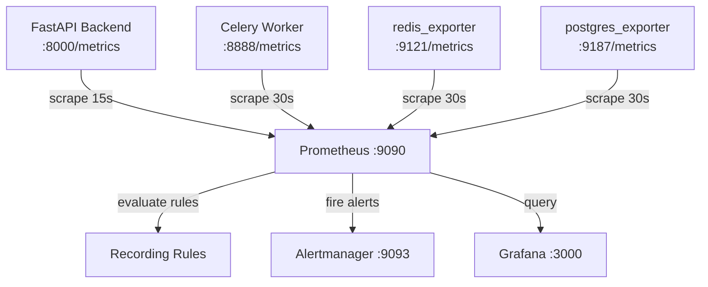

# Prometheus Metrics

This page documents every metric exposed by the Portfolio Optimizer stack, the scrape configuration that collects them, and the recording rules that pre-aggregate expensive queries for dashboard and alerting use.

The full Prometheus configuration lives in `infra/prometheus/prometheus.yml` and `infra/monitoring/prometheus.yml`. Alert and recording rules are in `infra/monitoring/prometheus_rules.yml`.

---

## Architecture Overview



---

## Scrape Configuration

Prometheus is configured with a **global scrape interval of 15 seconds** and a **scrape timeout of 10 seconds**. Individual jobs may override the interval.

| Job Name | Target | Scrape Interval | Component Label |
|---|---|---|---|
| `portfolio-optimizer-backend` | `backend:8000` | **15s** | `api` |
| `celery-worker` | `worker:8888` | 30s | `worker` |
| `redis` | `redis-exporter:9121` | 30s | `cache` |
| `postgres` | `postgres-exporter:9187` | 30s | `database` |
| `prometheus` | `localhost:9090` | 30s | `monitoring` |

All jobs attach `environment: "production"` and `service: "portfolio-optimizer"` as external labels, so every time series carries these for cross-environment filtering.

```yaml
# infra/monitoring/prometheus.yml (excerpt)
global:
  scrape_interval: 15s
  scrape_timeout: 10s
  evaluation_interval: 15s
  external_labels:
    environment: "production"
    service: "portfolio-optimizer"
```

> **Retention**: Prometheus is configured with `--storage.tsdb.retention.time=30d` in `docker-compose.yml`. Adjust this flag if you need longer history.

---

## HTTP Metrics (prometheus-fastapi-instrumentator)

The FastAPI application uses [`prometheus-fastapi-instrumentator`](https://github.com/trallnag/prometheus-fastapi-instrumentator) to automatically instrument every HTTP route. The instrumentation is set up in `backend/app/main.py` inside `_setup_prometheus()`:

```python
# backend/app/main.py
from prometheus_fastapi_instrumentator import Instrumentator

Instrumentator(
    excluded_handlers=["/metrics"],
).instrument(app).expose(
    app,
    endpoint="/metrics",
    include_in_schema=False,
    tags=["monitoring"],
)
```

The `/metrics` endpoint itself is excluded from tracking to avoid self-referential noise.

### `http_requests_total`

| Property | Value |
|---|---|
| **Type** | Counter |
| **Labels** | `method`, `handler`, `status` |
| **Description** | Total number of HTTP requests processed, labelled by HTTP method, route handler path, and response status code. |

**Example PromQL queries:**

```promql
# Overall request rate (5-minute window)
sum(rate(http_requests_total{job="portfolio-optimizer-backend"}[5m]))

# 5xx error rate as a fraction of total
sum(rate(http_requests_total{job="portfolio-optimizer-backend", status=~"5.."}[5m]))
/ sum(rate(http_requests_total{job="portfolio-optimizer-backend"}[5m]))

# Per-endpoint breakdown
sum by (handler) (
  rate(http_requests_total{job="portfolio-optimizer-backend"}[5m])
)
```

### `http_request_duration_seconds`

| Property | Value |
|---|---|
| **Type** | Histogram |
| **Labels** | `method`, `handler`, `status`, `le` (bucket boundary) |
| **Buckets** | 0.005, 0.01, 0.025, 0.05, 0.1, 0.25, 0.5, 1, 2.5, 5, 10 seconds |
| **Description** | Request latency distribution. Use `histogram_quantile()` to compute percentiles. |

**Example PromQL queries:**

```promql
# p95 latency across all routes
histogram_quantile(
  0.95,
  sum(rate(http_request_duration_seconds_bucket{job="portfolio-optimizer-backend"}[5m])) by (le)
)

# p99 latency for the /api/v1/optimize endpoint
histogram_quantile(
  0.99,
  sum(rate(http_request_duration_seconds_bucket{
    job="portfolio-optimizer-backend",
    handler="/api/v1/optimize"
  }[5m])) by (le)
)
```

### `http_requests_inprogress`

| Property | Value |
|---|---|
| **Type** | Gauge |
| **Labels** | `method`, `handler` |
| **Description** | Number of HTTP requests currently being processed (in-flight). Spikes indicate traffic bursts or slow upstream dependencies. |

```promql
# Total in-flight requests
sum(http_requests_inprogress{job="portfolio-optimizer-backend"})
```

---

## Custom Application Metrics (`app/core/metrics.py`)

The following custom metrics are registered in `backend/app/core/metrics.py` using the `prometheus_client` library and are exposed on the same `/metrics` endpoint as the HTTP metrics.

### `optimization_runs_total`

| Property | Value |
|---|---|
| **Type** | Counter |
| **Labels** | `solver` (`classical`, `qaoa`, `vqe`), `status` (`success`, `failure`) |
| **Description** | Total number of optimization runs completed, broken down by solver type and outcome. |

```promql
# Success rate per solver (5-minute window)
sum by (solver) (
  rate(optimization_runs_total{job="portfolio-optimizer-backend", status="success"}[5m])
)
/ sum by (solver) (
  rate(optimization_runs_total{job="portfolio-optimizer-backend"}[5m])
)

# Quantum failure rate (QAOA + VQE combined)
sum(rate(optimization_runs_total{
  job="portfolio-optimizer-backend",
  solver=~"qaoa|vqe",
  status="failure"
}[10m]))
/ sum(rate(optimization_runs_total{
  job="portfolio-optimizer-backend",
  solver=~"qaoa|vqe"
}[10m]))
```

### `optimization_duration_seconds`

| Property | Value |
|---|---|
| **Type** | Histogram |
| **Labels** | `solver` (`classical`, `qaoa`, `vqe`), `le` (bucket boundary) |
| **Description** | Wall-clock duration of each optimization run from start to completion. Includes all agent nodes for the given solver path. |

```promql
# p95 optimization duration per solver
histogram_quantile(
  0.95,
  sum(rate(optimization_duration_seconds_bucket{
    job="portfolio-optimizer-backend"
  }[5m])) by (le, solver)
)
```

### `quantum_circuit_depth`

| Property | Value |
|---|---|
| **Type** | Histogram |
| **Labels** | `solver` (`qaoa`, `vqe`) |
| **Description** | Depth of the quantum circuit generated for each optimization run. Higher depth means more gate operations and greater noise sensitivity on real hardware. |

```promql
# Average circuit depth per solver
sum by (solver) (
  rate(quantum_circuit_depth_sum{job="portfolio-optimizer-backend"}[5m])
)
/ sum by (solver) (
  rate(quantum_circuit_depth_count{job="portfolio-optimizer-backend"}[5m])
)
```

### `agent_node_duration_seconds`

| Property | Value |
|---|---|
| **Type** | Histogram |
| **Labels** | `node` (e.g., `data_fetch`, `classical_optimization`, `quantum_dispatch`, `llm_explanation`), `le` |
| **Description** | Duration of each individual LangGraph agent node. Use this to identify which node is the bottleneck in the pipeline. |

```promql
# p95 duration per agent node
histogram_quantile(
  0.95,
  sum(rate(agent_node_duration_seconds_bucket{
    job="portfolio-optimizer-backend"
  }[5m])) by (le, node)
)
```

### `cache_hits_total`

| Property | Value |
|---|---|
| **Type** | Counter |
| **Labels** | `operation` (e.g., `market_data`, `sector_tags`) |
| **Description** | Number of Redis cache lookups that returned a cached value. |

### `cache_misses_total`

| Property | Value |
|---|---|
| **Type** | Counter |
| **Labels** | `operation` (e.g., `market_data`, `sector_tags`) |
| **Description** | Number of Redis cache lookups that resulted in a cache miss (requiring a live data fetch). |

```promql
# Cache hit ratio (5-minute window)
sum(rate(cache_hits_total{job="portfolio-optimizer-backend"}[5m]))
/ (
  sum(rate(cache_hits_total{job="portfolio-optimizer-backend"}[5m]))
  + sum(rate(cache_misses_total{job="portfolio-optimizer-backend"}[5m]))
)
```

---

## Celery Metrics (celery-prometheus-exporter)

Celery worker metrics are exposed by a `celery-prometheus-exporter` sidecar running on port `8888` inside the worker container. This is an optional component — comment out the `celery-worker` scrape job if it is not deployed.

### `celery_tasks_total`

| Property | Value |
|---|---|
| **Type** | Counter |
| **Labels** | `state` (`received`, `started`, `succeeded`, `failed`, `retried`, `revoked`), `name` (task name) |
| **Description** | Total number of Celery tasks by state and task name. |

```promql
# Task failure rate for the optimization task
sum(rate(celery_tasks_total{state="failed", name="run_optimization_task"}[5m]))
/ sum(rate(celery_tasks_total{name="run_optimization_task"}[5m]))
```

### `celery_tasks_runtime_seconds`

| Property | Value |
|---|---|
| **Type** | Histogram |
| **Labels** | `name` (task name), `le` |
| **Description** | Runtime distribution of completed Celery tasks. |

```promql
# p95 task runtime
histogram_quantile(
  0.95,
  sum(rate(celery_tasks_runtime_seconds_bucket{name="run_optimization_task"}[5m])) by (le)
)
```

### `celery_workers_total`

| Property | Value |
|---|---|
| **Type** | Gauge |
| **Labels** | none |
| **Description** | Number of Celery workers currently online and registered with the broker. |

```promql
celery_workers_total{job="celery-worker"}
```

---

## Redis Metrics (redis_exporter)

Redis metrics are collected by [`oliver006/redis_exporter`](https://github.com/oliver006/redis_exporter) running on port `9121`. The exporter connects to Redis and translates `INFO` output into Prometheus metrics.

| Metric | Type | Description |
|---|---|---|
| `redis_up` | Gauge | `1` if Redis is reachable, `0` otherwise |
| `redis_connected_clients` | Gauge | Number of client connections currently open |
| `redis_memory_used_bytes` | Gauge | Memory currently used by Redis (RSS) |
| `redis_memory_max_bytes` | Gauge | `maxmemory` setting (0 = unlimited) |
| `redis_commands_processed_total` | Counter | Total commands processed since startup |
| `redis_keyspace_hits_total` | Counter | Successful key lookups |
| `redis_keyspace_misses_total` | Counter | Failed key lookups |
| `redis_expired_keys_total` | Counter | Keys expired by TTL |
| `redis_evicted_keys_total` | Counter | Keys evicted due to memory pressure |

```promql
# Redis memory utilisation ratio
redis_memory_used_bytes / redis_memory_max_bytes

# Keyspace hit ratio (Redis-native, complements application-level cache metrics)
rate(redis_keyspace_hits_total[5m])
/ (rate(redis_keyspace_hits_total[5m]) + rate(redis_keyspace_misses_total[5m]))
```

---

## PostgreSQL Metrics (postgres_exporter)

PostgreSQL metrics are collected by [`prometheuscommunity/postgres-exporter`](https://github.com/prometheus-community/postgres_exporter) running on port `9187`.

| Metric | Type | Description |
|---|---|---|
| `pg_up` | Gauge | `1` if PostgreSQL is reachable |
| `pg_stat_database_tup_fetched_total` | Counter | Rows fetched by queries (per database) |
| `pg_stat_database_tup_inserted_total` | Counter | Rows inserted (per database) |
| `pg_stat_database_tup_updated_total` | Counter | Rows updated (per database) |
| `pg_stat_database_tup_deleted_total` | Counter | Rows deleted (per database) |
| `pg_stat_database_blks_hit_total` | Counter | Buffer cache hits (per database) |
| `pg_stat_database_blks_read_total` | Counter | Disk block reads (per database) |
| `pg_stat_activity_count` | Gauge | Active connections by state (`active`, `idle`, `idle in transaction`) |
| `pg_database_size_bytes` | Gauge | Total database size on disk |
| `pg_stat_bgwriter_checkpoints_timed_total` | Counter | Scheduled checkpoints |
| `pg_stat_bgwriter_checkpoints_req_total` | Counter | Requested checkpoints (indicates write pressure) |

```promql
# Active (non-idle) connections to portfolio_optimizer database
sum(pg_stat_activity_count{datname="portfolio_optimizer", state!="idle"})

# Buffer cache hit ratio
rate(pg_stat_database_blks_hit_total{datname="portfolio_optimizer"}[5m])
/ (
  rate(pg_stat_database_blks_hit_total{datname="portfolio_optimizer"}[5m])
  + rate(pg_stat_database_blks_read_total{datname="portfolio_optimizer"}[5m])
)
```

---

## Recording Rules

Recording rules pre-compute expensive queries and store them as new time series. Dashboards and alert expressions reference these pre-aggregated metrics for better performance. Rules are evaluated every 30 seconds.

| Recording Rule | Expression Summary |
|---|---|
| `job:http_requests_total:rate5m` | Total request rate (5m window) |
| `job:http_requests_by_status_class:rate5m` | Request rate by status class (2xx, 4xx, 5xx) |
| `job:http_error_rate_5xx:rate5m` | 5xx error fraction of total requests |
| `job:http_error_rate_4xx:rate5m` | 4xx error fraction of total requests |
| `job:http_request_duration_seconds:p50` | Median latency across all routes |
| `job:http_request_duration_seconds:p95` | p95 latency across all routes |
| `job:http_request_duration_seconds:p99` | p99 latency across all routes |
| `handler:http_request_duration_seconds:p95` | p95 latency per handler |
| `job:optimization_runs_total:rate5m` | Optimization run rate by solver |
| `job:optimization_success_rate:rate5m` | Optimization success rate by solver |
| `solver:optimization_duration_seconds:p95` | p95 optimization duration by solver |
| `job:cache_hit_ratio:rate5m` | Application-level cache hit ratio |
| `instance:redis_memory_utilisation:ratio` | Redis memory used / max |

---

## Related Pages

- [Grafana Dashboards](grafana-dashboards.md) — how panels use these metrics
- [Alertmanager](alertmanager.md) — alert rules and notification routing
- [Logging Guide](logging-guide.md) — structured log fields and aggregation

## Operations Cross-References

- [Runbook](../17-operations/runbook.md) — On-call procedures that use these metrics for incident diagnosis
- [Troubleshooting Guide](../17-operations/troubleshooting.md) — Diagnostic steps referencing metric thresholds
- [Deployment Guide](../17-operations/deployment-guide.md) — Post-deploy smoke checks using health metrics
- [Configuration Reference](../17-operations/configuration-reference.md) — Prometheus scrape interval and retention settings
