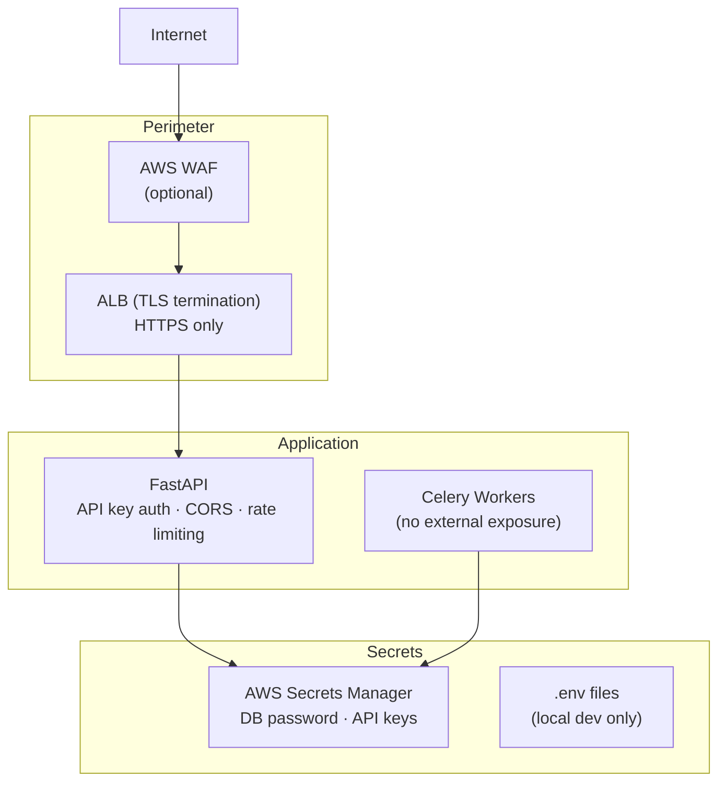

# Security

Security considerations, CORS configuration, secret management, API key handling, production hardening recommendations, and dependency vulnerability scanning for the Portfolio Optimizer.

## Overview

This section covers the security posture of the Portfolio Optimizer. While the system is primarily a portfolio simulation tool (not a financial transaction system), it handles API keys, database credentials, and potentially sensitive portfolio data that must be protected.

## Security Architecture

## Key Security Controls

| Control | Implementation | Documentation |
|---------|---------------|---------------|
| **API Authentication** | `X-API-Key` header validation | [Backend Configuration](../03-backend/configuration.md) |
| **CORS** | `CORS_ORIGINS` allowlist | [Backend Configuration](../03-backend/configuration.md) |
| **Secret Management** | AWS Secrets Manager (prod) / `.env` (dev) | [Environment Variables](../01-getting-started/environment-variables.md) |
| **TLS** | ALB terminates TLS; internal traffic is plain | [AWS Architecture](../14-infrastructure/aws-architecture.md) |
| **Dependency Scanning** | `pip-audit` + `npm audit` in CI | [CI Workflow](../15-cicd/ci-workflow.md) |
| **Container Security** | Non-root user in Dockerfile | [Docker Compose](../14-infrastructure/docker-compose.md) |
| **GitHub Secrets** | OIDC-based AWS auth, no long-lived keys | [GitHub Secrets](../15-cicd/github-secrets.md) |

## Production Hardening Checklist

- [ ] Set `DEBUG=false` in production
- [ ] Use a strong, randomly generated `API_KEY`
- [ ] Restrict `CORS_ORIGINS` to your frontend domain only
- [ ] Store all secrets in AWS Secrets Manager (not in `.env`)
- [ ] Enable RDS encryption at rest
- [ ] Enable ElastiCache encryption in transit
- [ ] Configure WAF rules on the ALB
- [ ] Enable VPC Flow Logs
- [ ] Run `pip-audit` and `npm audit` regularly

## Cross-References

- **GitHub Actions secrets** → [GitHub Secrets](../15-cicd/github-secrets.md)
- **Environment variables** → [Environment Variables](../01-getting-started/environment-variables.md)
- **Infrastructure** → [AWS Architecture](../14-infrastructure/aws-architecture.md)
- **CI/CD security scanning** → [CI Workflow](../15-cicd/ci-workflow.md)
