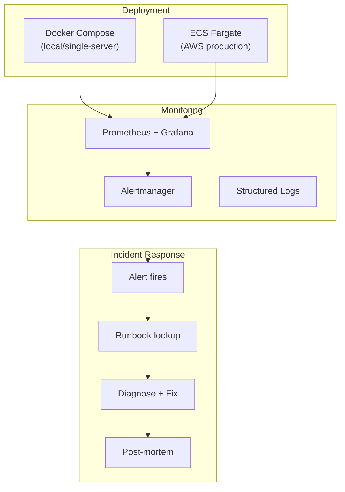

# Operations & Runbook

Deployment guides, configuration reference, troubleshooting procedures, and on-call runbook for the Portfolio Optimizer.

## Section Contents

| Page | Description |
|------|-------------|
| [Deployment Guide](deployment-guide.md) | Step-by-step production deployment procedures |
| [Configuration Reference](configuration-reference.md) | Complete reference for all environment variables and settings |
| [Troubleshooting](troubleshooting.md) | Common issues, diagnostic steps, and resolution procedures |
| [Runbook](runbook.md) | On-call incident response procedures and escalation paths |

## Operations Overview

## Common Operations

| Task | Documentation |
|------|---------------|
| Deploy to production | [Deployment Guide](deployment-guide.md) |
| Roll back a deployment | [Runbook](runbook.md#rollback) |
| Scale Celery workers | [Configuration Reference](configuration-reference.md) |
| Clear Redis cache | [Troubleshooting](troubleshooting.md) |
| Run database migration | [Migrations](../09-database/migrations.md) |
| Rotate API keys | [Configuration Reference](configuration-reference.md) |
| Investigate slow optimization | [Troubleshooting](troubleshooting.md) |

## Cross-References

- **Infrastructure** → [Docker Compose](../14-infrastructure/docker-compose.md) · [AWS Architecture](../14-infrastructure/aws-architecture.md)
- **CI/CD** → [CD Workflow](../15-cicd/cd-workflow.md)
- **Observability** → [Prometheus Metrics](../16-observability/prometheus-metrics.md) · [Grafana Dashboards](../16-observability/grafana-dashboards.md)
- **Environment variables** → [Environment Variables](../01-getting-started/environment-variables.md)
