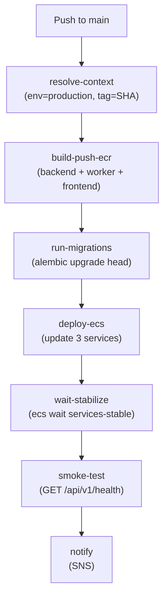
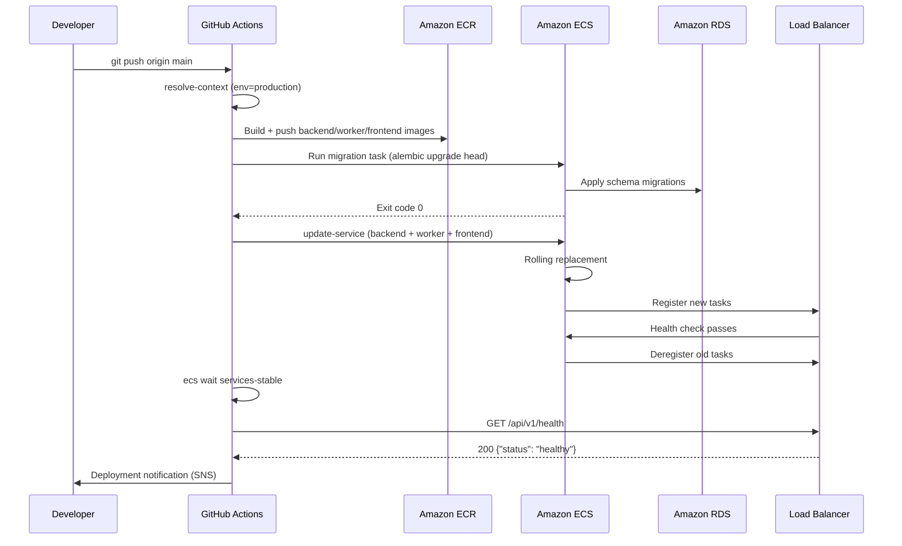

# Deployment Guide

This guide walks through a complete production deployment of the Portfolio Optimizer on AWS ECS Fargate — from bootstrapping Terraform state storage through verifying a live smoke test. Follow the steps in order; each phase depends on the previous one completing successfully.

## Prerequisites

Before starting, ensure you have the following installed and configured:

| Tool | Minimum Version | Purpose |
|------|----------------|---------|
| AWS CLI | v2.x | AWS resource management |
| Terraform | >= 1.8.0 | Infrastructure provisioning |
| Docker | 24.x | Image builds |
| GitHub CLI (`gh`) | 2.x | Secret/variable management |
| `jq` | 1.6+ | JSON parsing in shell scripts |

You also need:
- An AWS account with sufficient IAM permissions (EC2, ECS, RDS, ElastiCache, IAM, Secrets Manager)
- A GitHub repository with the Portfolio Optimizer source code
- An ACM certificate in the target region (for HTTPS)
- A registered domain name (optional but recommended)

---

## Phase 1 — Bootstrap Terraform State

Terraform requires a remote backend (S3 + DynamoDB) before it can manage any infrastructure. The bootstrap module creates these resources using **local state** — this is the only Terraform run that uses local state intentionally.

> **Run this once per AWS account.** If the S3 bucket and DynamoDB table already exist, skip to Phase 2.

### Step 1.1 — Navigate to the bootstrap directory

```bash
cd infra/terraform/bootstrap
```

### Step 1.2 — Initialize Terraform (local backend)

```bash
terraform init
```

### Step 1.3 — Review the plan

```bash
terraform plan \
  -var="project_name=portfolio-optimizer" \
  -var="aws_region=us-east-1" \
  -var="github_org=your-github-org" \
  -var="github_repo=portfolio-optimizer"
```

The plan creates:
- **S3 bucket** — `portfolio-optimizer-terraform-state-<random-hex>` with versioning, AES-256 encryption, and public access blocked
- **DynamoDB table** — `portfolio-optimizer-terraform-state-lock` with `LockID` hash key and point-in-time recovery
- **GitHub Actions IAM role** — with OIDC trust policy scoped to your repository

### Step 1.4 — Apply the bootstrap

```bash
terraform apply \
  -var="project_name=portfolio-optimizer" \
  -var="aws_region=us-east-1" \
  -var="github_org=your-github-org" \
  -var="github_repo=portfolio-optimizer"
```

Type `yes` when prompted.

### Step 1.5 — Capture outputs

```bash
TF_STATE_BUCKET=$(terraform output -raw state_bucket_name)
TF_STATE_LOCK_TABLE=$(terraform output -raw state_lock_table_name)
GITHUB_ACTIONS_ROLE_ARN=$(terraform output -raw github_actions_role_arn)

echo "State bucket:     $TF_STATE_BUCKET"
echo "Lock table:       $TF_STATE_LOCK_TABLE"
echo "GitHub role ARN:  $GITHUB_ACTIONS_ROLE_ARN"
```

> **Save these values.** You will need them in the next phase.

---

## Phase 2 — Configure GitHub Secrets and Variables

The CI/CD pipelines authenticate to AWS via OIDC (no long-lived keys). All configuration is stored as GitHub repository secrets and variables.

### Step 2.1 — Set AWS identity variables

```bash
# Replace with your actual values
gh variable set AWS_ACCOUNT_ID --body "123456789012"
gh variable set AWS_REGION --body "us-east-1"
gh variable set AWS_DEPLOY_ROLE_ARN --body "$GITHUB_ACTIONS_ROLE_ARN"
gh secret set AWS_ROLE_ARN --body "$GITHUB_ACTIONS_ROLE_ARN"
```

### Step 2.2 — Set Terraform state backend variables

```bash
gh variable set TF_STATE_BUCKET --body "$TF_STATE_BUCKET"
gh variable set TF_STATE_LOCK_TABLE --body "$TF_STATE_LOCK_TABLE"
```

### Step 2.3 — Set application secrets

```bash
# Generate strong random secrets
DB_PASSWORD=$(openssl rand -base64 32)
REDIS_AUTH_TOKEN=$(openssl rand -hex 32)

gh secret set DB_PASSWORD --body "$DB_PASSWORD"
gh secret set REDIS_AUTH_TOKEN --body "$REDIS_AUTH_TOKEN"
gh secret set OPENAI_API_KEY --body "sk-your-openai-key-here"
```

### Step 2.4 — Set DNS and TLS variables

```bash
gh variable set ACM_CERTIFICATE_ARN \
  --body "arn:aws:acm:us-east-1:123456789012:certificate/xxxxxxxx-xxxx-xxxx-xxxx-xxxxxxxxxxxx"
gh variable set DOMAIN_NAME --body "portfolio-optimizer.example.com"
```

### Step 2.5 — Set ECR registry variable

```bash
gh variable set ECR_REGISTRY \
  --body "123456789012.dkr.ecr.us-east-1.amazonaws.com"
```

### Step 2.6 — Create GitHub environments

```bash
# Create environments (requires GitHub CLI 2.x)
gh api repos/:owner/:repo/environments/staging --method PUT
gh api repos/:owner/:repo/environments/production --method PUT
```

Then in the GitHub web UI (**Settings → Environments → production**):
- Enable **Required reviewers** (add at least one team member)
- Enable **Wait timer** (5 minutes recommended)
- Restrict deployments to the `main` branch only

For the complete secrets reference, see [GitHub Secrets & Variables](../15-cicd/github-secrets.md).

---

## Phase 3 — Provision Infrastructure with Terraform

The Terraform workflow (`terraform.yml`) provisions all AWS infrastructure. It runs automatically when changes are pushed to `infra/terraform/`, or you can trigger it manually.

### Step 3.1 — Trigger the Terraform workflow

```bash
# Trigger via GitHub CLI for production
gh workflow run terraform.yml \
  --field environment=production \
  --field action=apply
```

Or push a change to `infra/terraform/` on the `main` branch.

### Step 3.2 — Monitor the workflow

```bash
gh run watch
```

The workflow runs `terraform plan` first and posts the plan as a PR comment (or workflow summary). For production, a manual approval step is required before `apply` runs.

### Step 3.3 — Capture Terraform outputs for GitHub variables

After the apply completes, retrieve the ECS resource names:

```bash
cd infra/terraform

# Get outputs (requires AWS credentials)
ECS_CLUSTER=$(terraform output -raw ecs_cluster_name)
BACKEND_SVC=$(terraform output -raw backend_service_name)
WORKER_SVC=$(terraform output -raw worker_service_name)
FRONTEND_SVC=$(terraform output -raw frontend_service_name)
PRIVATE_SUBNETS=$(terraform output -json private_subnet_ids | jq -r 'join(",")')
BACKEND_SG=$(terraform output -raw backend_security_group_id)
ALB_DNS=$(terraform output -raw alb_dns_name)

# Set as GitHub variables
gh variable set ECS_CLUSTER_NAME --body "$ECS_CLUSTER"
gh variable set ECS_BACKEND_SERVICE --body "$BACKEND_SVC"
gh variable set ECS_WORKER_SERVICE --body "$WORKER_SVC"
gh variable set ECS_FRONTEND_SERVICE --body "$FRONTEND_SVC"
gh variable set ECS_MIGRATION_TASK_DEF --body "$BACKEND_SVC"
gh variable set ECS_SUBNET_IDS --body "$PRIVATE_SUBNETS"
gh variable set ECS_SECURITY_GROUP_ID --body "$BACKEND_SG"
gh variable set PRODUCTION_ALB_URL --body "$ALB_DNS"
```

---

## Phase 4 — First Deployment (Push to Main)

With infrastructure provisioned and GitHub variables set, the first deployment is triggered by pushing to the `main` branch.

### Step 4.1 — Push to main

```bash
git checkout main
git push origin main
```

This triggers the CD workflow (`cd.yml`) which:



### Step 4.2 — Monitor the CD workflow

```bash
gh run watch
```

Expected duration: **8–15 minutes** for a full deployment (image builds dominate).

---

## Phase 5 — Monitor ECS Service Stabilization

After `deploy-ecs` updates the services, ECS performs a rolling replacement. The `wait-stabilize` job polls until all services reach a steady state.

### What "stabilization" means

ECS considers a service stable when:
1. The desired task count equals the running task count
2. All running tasks pass their health checks
3. No tasks are in `PENDING` or `STOPPING` state

### Monitoring via AWS Console

Navigate to **ECS → Clusters → portfolio-optimizer-production-cluster → Services** and watch:
- **Running tasks** count increases to match **Desired**
- **Pending tasks** count drops to 0
- **Deployments** tab shows the new deployment as `PRIMARY` with `COMPLETED` status

### Monitoring via AWS CLI

```bash
# Watch service events in real time
watch -n 10 "aws ecs describe-services \
  --cluster portfolio-optimizer-production-cluster \
  --services portfolio-optimizer-production-backend \
  --query 'services[0].events[:5]' \
  --output table"
```

### Monitoring via CloudWatch Logs

```bash
# Stream backend logs
aws logs tail /portfolio-optimizer/production/backend \
  --follow \
  --format short
```

### Typical stabilization timeline

| Time | Event |
|------|-------|
| 0:00 | New task definition registered |
| 0:30 | New tasks start (pulling image from ECR) |
| 1:30 | New tasks pass health checks |
| 2:00 | ALB registers new tasks, deregisters old |
| 3:00 | Old tasks drain and stop |
| 3:30 | Service reaches steady state |

> **If stabilization takes longer than 10 minutes**, check CloudWatch logs for startup errors. Common causes: failed database migration, missing Secrets Manager permissions, or incorrect environment variables.

---

## Phase 6 — Verify Smoke Test

The CD workflow automatically runs a smoke test after stabilization. You can also run it manually:

```bash
# Replace with your actual ALB DNS name or domain
ALB_URL="portfolio-optimizer-prod-1234567890.us-east-1.elb.amazonaws.com"

curl -sf "https://${ALB_URL}/api/v1/health" | jq .
```

Expected response:

```json
{
  "status": "healthy",
  "version": "1.0.0",
  "environment": "production",
  "checks": {
    "database": "healthy",
    "redis": "healthy",
    "celery": "healthy"
  }
}
```

A `200 OK` with `"status": "healthy"` confirms:
- FastAPI application is running
- PostgreSQL connection is live
- Redis connection is live
- Celery workers are reachable

---

## Rollback Procedure

If the deployment introduces a regression, roll back to the previous task definition.

### Option A — Re-deploy previous image tag via GitHub Actions (recommended)

```bash
# Find the previous successful deployment SHA
gh run list --workflow=cd.yml --status=success --limit=5

# Trigger rollback with the previous SHA
gh workflow run cd.yml \
  --field environment=production \
  --field image_tag=<previous-sha>
```

This re-runs the full CD pipeline with the previous image, including migrations (which are idempotent).

### Option B — Force previous task definition via AWS CLI

```bash
CLUSTER="portfolio-optimizer-production-cluster"
SERVICE="portfolio-optimizer-production-backend"

# List recent task definition revisions
aws ecs list-task-definitions \
  --family-prefix portfolio-optimizer-production-backend \
  --sort DESC \
  --query 'taskDefinitionArns[:5]' \
  --output table

# Force the service to use the previous revision (e.g., revision 42)
aws ecs update-service \
  --cluster "$CLUSTER" \
  --service "$SERVICE" \
  --task-definition portfolio-optimizer-production-backend:42 \
  --force-new-deployment

# Wait for stabilization
aws ecs wait services-stable \
  --cluster "$CLUSTER" \
  --services "$SERVICE"
```

Repeat for `worker` and `frontend` services.

> **Note:** Forcing a previous task definition does not roll back database migrations. If the new code introduced a schema migration, you may need to run `alembic downgrade -1` manually. See [Runbook — Database Backup and Restore](runbook.md#database-backup-and-restore) for the procedure.

### Option C — Emergency: scale down to zero

If the new deployment is causing active harm (e.g., corrupting data), scale all services to zero immediately:

```bash
for SERVICE in backend worker frontend; do
  aws ecs update-service \
    --cluster portfolio-optimizer-production-cluster \
    --service "portfolio-optimizer-production-${SERVICE}" \
    --desired-count 0
done
```

Then investigate, fix, and redeploy.

---

## Deployment Flow Summary



---

## Related Pages

- [CD Workflow](../15-cicd/cd-workflow.md) — detailed CD pipeline documentation
- [GitHub Secrets & Variables](../15-cicd/github-secrets.md) — complete secrets reference
- [Terraform Overview](../14-infrastructure/terraform-overview.md) — infrastructure modules
- [Runbook](runbook.md) — operational procedures (scaling, backup, rollback)
- [Troubleshooting](troubleshooting.md) — common deployment issues
