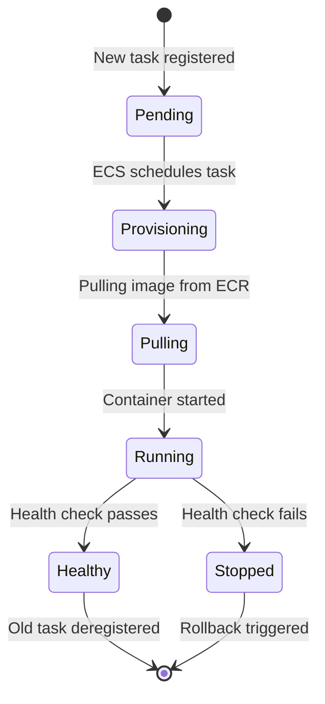

# Operational Runbook

This runbook provides step-by-step procedures for common operational tasks: scaling workers, database backup and restore, Redis cache management, rolling deployments, emergency rollback, disaster recovery, and on-call escalation. Keep this page bookmarked — it is designed for use under pressure.

> **Conventions:** Commands assume you have AWS CLI configured with appropriate permissions and the environment variables `CLUSTER`, `REGION`, and `ENV` set:
> ```bash
> export CLUSTER="portfolio-optimizer-production-cluster"
> export REGION="us-east-1"
> export ENV="production"
> ```

---

## Scaling Workers

### Adjust Celery Concurrency (Docker Compose / Local)

In Docker Compose, worker concurrency is controlled by environment variables passed to the Celery worker command:

```bash
# Scale up classical workers (handles more parallel optimization runs)
CELERY_DEFAULT_CONCURRENCY=8 docker-compose up -d worker

# Scale up quantum workers (more parallel quantum jobs, but each is CPU-heavy)
CELERY_QUANTUM_CONCURRENCY=4 docker-compose up -d worker-quantum
```

> **Warning:** Each Celery worker process uses a full CPU core for quantum simulations. Setting `CELERY_QUANTUM_CONCURRENCY` higher than the number of available vCPUs causes CPU contention and may increase job duration.

### Adjust ECS Desired Count (Production)

To handle increased load, scale the number of ECS task replicas:

```bash
# Scale up Celery workers to 4 replicas
aws ecs update-service \
  --cluster "$CLUSTER" \
  --service "portfolio-optimizer-${ENV}-worker" \
  --desired-count 4

# Scale up backend API to 4 replicas
aws ecs update-service \
  --cluster "$CLUSTER" \
  --service "portfolio-optimizer-${ENV}-backend" \
  --desired-count 4

# Wait for stabilization
aws ecs wait services-stable \
  --cluster "$CLUSTER" \
  --services \
    "portfolio-optimizer-${ENV}-worker" \
    "portfolio-optimizer-${ENV}-backend"
```

### Adjust Auto-Scaling Bounds via Terraform

For permanent scaling changes, update `terraform.tfvars` and apply:

```hcl
# infra/terraform/environments/production/terraform.tfvars

# Increase worker capacity for sustained high load
worker_desired_count = 4
worker_min_capacity  = 2
worker_max_capacity  = 12

# Increase backend capacity
backend_desired_count = 4
backend_min_capacity  = 2
backend_max_capacity  = 16
```

```bash
# Apply via Terraform workflow
gh workflow run terraform.yml \
  --field environment=production \
  --field action=apply
```

### Adjust `CELERY_DEFAULT_CONCURRENCY` / `CELERY_QUANTUM_CONCURRENCY` in ECS

In ECS, concurrency is set in the task definition command. To change it without a full Terraform apply:

1. Register a new task definition revision with the updated command:

```bash
# Get current task definition
aws ecs describe-task-definition \
  --task-definition "portfolio-optimizer-${ENV}-worker" \
  --query 'taskDefinition' > /tmp/worker-task-def.json

# Edit the command in /tmp/worker-task-def.json:
# Change "--concurrency=2" to "--concurrency=4"
# Then register the new revision
aws ecs register-task-definition \
  --cli-input-json file:///tmp/worker-task-def.json
```

2. Update the service to use the new revision:

```bash
aws ecs update-service \
  --cluster "$CLUSTER" \
  --service "portfolio-optimizer-${ENV}-worker" \
  --task-definition "portfolio-optimizer-${ENV}-worker:<new-revision>"
```

---

## Database Backup and Restore

### Automated Backups

RDS automated backups run daily during the configured maintenance window. Backups are retained for `db_backup_retention_days` (default: 7 days). No manual action is required.

```bash
# List available automated backups
aws rds describe-db-snapshots \
  --db-instance-identifier "portfolio-optimizer-${ENV}-postgres" \
  --snapshot-type automated \
  --query 'DBSnapshots[*].{ID:DBSnapshotIdentifier,Time:SnapshotCreateTime,Status:Status}' \
  --output table
```

### Manual Snapshot (Before Risky Operations)

Always take a manual snapshot before running destructive operations (schema changes, data migrations, major upgrades):

```bash
SNAPSHOT_ID="portfolio-optimizer-${ENV}-manual-$(date +%Y%m%d-%H%M%S)"

aws rds create-db-snapshot \
  --db-instance-identifier "portfolio-optimizer-${ENV}-postgres" \
  --db-snapshot-identifier "$SNAPSHOT_ID"

# Wait for snapshot to complete
aws rds wait db-snapshot-completed \
  --db-snapshot-identifier "$SNAPSHOT_ID"

echo "Snapshot created: $SNAPSHOT_ID"
```

### Restore from Snapshot

> **Warning:** Restoring from a snapshot creates a **new** RDS instance. You must update the application's `DATABASE_URL` to point to the new endpoint, or rename the instances.

```bash
# Restore to a new instance
aws rds restore-db-instance-from-db-snapshot \
  --db-instance-identifier "portfolio-optimizer-${ENV}-postgres-restored" \
  --db-snapshot-identifier "$SNAPSHOT_ID" \
  --db-instance-class db.t3.medium \
  --multi-az \
  --no-publicly-accessible

# Wait for the instance to be available
aws rds wait db-instance-available \
  --db-instance-identifier "portfolio-optimizer-${ENV}-postgres-restored"

# Get the new endpoint
NEW_ENDPOINT=$(aws rds describe-db-instances \
  --db-instance-identifier "portfolio-optimizer-${ENV}-postgres-restored" \
  --query 'DBInstances[0].Endpoint.Address' \
  --output text)

echo "New endpoint: $NEW_ENDPOINT"
```

After restoring, update the `DATABASE_URL` in the ECS task definition and redeploy.

### Point-in-Time Recovery (PITR)

RDS supports PITR to any second within the backup retention window:

```bash
# Restore to a specific point in time (UTC)
aws rds restore-db-instance-to-point-in-time \
  --source-db-instance-identifier "portfolio-optimizer-${ENV}-postgres" \
  --target-db-instance-identifier "portfolio-optimizer-${ENV}-postgres-pitr" \
  --restore-time "2026-06-14T15:30:00Z" \
  --db-instance-class db.t3.medium \
  --multi-az
```

### Run Database Migrations Manually

If you need to run migrations outside the CD pipeline:

```bash
# Run alembic upgrade head as a one-off ECS task
TASK_ARN=$(aws ecs run-task \
  --cluster "$CLUSTER" \
  --task-definition "portfolio-optimizer-${ENV}-backend" \
  --launch-type FARGATE \
  --network-configuration "awsvpcConfiguration={
    subnets=[subnet-0abc1234,subnet-0def5678],
    securityGroups=[sg-0abc1234def56789],
    assignPublicIp=DISABLED
  }" \
  --overrides '{
    "containerOverrides": [{
      "name": "backend",
      "command": ["alembic", "upgrade", "head"]
    }]
  }' \
  --query 'tasks[0].taskArn' \
  --output text)

echo "Migration task: $TASK_ARN"

# Wait for completion
aws ecs wait tasks-stopped \
  --cluster "$CLUSTER" \
  --tasks "$TASK_ARN"

# Check exit code
aws ecs describe-tasks \
  --cluster "$CLUSTER" \
  --tasks "$TASK_ARN" \
  --query 'tasks[0].containers[0].exitCode'
```

### Downgrade Migration (Rollback Schema)

```bash
# Roll back one migration step
aws ecs run-task \
  --cluster "$CLUSTER" \
  --task-definition "portfolio-optimizer-${ENV}-backend" \
  --launch-type FARGATE \
  --network-configuration "..." \
  --overrides '{
    "containerOverrides": [{
      "name": "backend",
      "command": ["alembic", "downgrade", "-1"]
    }]
  }'
```

---

## Redis Cache Management

### Flush Market Data Cache

Flush only the market data cache (database 0) without affecting Celery broker (database 1) or results (database 2):

```bash
# Connect to ElastiCache
REDIS_HOST="your-elasticache-endpoint.cache.amazonaws.com"
REDIS_TOKEN="your-redis-auth-token"

# Flush only market data keys (safe — does not affect Celery)
redis-cli -h "$REDIS_HOST" -a "$REDIS_TOKEN" \
  --scan --pattern "market_data:*" \
  | xargs -r redis-cli -h "$REDIS_HOST" -a "$REDIS_TOKEN" DEL

echo "Market data cache flushed"
```

> **Never run `FLUSHALL` in production** — this deletes Celery broker messages and task results, causing in-flight optimization runs to be lost.

### Flush Entire Cache Database 0 (Market Data Only)

```bash
# Select database 0 and flush it
redis-cli -h "$REDIS_HOST" -a "$REDIS_TOKEN" -n 0 FLUSHDB
```

### Check Cache Statistics

```bash
# Overall Redis info
redis-cli -h "$REDIS_HOST" -a "$REDIS_TOKEN" INFO all

# Key counts per database
redis-cli -h "$REDIS_HOST" -a "$REDIS_TOKEN" INFO keyspace

# Memory usage
redis-cli -h "$REDIS_HOST" -a "$REDIS_TOKEN" INFO memory | grep used_memory_human

# Cache hit rate
redis-cli -h "$REDIS_HOST" -a "$REDIS_TOKEN" INFO stats \
  | grep -E "keyspace_hits|keyspace_misses"
```

### Inspect a Specific Cache Entry

```bash
# List all cached tickers
redis-cli -h "$REDIS_HOST" -a "$REDIS_TOKEN" \
  --scan --pattern "market_data:*" | head -20

# Check TTL of a specific key
redis-cli -h "$REDIS_HOST" -a "$REDIS_TOKEN" TTL "market_data:AAPL:MSFT:365"

# Delete a specific key to force refresh
redis-cli -h "$REDIS_HOST" -a "$REDIS_TOKEN" DEL "market_data:AAPL:MSFT:365"
```

### Redis Failover (ElastiCache)

If the primary Redis node fails, ElastiCache automatically promotes a replica (if configured with `redis_num_cache_nodes > 1`). For single-node setups, a node failure requires waiting for ElastiCache to replace the node (typically 5–10 minutes).

```bash
# Check ElastiCache cluster status
aws elasticache describe-cache-clusters \
  --cache-cluster-id "portfolio-optimizer-${ENV}-redis" \
  --query 'CacheClusters[0].{Status:CacheClusterStatus,Engine:Engine,NodeType:CacheNodeType}'

# Check for ongoing events
aws elasticache describe-events \
  --source-identifier "portfolio-optimizer-${ENV}-redis" \
  --duration 60
```

---

## Rolling Deployment Procedure

A rolling deployment replaces tasks one at a time, maintaining availability throughout.

### Standard Rolling Deployment (via CD Pipeline)

The recommended approach is to push to `main` and let the CD workflow handle it:

```bash
git checkout main
git pull origin main
# Make your changes
git add .
git commit -m "feat: your change description"
git push origin main
```

The CD workflow performs:
1. Build and push new images to ECR
2. Run database migrations
3. Update ECS services (rolling replacement)
4. Wait for stabilization
5. Run smoke test

### Manual Rolling Deployment

If you need to deploy a specific image tag without going through the full CD pipeline:

```bash
IMAGE_TAG="abc1234def5678"
ECR_REGISTRY="123456789012.dkr.ecr.us-east-1.amazonaws.com"

# Update backend service
aws ecs update-service \
  --cluster "$CLUSTER" \
  --service "portfolio-optimizer-${ENV}-backend" \
  --task-definition "portfolio-optimizer-${ENV}-backend" \
  --force-new-deployment

# Update worker service
aws ecs update-service \
  --cluster "$CLUSTER" \
  --service "portfolio-optimizer-${ENV}-worker" \
  --task-definition "portfolio-optimizer-${ENV}-worker" \
  --force-new-deployment

# Update frontend service
aws ecs update-service \
  --cluster "$CLUSTER" \
  --service "portfolio-optimizer-${ENV}-frontend" \
  --task-definition "portfolio-optimizer-${ENV}-frontend" \
  --force-new-deployment

# Wait for all services to stabilize
aws ecs wait services-stable \
  --cluster "$CLUSTER" \
  --services \
    "portfolio-optimizer-${ENV}-backend" \
    "portfolio-optimizer-${ENV}-worker" \
    "portfolio-optimizer-${ENV}-frontend"

echo "Deployment complete"
```

### Monitor Deployment Progress



```bash
# Watch deployment events in real time
watch -n 5 "aws ecs describe-services \
  --cluster $CLUSTER \
  --services portfolio-optimizer-${ENV}-backend \
  --query 'services[0].{
    Running:runningCount,
    Desired:desiredCount,
    Pending:pendingCount,
    Deployments:deployments[*].{Status:status,Running:runningCount,Desired:desiredCount}
  }'"
```

---

## Emergency Rollback

Use this procedure when a deployment causes active production issues and must be reverted immediately.

### Step 1 — Identify the previous task definition revision

```bash
# List recent task definition revisions for backend
aws ecs list-task-definitions \
  --family-prefix "portfolio-optimizer-${ENV}-backend" \
  --sort DESC \
  --query 'taskDefinitionArns[:5]' \
  --output table
```

### Step 2 — Force rollback to previous revision

```bash
PREV_REVISION=42  # Replace with the actual previous revision number

for SERVICE in backend worker frontend; do
  aws ecs update-service \
    --cluster "$CLUSTER" \
    --service "portfolio-optimizer-${ENV}-${SERVICE}" \
    --task-definition "portfolio-optimizer-${ENV}-${SERVICE}:${PREV_REVISION}" \
    --force-new-deployment
  echo "Rollback initiated for $SERVICE"
done
```

### Step 3 — Wait for stabilization

```bash
aws ecs wait services-stable \
  --cluster "$CLUSTER" \
  --services \
    "portfolio-optimizer-${ENV}-backend" \
    "portfolio-optimizer-${ENV}-worker" \
    "portfolio-optimizer-${ENV}-frontend"

echo "Rollback complete"
```

### Step 4 — Verify smoke test

```bash
curl -sf "https://your-domain/api/v1/health" | jq .
```

### Step 5 — Notify the team

Post to the incident channel with:
- What was rolled back
- The previous revision number
- The reason for rollback
- Next steps (investigation, fix, re-deploy)

---

## Disaster Recovery

### Scenario 1 — RDS Instance Failure

**Detection:** CloudWatch alarm `RDSHighConnectionCount` or `RDSInstanceDown`. Backend health check returns `"database": "unhealthy"`.

**Recovery procedure:**

1. Check RDS instance status:
   ```bash
   aws rds describe-db-instances \
     --db-instance-identifier "portfolio-optimizer-${ENV}-postgres" \
     --query 'DBInstances[0].{Status:DBInstanceStatus,MultiAZ:MultiAZ}'
   ```

2. If Multi-AZ is enabled, RDS automatically fails over to the standby (typically 60–120 seconds). No manual action required.

3. If Multi-AZ is not enabled or failover fails, restore from the latest snapshot:
   ```bash
   # Get the latest automated snapshot
   LATEST_SNAPSHOT=$(aws rds describe-db-snapshots \
     --db-instance-identifier "portfolio-optimizer-${ENV}-postgres" \
     --snapshot-type automated \
     --query 'sort_by(DBSnapshots, &SnapshotCreateTime)[-1].DBSnapshotIdentifier' \
     --output text)
   
   # Restore (see Database Backup and Restore section above)
   ```

4. Update `DATABASE_URL` in ECS task definition to point to the new endpoint.

5. Redeploy all services.

**RTO:** ~5 minutes (Multi-AZ failover) or ~30 minutes (snapshot restore)
**RPO:** ~0 (Multi-AZ) or up to 24 hours (last automated backup)

### Scenario 2 — Redis Failure

**Detection:** CloudWatch alarm or backend health check returns `"redis": "unhealthy"`.

**Impact:**
- Market data cache is unavailable — all requests hit yfinance directly (increased latency, rate limiting risk)
- Celery broker is unavailable — new optimization tasks cannot be queued
- In-flight tasks may be lost if the worker cannot acknowledge completion

**Recovery procedure:**

1. Check ElastiCache status:
   ```bash
   aws elasticache describe-cache-clusters \
     --cache-cluster-id "portfolio-optimizer-${ENV}-redis" \
     --query 'CacheClusters[0].CacheClusterStatus'
   ```

2. ElastiCache automatically replaces failed nodes. Monitor the replacement:
   ```bash
   aws elasticache describe-events \
     --source-identifier "portfolio-optimizer-${ENV}-redis" \
     --duration 120
   ```

3. Once Redis is available, restart the Celery workers to re-establish broker connections:
   ```bash
   aws ecs update-service \
     --cluster "$CLUSTER" \
     --service "portfolio-optimizer-${ENV}-worker" \
     --force-new-deployment
   ```

4. The market data cache will repopulate automatically as users submit requests.

**RTO:** ~5–10 minutes (ElastiCache node replacement)
**RPO:** Cache data is ephemeral — no data loss for persistent data (runs are in RDS)

### Scenario 3 — ECS Service Failure (All Tasks Stopped)

**Detection:** CloudWatch alarm `ECSServiceUnhealthy` or ALB returns 503.

**Recovery procedure:**

1. Check service events:
   ```bash
   aws ecs describe-services \
     --cluster "$CLUSTER" \
     --services "portfolio-optimizer-${ENV}-backend" \
     --query 'services[0].events[:10]'
   ```

2. Check for task failures:
   ```bash
   aws ecs list-tasks \
     --cluster "$CLUSTER" \
     --service-name "portfolio-optimizer-${ENV}-backend" \
     --desired-status STOPPED \
     --query 'taskArns[:5]'
   ```

3. Force a new deployment:
   ```bash
   aws ecs update-service \
     --cluster "$CLUSTER" \
     --service "portfolio-optimizer-${ENV}-backend" \
     --force-new-deployment
   ```

4. If tasks continue to fail, check CloudWatch logs for the root cause (see [Troubleshooting](troubleshooting.md)).

### Scenario 4 — Full Region Failure

In the event of a complete AWS region failure:

1. Activate the DR region (requires pre-provisioned infrastructure in a secondary region)
2. Update Route 53 DNS to point to the DR region's ALB
3. Restore the latest RDS snapshot in the DR region
4. Update all environment variables to point to DR region endpoints
5. Deploy the application in the DR region

> **Note:** Cross-region DR is not configured by default. Contact the infrastructure team to set up cross-region replication for RDS and ElastiCache.

---

## On-Call Escalation Checklist

Use this checklist when responding to a production incident.

### Immediate Response (0–5 minutes)

```
[ ] Acknowledge the alert in PagerDuty / Slack
[ ] Check the health endpoint: curl https://your-domain/api/v1/health
[ ] Check CloudWatch dashboards for the affected service
[ ] Determine blast radius: is it affecting all users or a subset?
[ ] Post initial status update to #incidents channel
```

### Diagnosis (5–15 minutes)

```
[ ] Check CloudWatch logs for the affected service:
    - Backend: /portfolio-optimizer/production/backend
    - Worker:  /portfolio-optimizer/production/worker
[ ] Check ECS service events for task failures
[ ] Check ALB access logs for error patterns
[ ] Check RDS and ElastiCache status
[ ] Identify the error code (QUANTUM_TIMEOUT, DATA_FETCH_ERROR, etc.)
[ ] Check if a recent deployment triggered the issue (check CD workflow history)
```

### Mitigation (15–30 minutes)

```
[ ] If caused by a bad deployment: initiate rollback (see Emergency Rollback)
[ ] If caused by Redis failure: wait for ElastiCache recovery, restart workers
[ ] If caused by RDS failure: check Multi-AZ failover status
[ ] If caused by yfinance rate limiting: wait for rate limit reset (5–10 min)
[ ] If caused by quantum timeout: notify users, consider disabling quantum temporarily
[ ] Scale up services if under load: increase ECS desired count
```

### Resolution

```
[ ] Verify health endpoint returns {"status": "healthy"}
[ ] Run smoke test: submit a test optimization request
[ ] Post resolution update to #incidents channel
[ ] Update incident ticket with root cause and resolution
[ ] Schedule post-mortem if incident lasted > 30 minutes
```

### Escalation Contacts

| Severity | Condition | Escalate To |
|----------|-----------|-------------|
| P1 | Complete service outage (all users affected) | On-call engineer + engineering lead |
| P2 | Partial outage (quantum jobs failing, classical working) | On-call engineer |
| P3 | Degraded performance (high latency, occasional errors) | On-call engineer (next business day) |
| P4 | Non-critical issue (single user affected, workaround available) | File ticket |

### Useful Commands Reference Card

```bash
# Health check
curl -sf https://your-domain/api/v1/health | jq .

# ECS service status
aws ecs describe-services --cluster $CLUSTER \
  --services portfolio-optimizer-production-backend \
  --query 'services[0].{Running:runningCount,Desired:desiredCount,Status:status}'

# Recent backend errors
aws logs filter-log-events \
  --log-group-name /portfolio-optimizer/production/backend \
  --filter-pattern "ERROR" \
  --start-time $(date -d '30 minutes ago' +%s000) \
  | jq '.events[-5:][].message'

# Force new deployment (restart all tasks)
aws ecs update-service --cluster $CLUSTER \
  --service portfolio-optimizer-production-backend \
  --force-new-deployment

# Scale workers up
aws ecs update-service --cluster $CLUSTER \
  --service portfolio-optimizer-production-worker \
  --desired-count 4

# Flush market data cache
redis-cli -h $REDIS_HOST -a $REDIS_TOKEN -n 0 FLUSHDB

# Rollback to previous task definition
aws ecs update-service --cluster $CLUSTER \
  --service portfolio-optimizer-production-backend \
  --task-definition portfolio-optimizer-production-backend:PREV_REV \
  --force-new-deployment
```

---

## Related Pages

- [Deployment Guide](deployment-guide.md) — initial deployment and standard procedures
- [Troubleshooting](troubleshooting.md) — common issues and fixes
- [Configuration Reference](configuration-reference.md) — all configuration variables
- [Prometheus Metrics](../16-observability/prometheus-metrics.md) — available metrics
- [Grafana Dashboards](../16-observability/grafana-dashboards.md) — monitoring dashboards
- [Alertmanager](../16-observability/alertmanager.md) — alert routing and escalation
- [AWS Architecture](../14-infrastructure/aws-architecture.md) — infrastructure overview
