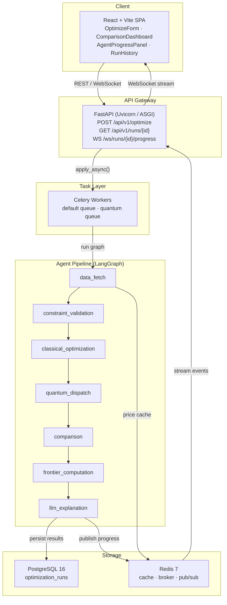
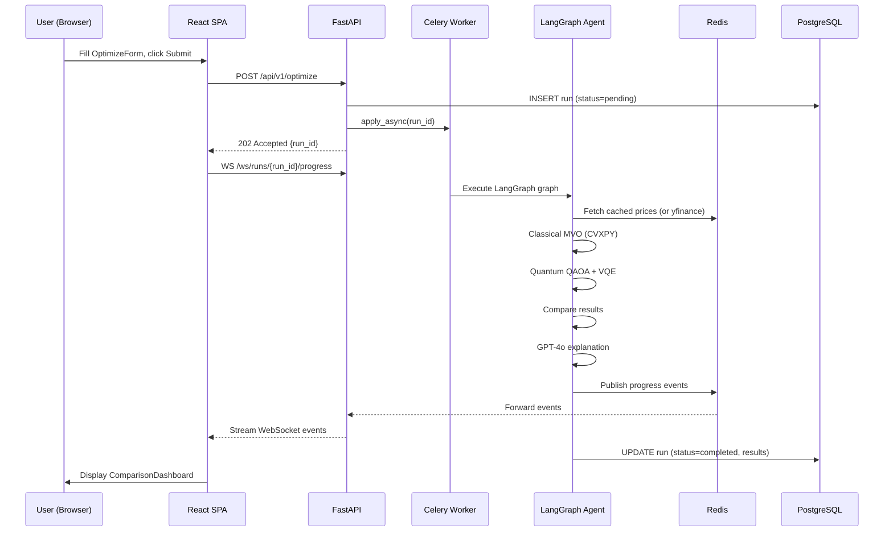

# Portfolio Optimizer — Classical + Quantum + Agent-First

A production-grade portfolio optimization simulator that combines **classical Markowitz Mean-Variance Optimization** (CVXPY), **quantum optimization** (QAOA via Qiskit, VQE via PennyLane), and an **LLM-powered agent layer** (LangGraph + GPT-4o) to recommend optimized portfolios under real-world constraints.

---

## Quick Links

| I want to… | Go to |
|------------|-------|
| 🚀 **Get started quickly** | [Docker Quickstart](01-getting-started/quickstart-docker.md) · [Local Quickstart](01-getting-started/quickstart-local.md) |
| 📐 **Understand the architecture** | [System Overview](02-architecture/system-overview.md) · [Agent Pipeline](02-architecture/agent-pipeline.md) |
| 📡 **Explore the API** | [Optimize Endpoint](04-api-reference/optimize-endpoint.md) · [WebSocket](04-api-reference/websocket-endpoint.md) · [Error Codes](04-api-reference/error-codes.md) |
| ⚛️ **Learn about quantum algorithms** | [QUBO Formulation](07-quantum-optimization/qubo-formulation.md) · [QAOA Solver](07-quantum-optimization/qaoa-solver.md) · [Quantum vs Classical](07-quantum-optimization/quantum-vs-classical.md) |
| 🤖 **Understand the agent graph** | [Graph Definition](05-agent-layer/graph-definition.md) · [Agent State](05-agent-layer/agent-state.md) |
| 🔧 **Configure the system** | [Environment Variables](01-getting-started/environment-variables.md) · [Backend Configuration](03-backend/configuration.md) |
| 🐛 **Troubleshoot issues** | [Troubleshooting Guide](17-operations/troubleshooting.md) · [Runbook](17-operations/runbook.md) |
| 🧪 **Run tests** | [Backend Tests](13-testing/backend-tests.md) · [Test Coverage](13-testing/test-coverage.md) |

---

## What Is Portfolio Optimizer?

The Portfolio Optimizer is a full-stack, cloud-ready application that solves a fundamental challenge in quantitative finance: **how to allocate capital across a set of assets to maximize risk-adjusted returns under real-world constraints**.

Unlike traditional portfolio tools, this system runs **three optimization engines in parallel** and uses an AI agent to compare their results and generate a natural-language explanation of the recommended allocation:

1. **Classical Engine** — Markowitz Mean-Variance Optimization (MVO) using CVXPY, always executed as the baseline
2. **Quantum Engine** — QAOA (Qiskit) and VQE (PennyLane) for portfolios up to 8 assets, running on a dedicated Celery worker queue
3. **Agent Layer** — LangGraph StateGraph orchestrating the full pipeline, with GPT-4o generating the final explanation

A single `POST /api/v1/optimize` call triggers the entire pipeline asynchronously. Progress is streamed to the client via WebSocket, and results are persisted in PostgreSQL for historical analysis.

---

## Architecture Overview



---

## Technology Stack

| Layer | Technology | Purpose |
|-------|-----------|---------|
| **Frontend** | React 18 + Vite + TypeScript | Single-page application |
| **UI Components** | shadcn/ui + Tailwind CSS | Design system |
| **API Framework** | FastAPI + Uvicorn (ASGI) | REST API + WebSocket gateway |
| **Task Queue** | Celery 5 + Redis | Async optimization jobs |
| **Agent Orchestration** | LangGraph (LangChain) | Stateful agent graph |
| **LLM** | OpenAI GPT-4o | Natural-language explanations |
| **Classical Solver** | CVXPY + SCS/ECOS | Markowitz MVO |
| **Quantum (Gate-based)** | Qiskit + Qiskit Aer | QAOA simulation |
| **Quantum (Variational)** | PennyLane | VQE simulation |
| **Market Data** | yfinance | Historical price fetching |
| **Database** | PostgreSQL 16 + SQLAlchemy 2 | Run persistence |
| **Migrations** | Alembic | Schema versioning |
| **Cache / Broker** | Redis 7 | Price cache + Celery broker |
| **Containerization** | Docker Compose / Podman | Local development |
| **Cloud Infrastructure** | AWS ECS Fargate + Terraform | Production deployment |
| **CI/CD** | GitHub Actions | Automated pipelines |
| **Observability** | Prometheus + Grafana + Alertmanager | Metrics + dashboards |

---

## Documentation Sections

### 🚀 Getting Started
Set up and run the Portfolio Optimizer in minutes.

| Page | Description |
|------|-------------|
| [Overview](01-getting-started/overview.md) | Project introduction and key capabilities |
| [Docker Quickstart](01-getting-started/quickstart-docker.md) | Run with Docker Compose (recommended) |
| [Local Quickstart](01-getting-started/quickstart-local.md) | Run with bare-metal Python + Node.js |
| [Environment Variables](01-getting-started/environment-variables.md) | All `.env` configuration options |
| [Podman Notes](01-getting-started/podman-notes.md) | Podman-specific setup and caveats |

### 🏗️ Architecture
Understand the system design, data flow, and technology decisions.

| Page | Description |
|------|-------------|
| [System Overview](02-architecture/system-overview.md) | Service topology and layer responsibilities |
| [Request Lifecycle](02-architecture/request-lifecycle.md) | End-to-end flow from HTTP request to WebSocket response |
| [Agent Pipeline](02-architecture/agent-pipeline.md) | LangGraph graph structure and node interactions |
| [Technology Decisions](02-architecture/technology-decisions.md) | ADRs and rationale for key technology choices |

### ⚙️ Backend Core
FastAPI application internals, configuration, and cross-cutting concerns.

| Page | Description |
|------|-------------|
| [Application Factory](03-backend/application-factory.md) | FastAPI app creation, middleware, and lifespan |
| [Configuration](03-backend/configuration.md) | Pydantic Settings and environment loading |
| [Logging](03-backend/logging.md) | Structured JSON logging with structlog |
| [Exceptions](03-backend/exceptions.md) | Custom exception hierarchy and error handlers |
| [Dependencies](03-backend/dependencies.md) | FastAPI dependency injection patterns |

### 📡 API Reference
Complete REST API and WebSocket documentation.

| Page | Description |
|------|-------------|
| [Optimize Endpoint](04-api-reference/optimize-endpoint.md) | `POST /api/v1/optimize` — trigger optimization |
| [Runs Endpoints](04-api-reference/runs-endpoints.md) | `GET /api/v1/runs` — list and retrieve run history |
| [Assets Endpoint](04-api-reference/assets-endpoint.md) | `GET /api/v1/assets` — available ticker universe |
| [Health Endpoint](04-api-reference/health-endpoint.md) | `GET /health` — liveness and readiness probes |
| [WebSocket Endpoint](04-api-reference/websocket-endpoint.md) | `WS /ws/runs/{id}/progress` — real-time streaming |
| [Error Codes](04-api-reference/error-codes.md) | HTTP status codes and error response schema |

### 🤖 Agent Layer
LangGraph agent graph — nodes, state, routing, and LLM integration.

| Page | Description |
|------|-------------|
| [Graph Definition](05-agent-layer/graph-definition.md) | StateGraph construction and node wiring |
| [Agent State](05-agent-layer/agent-state.md) | TypedDict state schema and field lifecycle |
| [Node: Data Fetch](05-agent-layer/node-data-fetch.md) | yfinance fetching with Redis cache |
| [Node: Constraint Validation](05-agent-layer/node-constraint-validation.md) | Input normalization and validation |
| [Node: Classical Optimization](05-agent-layer/node-classical.md) | CVXPY MVO invocation |
| [Node: Quantum Dispatch](05-agent-layer/node-quantum-dispatch.md) | Conditional QAOA + VQE execution |
| [Node: Comparison](05-agent-layer/node-comparison.md) | Side-by-side solver metrics |
| [Node: Frontier](05-agent-layer/node-frontier.md) | Efficient frontier computation |
| [Node: LLM Explanation](05-agent-layer/node-llm-explanation.md) | GPT-4o explanation generation |
| [Error Routing](05-agent-layer/error-routing.md) | Conditional edges and failure handling |

### 📊 Classical Optimization
Markowitz MVO engine built with CVXPY.

| Page | Description |
|------|-------------|
| [Markowitz MVO](06-classical-optimization/markowitz-mvo.md) | Mean-variance optimization formulation |
| [Multi-Objective](06-classical-optimization/multi-objective.md) | Composite objective functions |
| [Constraints](06-classical-optimization/constraints.md) | Budget, weight, sector, and risk constraints |
| [Efficient Frontier](06-classical-optimization/efficient-frontier.md) | Epsilon-constraint frontier sweep |

### ⚛️ Quantum Optimization
QUBO formulation, QAOA, and VQE solvers.

| Page | Description |
|------|-------------|
| [QUBO Formulation](07-quantum-optimization/qubo-formulation.md) | Portfolio-to-QUBO problem encoding |
| [QAOA Solver](07-quantum-optimization/qaoa-solver.md) | Qiskit QAOA circuit and optimization |
| [VQE Solver](07-quantum-optimization/vqe-solver.md) | PennyLane VQE implementation |
| [Quantum Dispatcher](07-quantum-optimization/quantum-dispatcher.md) | Solver selection and result aggregation |
| [Quantum vs Classical](07-quantum-optimization/quantum-vs-classical.md) | Performance comparison and trade-offs |

### 🗄️ Data Layer
Market data pipeline, caching, and financial metrics.

| Page | Description |
|------|-------------|
| [Market Data Fetcher](08-data-layer/market-data-fetcher.md) | yfinance integration and data normalization |
| [Redis Caching](08-data-layer/redis-caching.md) | Cache strategy, TTL, and invalidation |
| [Sector Classification](08-data-layer/sector-classification.md) | Ticker-to-sector mapping |
| [Portfolio Metrics](08-data-layer/portfolio-metrics.md) | Returns, covariance, Sharpe ratio computation |

### 🗃️ Database
PostgreSQL schema, ORM models, and async session management.

| Page | Description |
|------|-------------|
| [Schema](09-database/schema.md) | Table definitions and relationships |
| [ORM Models](09-database/orm-models.md) | SQLAlchemy 2 mapped classes |
| [Migrations](09-database/migrations.md) | Alembic workflow and version management |
| [Async Session](09-database/async-session.md) | AsyncSession patterns and connection pooling |

### ⚙️ Task Queue
Celery workers, task definitions, and progress streaming.

| Page | Description |
|------|-------------|
| [Celery Configuration](10-task-queue/celery-configuration.md) | App setup, broker, and result backend |
| [Optimization Task](10-task-queue/optimization-task.md) | The main async optimization task |
| [Progress Events](10-task-queue/progress-events.md) | Redis pub/sub event publishing |
| [Queue Routing](10-task-queue/queue-routing.md) | default vs. quantum queue routing |

### 🖥️ Frontend
React + Vite + shadcn/ui single-page application.

| Page | Description |
|------|-------------|
| [Project Structure](11-frontend/project-structure.md) | Directory layout and module organization |
| [Pages](11-frontend/pages.md) | Route-level page components |
| [Components](11-frontend/components.md) | Reusable UI component library |
| [Hooks](11-frontend/hooks.md) | Custom React hooks |
| [API Client](11-frontend/api-client.md) | Axios-based REST client and WebSocket manager |
| [State Management](11-frontend/state-management.md) | Zustand stores and React Query |
| [Type Definitions](11-frontend/type-definitions.md) | TypeScript interfaces and enums |

### 📋 Schemas & Validation
Pydantic request/response schemas and validation rules.

| Page | Description |
|------|-------------|
| [Request Schemas](12-schemas/request-schemas.md) | `OptimizationRequest` and nested models |
| [Response Schemas](12-schemas/response-schemas.md) | `OptimizationResult` and nested models |
| [Validation Rules](12-schemas/validation-rules.md) | Field validators and business rules |

### 🧪 Testing
Unit tests, integration tests, and end-to-end smoke tests.

| Page | Description |
|------|-------------|
| [Backend Tests](13-testing/backend-tests.md) | pytest suite, fixtures, and mocking |
| [Frontend Tests](13-testing/frontend-tests.md) | Vitest + React Testing Library |
| [Test Coverage](13-testing/test-coverage.md) | Coverage configuration and thresholds |
| [E2E Smoke Tests](13-testing/e2e-smoke-tests.md) | End-to-end smoke test suite |

### 🏗️ Infrastructure
Docker Compose, Terraform, and AWS architecture.

| Page | Description |
|------|-------------|
| [Docker Compose](14-infrastructure/docker-compose.md) | Service definitions and networking |
| [Terraform Overview](14-infrastructure/terraform-overview.md) | IaC structure and state management |
| [Terraform Modules](14-infrastructure/terraform-modules.md) | ECS, RDS, ElastiCache, and networking modules |
| [AWS Architecture](14-infrastructure/aws-architecture.md) | VPC, ECS Fargate, RDS, and ALB topology |
| [Environments](14-infrastructure/environments.md) | dev / staging / prod environment configuration |

### 🔄 CI/CD Pipelines
GitHub Actions workflows for continuous integration and deployment.

| Page | Description |
|------|-------------|
| [CI Workflow](15-cicd/ci-workflow.md) | Lint, test, and build pipeline |
| [CD Workflow](15-cicd/cd-workflow.md) | Docker build, push, and ECS deployment |
| [Terraform Workflow](15-cicd/terraform-workflow.md) | Infrastructure plan and apply pipeline |
| [GitHub Secrets](15-cicd/github-secrets.md) | Required secrets and OIDC configuration |

### 📈 Observability
Prometheus metrics, Grafana dashboards, and alerting.

| Page | Description |
|------|-------------|
| [Prometheus Metrics](16-observability/prometheus-metrics.md) | Custom metrics and instrumentation |
| [Grafana Dashboards](16-observability/grafana-dashboards.md) | Dashboard panels and queries |
| [Alertmanager](16-observability/alertmanager.md) | Alert rules and notification routing |
| [Logging Guide](16-observability/logging-guide.md) | Structured log format and querying |

### 🛠️ Operations & Runbook
Deployment, configuration reference, and incident response.

| Page | Description |
|------|-------------|
| [Deployment Guide](17-operations/deployment-guide.md) | Step-by-step production deployment |
| [Configuration Reference](17-operations/configuration-reference.md) | All environment variables and settings |
| [Troubleshooting](17-operations/troubleshooting.md) | Common issues and diagnostic steps |
| [Runbook](17-operations/runbook.md) | On-call incident response procedures |

---

## How It Works — End-to-End Flow



---

## Repository Structure

```
stock_optimization/
├── backend/                  # FastAPI application
│   ├── app/
│   │   ├── api/              # Route handlers
│   │   ├── agents/           # LangGraph graph and nodes
│   │   ├── optimization/     # Classical and quantum solvers
│   │   ├── data/             # Market data and caching
│   │   ├── db/               # SQLAlchemy models and sessions
│   │   ├── schemas/          # Pydantic request/response models
│   │   ├── tasks/            # Celery task definitions
│   │   └── core/             # Config, logging, exceptions
│   └── tests/                # pytest test suite
├── frontend/                 # React + Vite SPA
│   ├── src/
│   │   ├── pages/            # Route-level components
│   │   ├── components/       # Reusable UI components
│   │   ├── hooks/            # Custom React hooks
│   │   ├── lib/              # API client and utilities
│   │   └── types/            # TypeScript type definitions
│   └── tests/                # Vitest test suite
├── infrastructure/           # Terraform IaC
│   ├── modules/              # Reusable Terraform modules
│   └── environments/         # dev / staging / prod configs
├── .github/workflows/        # GitHub Actions CI/CD
├── monitoring/               # Prometheus + Grafana configs
└── docker-compose.yml        # Local development stack
```

---

> **Note:** This wiki is auto-generated from source code. For the most up-to-date information, always refer to the source files referenced in each documentation page.
